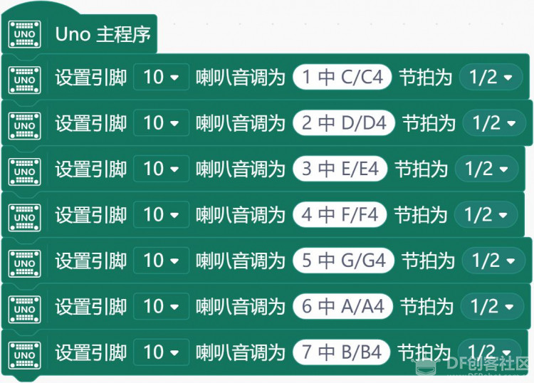
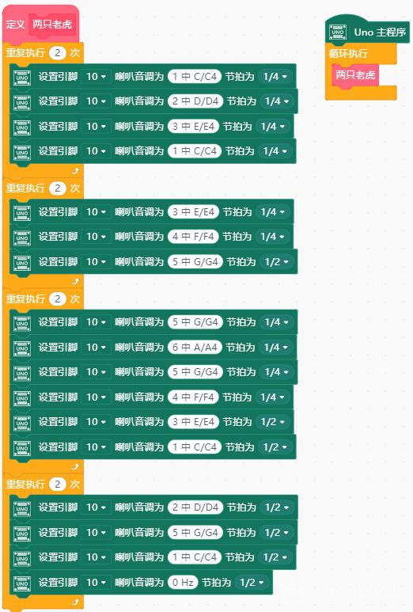

# 项目八 小小作曲家

项目七的末尾，我们留了一项课后作业——让蜂鸣器播放一段旋律。不知道你是否实现了？本节中，我们将向你介绍一种用 Mind+ 播放音乐的方法。这一节中，你能够了解到一些有关音乐的基本知识，以及它们如何与 Arduino 和 Mind+ 结合，并试着自己编一段小旋律。

## 学习目标：

1． 元件

- 蜂鸣器

2．Mind+ 程序模块

- 设置引脚喇叭音调
- 函数 

3．程序设计

- 顺序结构
- 循环结构

## 任务 1——简单音阶

1.实现功能

播放一组音阶

2.硬件连接

蜂鸣器—10

3.程序编写

这段程序实现了一个简单的功能：按顺序播放一组音阶（do, re, mi, fa, sol, la, si）。

关于音乐的基本知识

一般来讲，一个音有以下要素：音高、音色、响度。在乐曲中，时值也是一个重要的要素。

- 声音与物体的震动：声音是由物体的震动产生的。
- 音高与频率：一个音的音高，由物体振动的频率决定。振动频率指物体振动的快慢，频率越高，物体振动越快，音高越高。
- 音色与材质：不同的物体的材质不同，振动时产生的声音的“色彩”不相同。
- 响度与振幅：一个音色响度，由物体振动的幅度决定。物体振动幅度越大，响度越大。
- 音名：前面已经知道，音调的高低是由频率决定的。对于音乐来说，人们已经发现，用一些特定的频率的音，演奏出来的曲子比较悦耳。人们也将这些频率用英文字母代替，方便记忆。这个英文字母，就是它代表的那个音的音名。（例如，规定 A=440Hz，那么，A 就是一个音名）音名是唯一的，任何情况下，一个音名只能代表同一个频率。（如 A 永远代表 440Hz)。
- 唱名：音乐课上，你肯定听到过 do re mi fa sol la si 吧？这些就是唱名。因为唱出来比较简单。”do ”可以对应不同的频率，可以是 440Hz，也可以是 880Hz，也可以是……。所以可以看出音名和唱名的区别——一个音名值对应一个频率，一个唱名可以对应多个频率。
- 时值：一个音的长短。

## 任务 2——简单乐曲

1. 实现功能    

   播放简单乐曲

2. 硬件连接    

   蜂鸣器—10

3. 程序编写

同样，为了方便你们更好地了解音乐的基本知识，我们写好了一段程序，可看到如下程序：

## 任务 3——自编旋律

任务二中介绍了编写一段旋律的方法——接下来，就要由你自己来编写一段美丽的旋律啦！

1. 实现功能    

   播放自创旋律

1. 硬件连接    

   蜂鸣器-10

1. 程序编写    

   请参考任务2