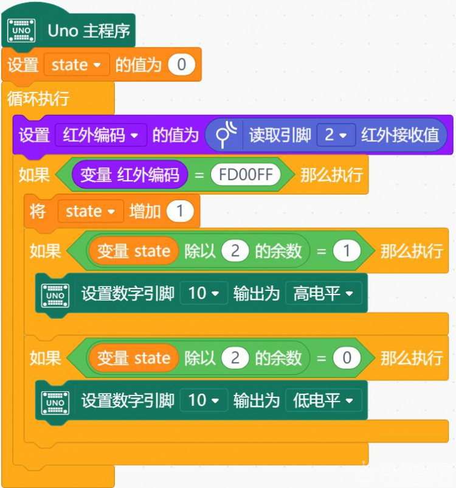
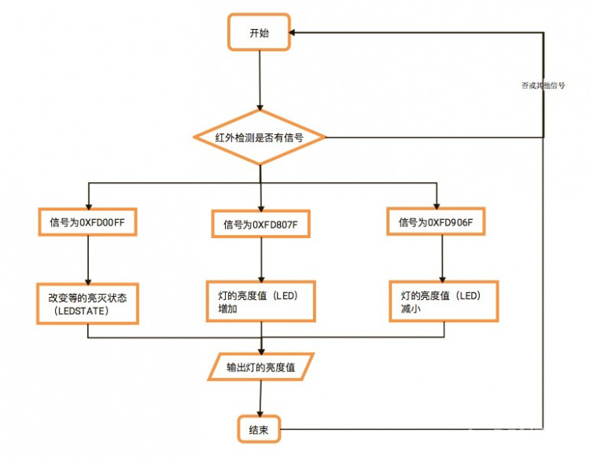
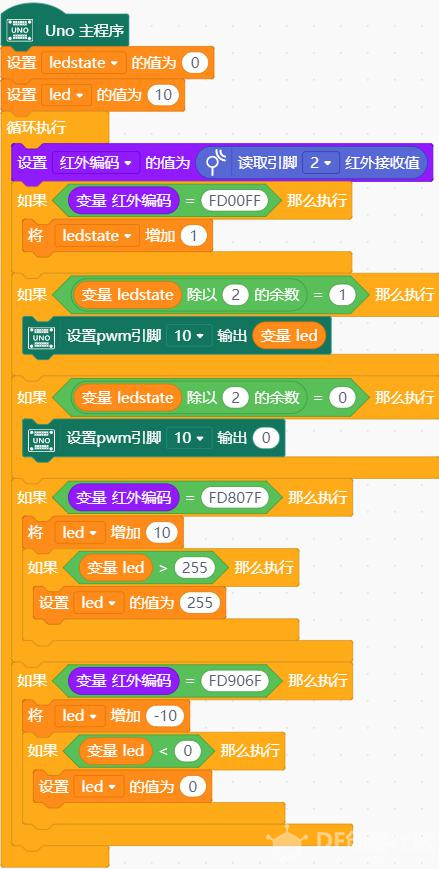

# 项目十 遥控灯

## 学习目标： 

1． 元件

- 红外遥控模块（红外遥控器，红外线接收传感器）
- LED 模块

2．Mind+ 程序模块

- 设置红外编码的值
- 读取引脚红外接收值 
- 变量
- 串口输出

3．程序设计

- 顺序结构
- 循环结构
- 条件判断 

想象自己躺在床上，该睡觉了，灯的开关却在几米外的门口，你不愿离开温暖的被窝，在寒冷中跋涉漫长的几米去关灯。你需要一个遥控器。

### 红外遥控器（发出和接收红外光的电子器件）

现实世界的大多数遥控器都是红外的，如电视机遥控器，机顶盒遥控器等。

任何一个遥控系统都由发射器和接收器两部分组成。 每个按钮都有一个特定的 16 进制代码，都以 FD 开头，在接收过程中有可能出错。

 

遥控器键值附表遥控器字符键值红色按钮

### 遥控器键值附表

| 遥控器字符 | 键值   |
| ---------- | ------ |
| 红色按钮   | 0xff00 |
| VOL+       | 0xfe01 |
| FUNC/STOP  | 0xfd02 |
| 左2个三角  | 0xfb04 |
| 暂停键     | 0xfa05 |
| 右2个三角  | 0xf906 |
| 向下三角   | 0xf708 |
| VOL-       | 0xf609 |
| 向上三角   | 0xf50a |
| 0          | 0xf30c |
| EQ         | 0xf20d |
| ST/REPT    | 0xf10e |
| 1          | 0xef10 |
| 2          | 0xee11 |
| 3          | 0xed12 |
| 4          | 0xeb14 |
| 5          | 0xea15 |
| 6          | 0xe916 |
| 7          | 0xe718 |
| 8          | 0xe619 |
| 9          | 0xe51a |

读取按键对应的代码值：

  

编译、上传后，打开“串口监视器”

 

## 任务 1——制作一个红外遥控灯

### 实现功能

按一下开关键控制灯的亮灭。

### 硬件连接

​    取出一个 LED 模块，用连接线将其与 10 号管脚对应的三个管脚相连（注意插线时颜色的对应）

​    取出一个红外遥控模块，用连接线将其与2 号管脚对应的三个管脚相连（注意插线时颜色的对应）

### 程序编写

 

## 课后作业

制作一个红外调光器：使用“＋、- ”对应光值的明暗变化。遥控多个 LED 灯（编程提示为一个）。切换不同的闪灯模式。等等…… 

### 思路解析

    如何使用加减按键控制 led 的亮度？

要用加减控制 led 灯的亮度，首先，我们能确定 led 灯需要使用模拟输出，其数值范围是 0-255，因此在控制加减时我们需要用到约束函数是数值范围不会越界。

其次，我们需要用一个 ledstate 变量来控制灯的开关状态（为更符合实际使用方便，可以为 led 灯设置一个初始亮度值）；还需要有一个 led 变量来记录操作过程中灯的亮度值。有了这些准备之后，我们只需用简单的逻辑关系把程序编写出来就 OK 了。

 
