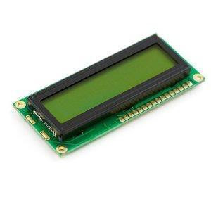
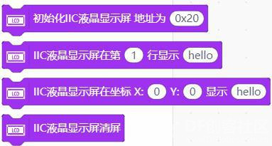
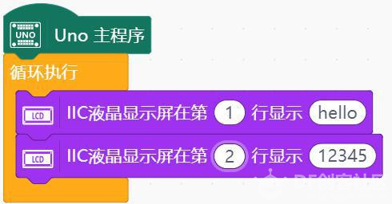
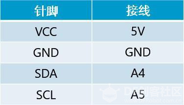
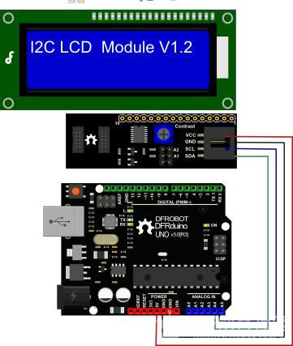
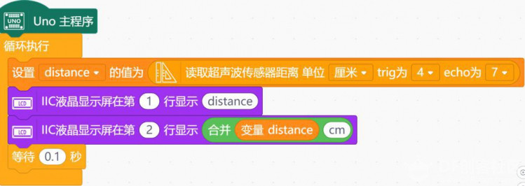

# 项目十二 超声波测距仪

## 学习目标：

1． 元件

- 超声波测距仪
- 液晶显示模块

2．Mind+ 程序模块

- 设置distance的值
- 读取超声波传感器距离
- IIC液晶显示屏显示

3．程序设计

- 顺序结构
- 循环结构

在上一个电子琴任务中，我们通过距离的变化，控制琴的音高。相应地，我们也能通过音高的变化，大致感受手与元件的距离。不过，我们能不能直接看到距离是多少呢？怎样把测得的数字显示出来呢？

此时就需要一个液晶显示屏了。

液晶显示模块：

- 每行 16 个字符，共 2 行
- 若出现乱码，可在每次输出之前清屏

## 任务 1——制作一个超声波测距仪，并在屏幕上显示距离

### 硬件连接

- 取出一个超声波测距模块，用连接线按第十一课的连接方式相连
- 取出一个液晶显示模块，用连接线按下图所示的连接方式相连

### 程序编写

