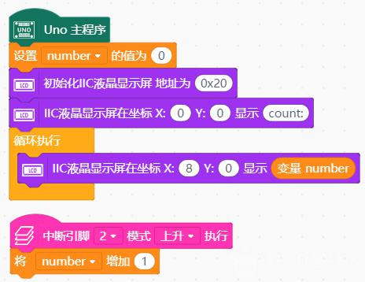
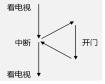
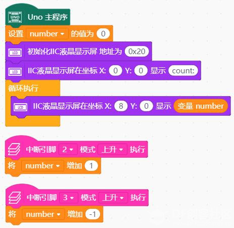
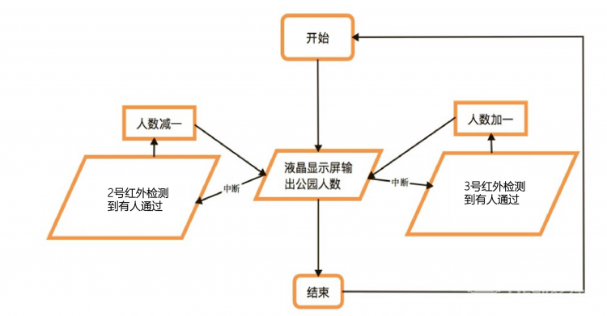

# 项目十三 公园人数计数系统

## 学习目标：

1．元件

- 红外接近开关模块
- 液晶显示模块

2．Mind+ 程序模块

- 设置number的值
- IIC液晶显示屏显示
- 中断引脚
- 变量

3．程序设计

- 顺序结构
- 循环结构

本节中，我们不再学习新的元件，而是将前面所学的液晶显示屏和红外接近开关联系起来，做一个综合项目，公园人数计数系统。我们经常见到媒体报道某个景区在某个假日接待多少人次，创下历史新高，不知道你有没有好奇过景区到底是如何完成这项统计的呢？
   我相信，在学习了本节之后，你一定可以找到一种解决办法。本节是一个难度较大的项目，但在你已经掌握了前面的知识和元件的用法后，相信你一定可以通过思考和实践完成这个任务。

## 任务 1——制作一个公园人数计数系统

### 实现功能   

每进来一位游客，显示屏上进入公园人次加一

### 硬件连接   

取出一个液晶显示模块，依然采用第 11 课的连接方式。 

取出一个红外接近开关模块，用连接线将其与 2 号管脚对应的三个管脚相连   （注意插线时颜色的对应（黑色为信号线）

### 程序编写

      

这段程序中，我们使用了一个新的模块——中断。

中断过程是指，在程序顺序执行的过程中，当主控板收到规定的某些数字输入信号时，会立即暂停当前执行的程序，转而去执行中断部分的程序，当中断部分执行完毕，再回到刚才暂停的地方继续执行原来的程序。注意：主控板上只有 2 号和 3 号管脚支持中断功能。

举一个简单的例子：比如你在家看电视，突然门铃响了（家人回来了），

  

那么你不得不停下看电视先去开门，之后你又可以继续看电视啦！在整个过程中接电话就是一个中断过程，门铃响就是中断的标志，即触发中断的条件。

## 任务 2——制作一个公园人数计数系统

### 实现功能   

每进来一位游客（2 号管脚触发中断），显示屏上公园人数加一。每出去一位游客（3 号管脚触发中断），显示屏上公园人数减一。

### 硬件连接   

取出一个液晶显示模块，依然采用第 11 课的连接方式   取出两个红外接近开关模块，用连接线分别将其与 2 号管脚，3 号管脚对应的三个管脚相连（注意插线时颜色的对应）

### 程序编写

## 课后作业

### 任务要求

制作一个公园人数计数系统：在任务 2 的基础上，增加防干扰功能（提示：如果 2 号或 3 号管脚在一定短暂时间内数次触发中断，则不增加或减少计次）

### 思路解析

### 程序编写

