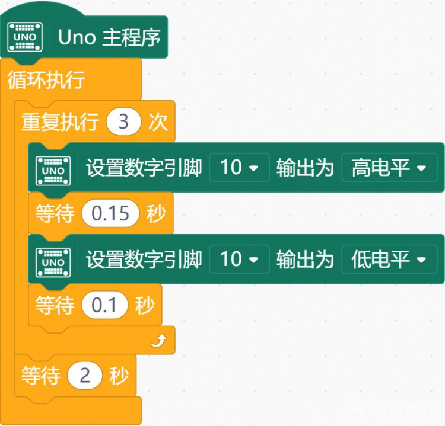

# 项目二 SOS

## 什么是 SOS?

什么是 S.O.S.?S.O.S.可以被展开为：

- Save Our Souls （拯救我们的灵魂）

- Save Our Ship （拯救我们的船）
- Send Our Succour （速来援助）
- Saving Of Soul （救命）

这是全球通用的求救信号。当你身在异乡，突遇险情，SOS 求救信号或许可以救你一命。

## S.O.S.如何表示？

摩尔斯电码中，用…---…（三短三长三短）来表示 S.O.S.求救信号。

摩尔斯电码由美国人萨缪尔·摩尔斯于 1844 年发明。它是一种时通时断的信号代码，通过不同的排列顺序来表达不同的英文字母、数字和标点符号，如下图所示。

- 点为1个单位
- 横为3个单位
- 字符内部的停顿（在点和划之间）：一个单位
- 字符之间的停顿：3个单位
- 单词之间的停顿：7个单位

### SOS的摩尔斯电码

S、O、S这三个字母的摩尔斯电码分别是“···”、“---”、“···”，念为“滴滴滴”、“答答答”、“滴滴滴”，也就是“三短音”、“三长音”、“三短音”。

极为简洁明确，即便是未经训练的民众，也可以轻易的利用手边的器物发出这样的信号，或是加以识别。

## 任务一：用 LED 发出摩尔斯电码中的求救信号

### 1.  硬件连接

将 LED 与主控板 10 号管脚相连。注意插线时的颜色对应。

### 2. 程序编写

观察摩尔斯电码 S.O.S 的表示形式（“…---…”），其中长短依次重复出现，可以采用上一任务中的循环结构：

这一段程序不是完整的，还不能实现任务要求。它的作用只是表示第一个字母 S。请你在此基础上完成程序，实现任务要求。

## 知识点小结

1． 元件

- LED 模块

2．Mind+ 程序模块

- 数字输出
- 等待
- 循环
