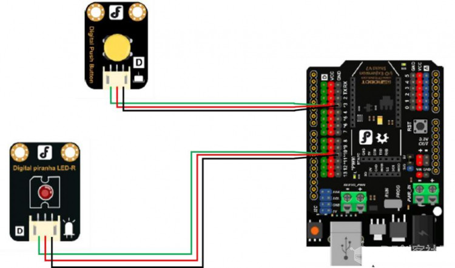
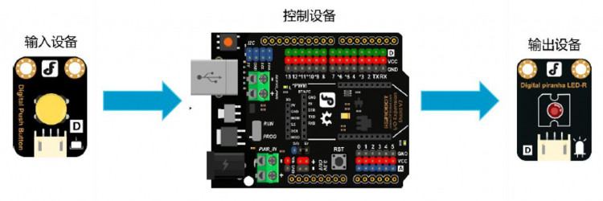
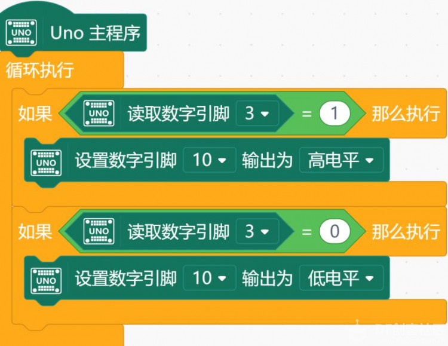
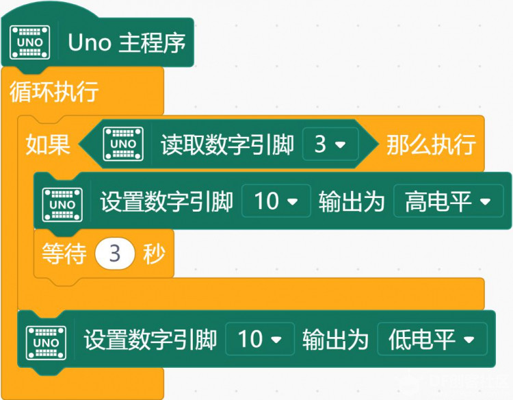
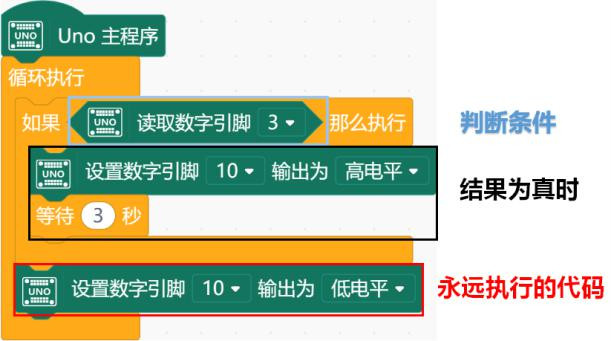
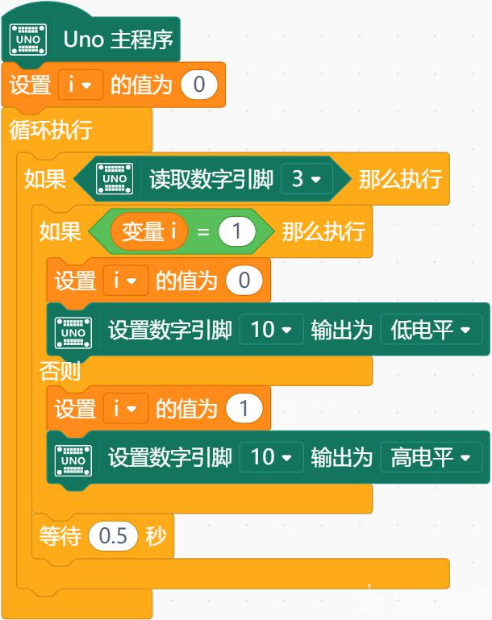

# 项目三 神奇的按钮

按钮是我们在这套元件中接触的第一个输入设备，具有按下（高）和抬起（低）两种状态。默认状态为抬起。生活中的按钮可以说无处不在，遥控器、计算器、手机、电脑等各种电子设备上的按键，都是按钮。

项目示例

可以通过以下三个小任务进行实践：

- 任务一：让按钮简单工作
- 任务二：简易延时灯
- 任务三：使用按钮模拟开关

## 任务一：让按钮简单工作

### 实现功能

按下按钮灯亮，松开按钮灯灭。

### 硬件连接

按钮~3；LED~10。注意插线时的颜色对应。

## 程序编写

首先是实现功能的逻辑，如下图：

输入设备向控制设备发送信号，控制设备对其进行处理，并控制输出设备进行相应的输出工作。
当按钮被按下时，向 3 号管脚输入高电平，此时 10 号管脚应输出高电平；当按钮被抬起时，向 3 号管脚输入低电平，此时 10 号管脚应输出低电平。
程序如下图所示：

数字输入：有两种状态，即“高”和“低”。按钮按下为高，抬起为低。

支持数字输入的管脚为：2~13，A0~A5（其实 0 号和 1 号管脚也支持数字输入，但因为负责串口通信功能，一般情况下不使用）。

## 任务二：简易延时灯

### 实现功能

按下按钮灯亮，3 秒钟后灯灭。

### 程序编写：

这里我们看到了一个新的结构——条件结构。它是如何应用的呢？请看下图：

如果当前状态符合判断条件的要求，判断模块内（黑色边框内的）的程序将会被执行。如果不符合，则那部分代码将会被跳过，直接执行接下来红色框中的程序。

## 任务三：使用按钮模拟开关
### 实现功能

每次按下，LED 灯切换亮灭。

### 程序编写：

这段程序中，我们使用了定义变量的模块。变量的名称是i。设置i的值为0指令，在整个程序运行过程中只执行一次，相当于对变量i的值初始化为0。 程序中等待0.5秒用于消除按键抖动。

## 知识点小结

元件

- 按钮

Mind+ 程序模块

- 数字输入
- 条件判断