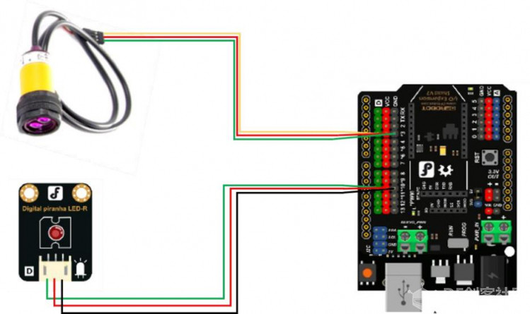

# 项目四 简易入侵检测仪

灯光在微电脑控制之下完成由暗到亮再由亮到暗的逐渐变化，感觉像是在呼吸，所以称为呼吸灯。呼吸灯广泛应用于手机、无线路由器之上，如你的手机里面有未处理的通知，比如说未接来电，未查收的短信等等，呼吸灯就会由暗到亮的变化，像呼吸一样那么有节奏，起到一个通知提醒的作用。 

项目示例

可以通过以下任务进行实践：

任务一：简单入侵检测仪

## 任务一：简单入侵检测仪  

### 实现功能

人近灯亮，人走灯灭 

### 硬件连接

红外入侵检测仪—3；LED—10。

注意红外接近开关的插线：黄接绿，红接红，绿接黑  

### 程序编写 

 

## 知识点小结

1. 元件

   - 红外接近开关

2. Mind+ 程序模块

   - 数字输入

   - 条件判断