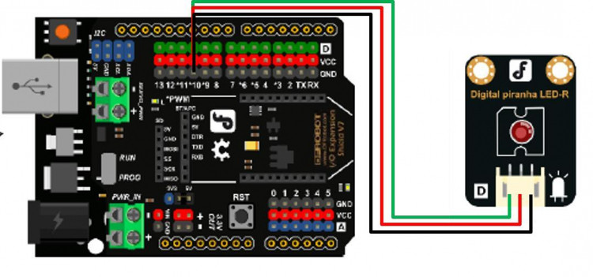
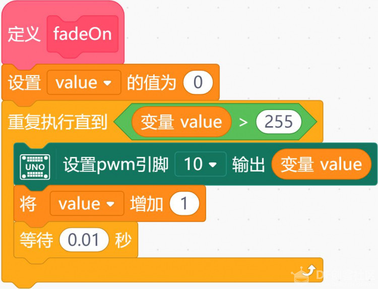
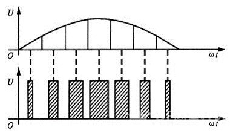
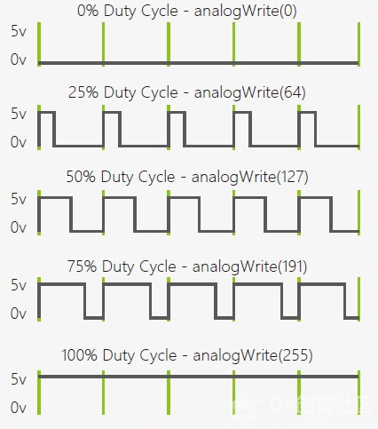
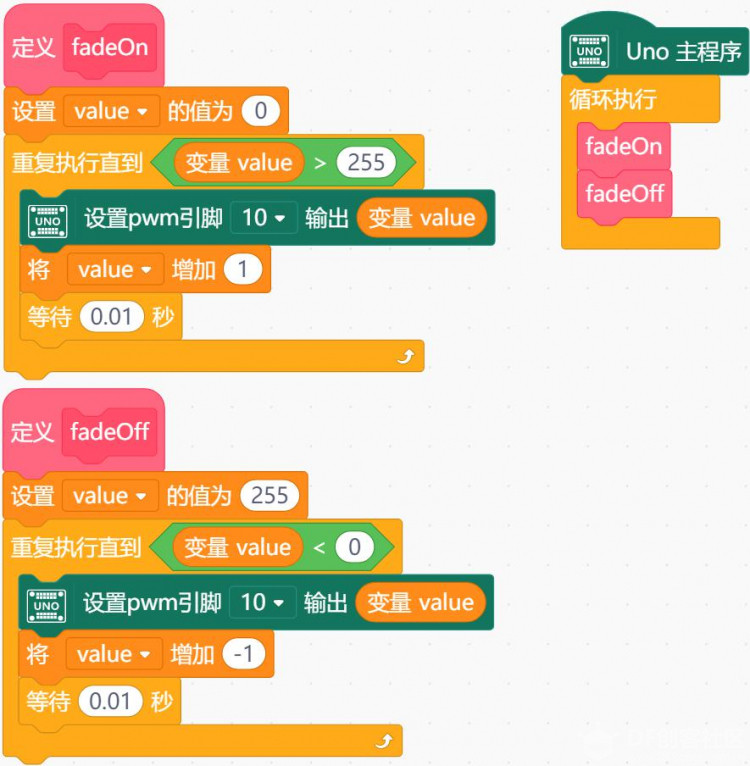
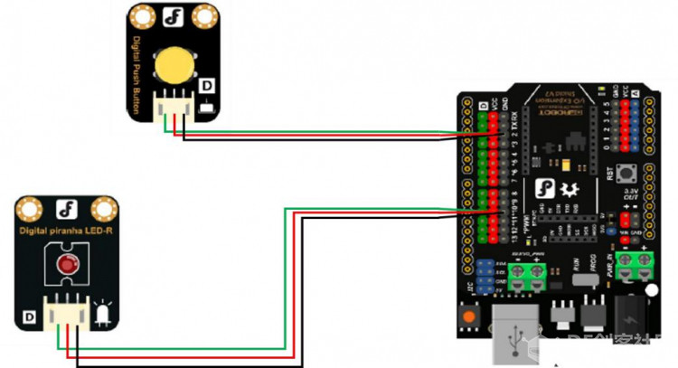
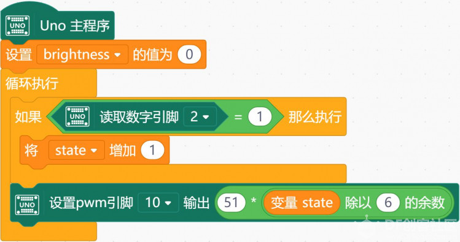
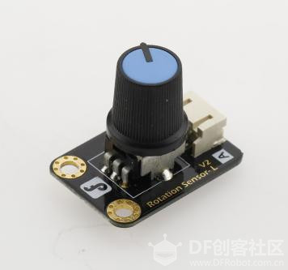
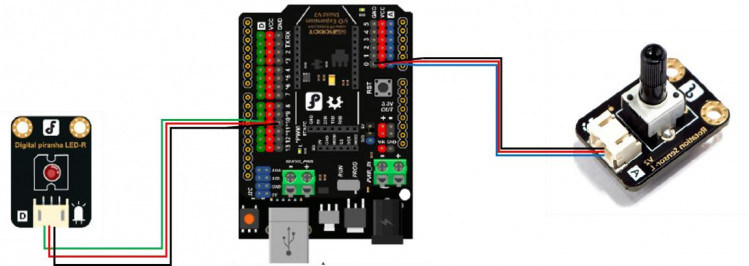

# 项目五 可调灯

灯光在微电脑控制之下完成由暗到亮再由亮到暗的逐渐变化，感觉像是在呼吸，所以称为呼吸灯。呼吸灯广泛应用于手机、无线路由器之上，如你的手机里面有未处理的通知，比如说未接来电，未查收的短信等等，呼吸灯就会由暗到亮的变化，像呼吸一样那么有节奏，起到一个通知提醒的作用。

项目示例

 可以通过以下三个小任务进行实践：

- 任务一：简易呼吸灯

- 任务二：制作 5 档可调灯

- 任务三：制作旋钮可调灯

## 任务一：简易呼吸灯

### 实现功能

灯的亮度逐渐变化。

### 硬件连接

LED—10。注意插线时的颜色对应。

### 程序编写

这段程序中我们接触到了两个新的模块——函数以及模拟输出。

函数：我们最初见到函数是在数学当中。y=f(x)是函数的一种一般形式，它接受变量 x 的值，经过对应法则 f 的处理，向人返回结果值 y。Mind+ 程序中的函数，可以类比理解。

函数的内部，也可以定义变量（如图中的 value），这个变量只在函数执行的时候起作用，一旦函数执行结束，value 也就不存在了。函数的一次执行叫做函数的调用，在一个函数中，可以调用其他函数，甚至可以调用自己。

模拟输出：脉宽调制（PWM：Pulse Width Modulation）

输出：它是一种对模拟信号电平进行数字编码的方法，简单来说就是通过一个时钟周期内高低电平的不同占空比来表征模拟信号，如右图就是一个具体的编码样例。

Arduino 使用 analogWrite(int value)输出 PWM 信号，其中的 value 取值范围是 0-255，效果如下图所示。

 

Arduino 主控板只有有限个 GPIO 管脚支持 PWM。

观察一下 Arduino 板，查看数字引脚，你会发现其中 6 个引脚（3、5、6、9、10、11）旁标有“~”，这些引脚不同于其他引脚，因为它们可以输出 PWM 信号。

 不难看出，上面这个函数的功能是让 LED 灯逐渐变亮。要实现任务要求，还需要一个让 LED 逐渐变暗的函数。

完整的程序如下图:

上图左侧为定义两个函数。程序的主体是右侧主程序，它们是对左侧的函数的调用。

## 任务二：制作5档可调灯

### 实现功能

通过按钮，让灯的亮度发生变化。

### 硬件连接

按钮—2；LED—10。注意插线时的颜色对应。

### 程序编写

## 任务三：制作旋钮可调灯

这里，我们用到了一个新的元件——模拟角度电位器，也叫“滑动变阻器”或”电位器”。通过调节旋钮，可以改变它接入电路的阻值大小。将其连到主控板支持模拟输入的接口上，就可以把阻值作为模拟信号输入到主控板上。主控板根据输入值的大小，确定输出的值（在这里，输入值大，输出值也大；也可能另外一些程序希望输出值随着输入值变大而减小。）

### 硬件连接

模拟角度电位器—A0；LE—10。注意插线时的颜色对应。

 需要注意的是，主控板支持的模拟输入信号的大小范围是 0~1023。然而，模拟输出大小是 0~255。

因此，模拟输入的数值，不能直接进行模拟输出，我们需要一种办法，能够把0~1023 内的数，按比例缩小，转化成 0~255 之间的数，再模拟输出。方法如下：

### 程序编写

## 知识点小结

### 元件

- 模拟角度电位器

### Mind+ 程序模块

- 模拟输入

- 函数

- 映射
