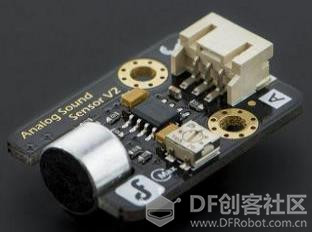
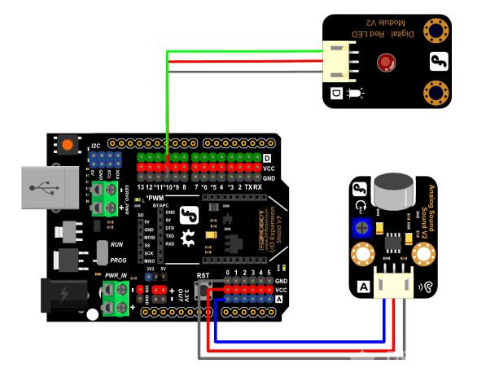
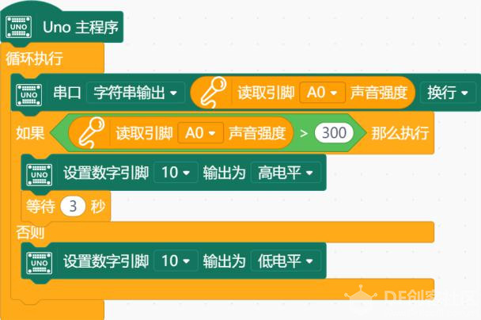
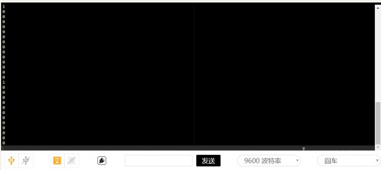
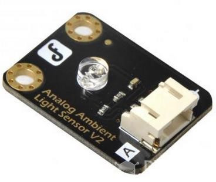
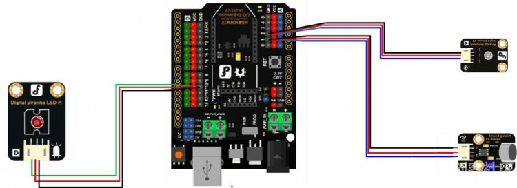
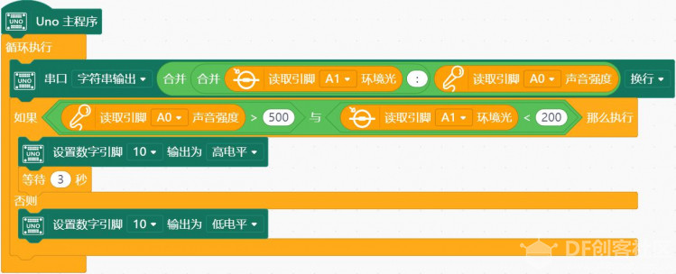

# 项目六 智能灯

项目示例
可以通过以下三个小任务进行实践：

- 任务一：声控灯

- 任务二：制作楼道灯

- 任务三：制作电子蜡烛

## 任务 1——声控灯

顾名思义，我们需要通过声音代替按钮形式的开关。如何识别声音信号呢？我们需要使用一个新的原件——模拟声音传感器。

    

模拟声音传感器可以将声音的响度转化成模拟信号。在 Arduino 主控板上，仍然是输入 0~1023 的数值。

### 实现功能

有响声灯亮并延时一段时间。

### 硬件连接

模拟声音传感器—A0；LED—10。注意插线时的颜色对应。

### 程序编写

   

我们看到，程序中使用了一个新的模块——串口输出    模拟输入的信号是通过串口传给 Arduino 主控板的，使用“串口输出”可以把当前通过串口的数据显示出来。显示在哪呢？在串口区里显示。
单击左下角的图标打开串口，可以在这个窗口中显示上传的数据：

## 任务 2——制作楼道灯

生活中我们是否用到了声控灯呢？对声控灯比较常见的应用，就是楼道灯。不过，在白天，楼道在阳光下并不昏暗的时候，声音再大，楼道灯也是不会亮的。而任务 1 中的声控灯则不论周围环境的亮度如何，只要声音超过了设定值便会亮灯。这是因为，控制楼道灯的开关，不只有模拟声音传感器，还有模拟光线传感器。

模拟光线传感器可以将周围的亮度转化为模拟信号，输入到 Arduino 主控板上。

### 实现功能

当亮度暗且有声音时，灯才亮

### 硬件连接

模拟声音传感器—A0；模拟光线传感器—A1；LED—10。注意插线时的颜色对应。

### 程序编写

## 任务 3——制作电子蜡烛

### 实现功能  

当亮度暗时，蜡烛“点亮”，火苗闪烁，有吹蜡烛的声音的时候，蜡烛熄灭。

### 硬件连接

与任务 2 相同。

### 程序编写

使用数值菜单中“随机数”模块，可以模拟真实蜡烛火苗闪动的效果。

