# 项目一 初识Arduino

## 教程简介

本教程共由14个项目组成，每个项目配合实例介绍了Arduino Uno入门套件和Mind+软件的基本使用方法，由易到难，循序渐进，帮助读者零基础入门Arduino Uno入门套件的图形化编程。通过教程将带领大家一起玩转Arduino Uno入门套件，实现各种创意。

本教程适合开源硬件初学者、图形化编程初学者和想要了解Arduino Uno入门套件的创客。

!!! note

    教程编写过程中使用的是V1.5.2版本Mind+软件，现官网已经更新到新版本，如果您是使用新版本的软件进行教程学习，在使用过程中若发现项目程序的任何问题。可以反馈到官方邮箱：MindPlus@dfrobot.com。

## Arduino UNO 入门教程

### 发现新世界

一天早上，你从梦中醒来，转头看了一眼床头的闹钟。七点三十四分！说好的七点钟的闹铃呢！上学要迟到了！你从床上弹起来，抓起昨晚换下来的外衣匆忙穿上，跑进卫生间洗脸刷牙，头发还乱糟糟的，但是没时间管它了，你跑进厨房，打开冰箱，发现里面什么也没有，昨天晚上你已经把吃的都吃掉了，看来你只能饿着肚子上课了。你把桌上的书本一股脑塞进书包，抓起钥匙跑出家门，眼前一片阴郁的灰色，空气中弥漫着雾霾的味道…… 你是否遇到过这样的窘境呢？每个人都可能会遇到这样倒霉的时候吧。

设想另一种情况，早上七点，阳光透过窗帘，照进你的房间。你的闹钟感受到了阳光，开始大叫，在房间里四处乱跑，等你抓到它，它才会安静。这时，你也就清醒了。在你去洗漱的同时，厨房里的机械手臂夹起烤好的面包，还有你喜欢吃的果酱，一杯热牛奶，放在一辆小餐车的盘子上。你洗漱完毕，走进厨房。小餐车停在你的面前，托盘抬高，让你舒服地享用早餐，为一天的学习、工作做好准备。安装在室外的湿度检测器、温度检测器、 PM2.5 检测器为你实时测量温度并提供预报，将数据传送到衣柜，衣柜则为你挑选好今天适合穿的衣服和鞋子，并为你决定今天是否需要戴口罩出门。你无需为每一件小事作出选择，可以节省精力专注于你的学习或事业。

这样的生活看上去很不错嘛！而且，我有一个好消息要告诉你，这样的生活，离我们已经不远了！这些为你的生活提供着各种便利的机器人，已经很容易被制造出来。它们有着共同的“大脑”，或者说“灵魂”—————Arduino 控制板。通过 Arduino，人们可以发明出很多有意思的、有用处的机器，为生活提供便利。还是那句老话，只有想不到，没有做不到。

下面是几样用 Adruino 主控板以及各种零件做出的作品：

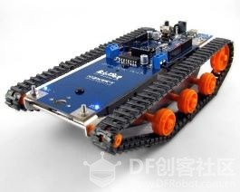 

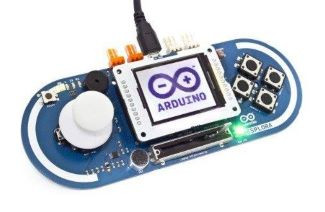 

### Arduino 开源系统

Arduino 是一个开放源码电子原型平台，拥有灵活、易用的硬件和软件(板子及在此之上的软件)。

Arduino 可以接收来自各种传感器的输入信号从而做到监测环境的效果，并通过控制光源，电机以及其他执行器来影响其周围环境(类似于人类的工作)。

硬件低廉，软件免费。

可以完成的例子：

- 当咖啡煮好时，咖啡壶就发出“吱吱”声提醒
- 当邮箱有新邮件时，电话就会发出铃声通知
- 自制一个心率监测器，将每次骑脚踏车的记录存进存储卡
- 复制一张门禁卡、饭卡
- ……

### Arduino Uno入门套件介绍

- 3-80cm 红外接近开关
- 模拟角度电位器
- 数字蜂鸣器模块
- 模拟环境光线传感器
- 模拟声音传感器
- 数字大按钮模块
- 数字 LED
- TowerPro SG90 舵机
- 红外接收模块+遥控器
- 超声波传感器
- LCD 液晶屏
- 传感器 IO 扩展板
- DFRduino UNOR3
- USB 电缆

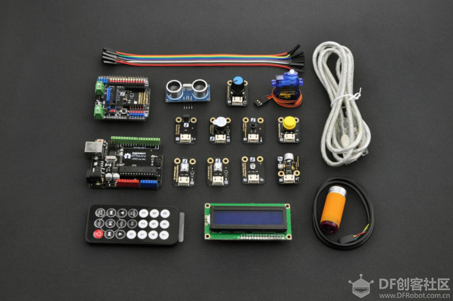

### Arduino UNO 介绍

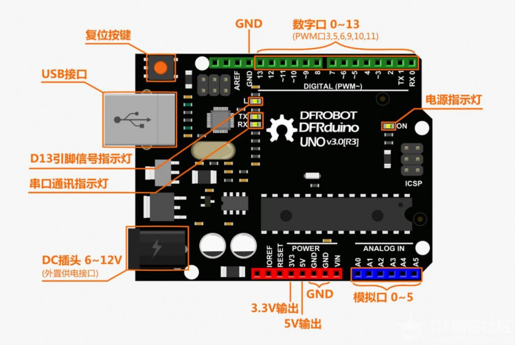

### Arduino UNO 扩展板介绍

注意：说明文字的颜色对应原件导线的颜色。

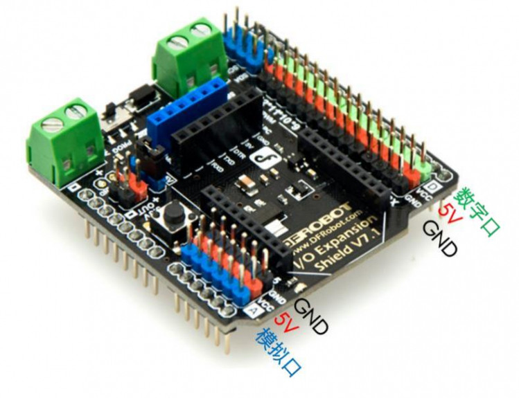

## Mind+安装使用

### 下载 Mind+

**下载地址：**[**http://mindplus.cc/**](http://mindplus.cc/)

Mind+是一款基于Scratch3.0开发的青少年编程软件，支持arduino、micro:bit、掌控板等各种开源硬件，只需要拖动图形化程序块即可完成编程，还可以使用python/c/c++等高级编程语言，让大家轻松体验创造的乐趣。

Mind+客户端下载

下载完成后双击安装：

### 安装驱动

下载成功之后点击“教程”——“视频教程”按钮打开教程，根据提示进行驱动安装。

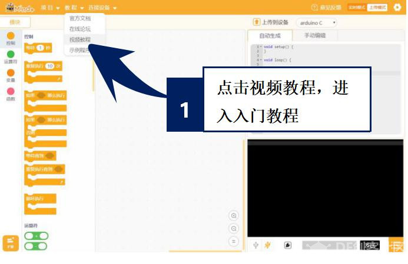

点击教程，打开课程视频悬浮窗

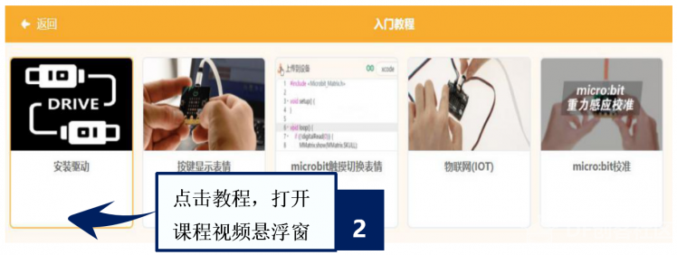

根据视频悬浮窗中的教程，一键安装驱动，这一步很重要！安装一次，一劳永逸！

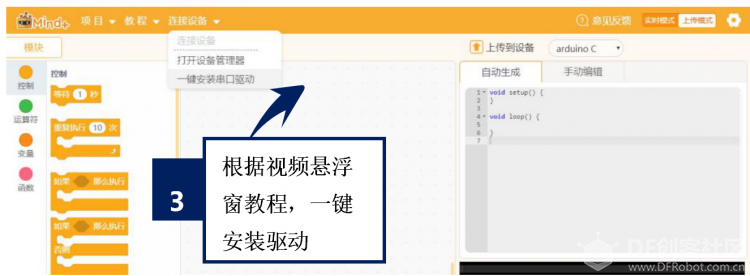

### 切换“上传模式”

（本系列教程均为“上传模式”下操作）

点击右上角“上传模式”按钮，等待切换

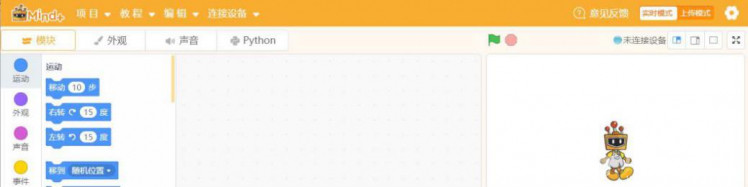

切换“上传模式”模式成功

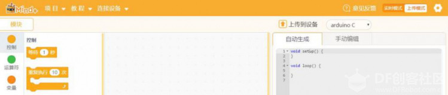

### Mind+界面介绍

下载安装成功之后让我们仔细看下Mind+编程界面。
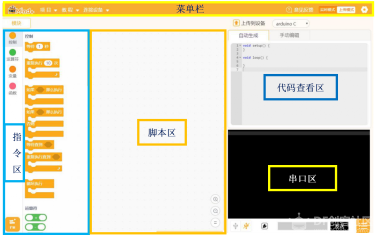

如果把整个软件比作一个舞台的话，那么不同区域的功能是什么呢？

首先看一下菜单栏：它是用来设置软件的区域，这里就是整个“舞台”的幕后啦，没有菜单栏的帮助，连上台表演的机会都没有。那么“舞台”的幕后都有什么呢？

- “项目”菜单可以新建项目、打开项目、保存项目。
- “教程”菜单在初步使用时可以在这里找到想要的教程和示例程序。
- “连接设备”菜单能检测到连接的设备，并且可以选择连接或是断开设备。
- “上传模式/实时模式”按钮切换程序执行的模式。
- “设置”按钮用于设置软件主题、语言、学习基本案例，在线或加入交流群进行咨询。
- 指令区：这里是“舞台”的“道具”区，为了完成各种眼花缭乱的动作，需要很多不同的道具组合。在“扩展”里，可以选择更多额外的道具，支持各种硬件编程。
- 脚本区：这里就是“舞台表演”的核心啦，所有的“表演”都会按照“脚本区”的指令行动，这里是大家都能看得懂的图形化编程。拖拽指令区的指令就能在此编写程序。
- 代码查看区：如果想弄清楚“脚本区”图形化指令的代码究竟是啥，这里是个好地方。
- 串口区：想知道“表演”的效果如何，那必须要和“观众”互动啦。这里能显示下载状况，比如可以看到程序有没有成功下载，哪里出错了；程序运行状况；还能显示串口通信数据，也就是说，如果你的Arduino UNO板外接了一个声音传感器，那么你就可以看到在这里显示的声音数值大小。这里还有：串口开关、滚屏开关、清除输出、波特率口、串口输入框、输出格式控制。

如果你不知道利用Mind+、Arduino Uno入门套件可以实现哪些功能，赶紧去看后面的教程吧！相信你会获得更多的灵感。