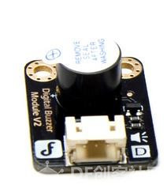
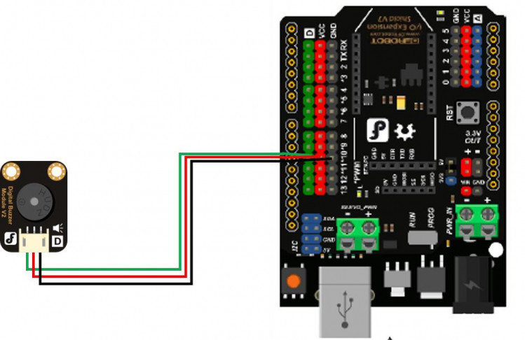
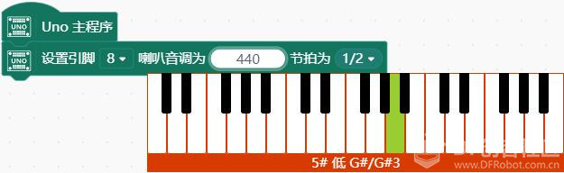
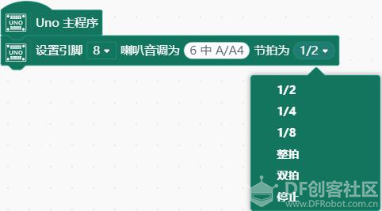
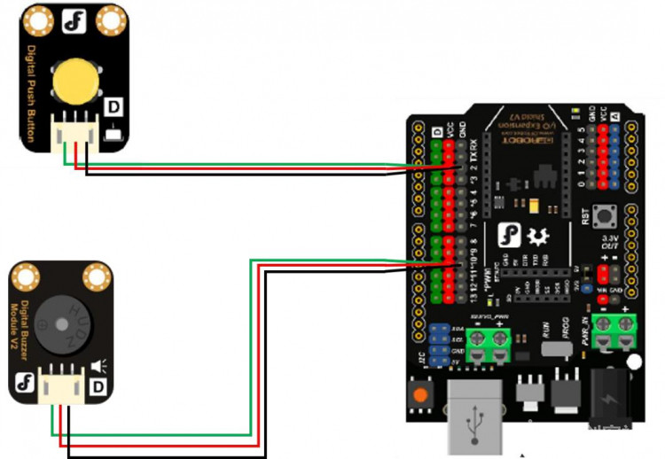
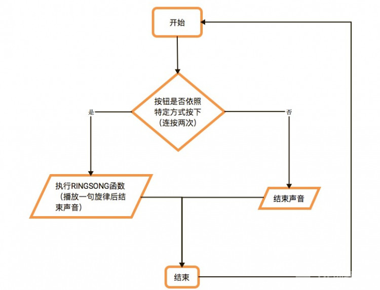

# 项目七 创意门铃

说到门铃，都会想起自家门铃“叮咚”的响声。制作一个门铃，需要一个能够发出声音的电子原件——蜂鸣器。

蜂鸣器可以依照设定的频率发出不同音高的声音。日常生活中蜂鸣器的应用非常广泛，比如刷公交卡时滴滴的提示音，警车，救护车等发出的警报声。

这个项目中，我们也要做门铃。与普通门铃不同的是，这个门铃可以按照你的想法来工作，比如门铃可以播放一段音乐，或者只有当门外的人连按两次时，门内的人才会被告知。你还可以再添加一些新奇的想法，快来试试吧！

## 学习目标

元件

- 蜂鸣器
- 按钮

Mind+ 程序模块

- 数字输入
- 条件判断

## 任务 1 让蜂鸣器发声

### 1.硬件连接

蜂鸣器—8。注意插线时的颜色对应。

### 2.程序编写

可通过设置引脚8喇叭音调指令，让蜂鸣器发声。 具体可更改的参数有音调和节拍。

## 任务 2 制作简易门铃

### 1.实现功能

按下按钮，蜂鸣器发出“叮咚”声。

### 2.硬件连接

按钮—3；蜂鸣器—8。注意插线时的颜色对应。

### 3.程序编写

## 课后作业

通过前六个项目的学习，你大概已经熟悉 Arduino 的硬件连接以及 Mind+ 的模块化编程了。

从本节开始，我们将增加课后作业一项，给出任务要求和思路，但是不提供连接方式和程序。程序需要由你自己来完成了，相信你能够做到！

制作一个音乐门铃：每次按下按钮，播放一句旋律。制作一个暗号门铃：用户依照特定方式按按钮（如一秒内按两次），门铃才会响。

### 思路解析

- 如何检测按键是否按特定方式按下（以 1 秒内 2 次按下为例）？

为了检测一秒内按键是否正好按下两次，不是数秒内，也不是一次或三次。在准备工作上，我们需要有一个 millis 函数来计时一秒，还需要有一个变量 times 来计次数。此外，在编程思路上，我们还需要考虑什么时候开始计时，不妨设为第一次检测到按键按下时；什么时候结束计时，即一秒之后；在这段时间内，我们需要反复检测（循环检测）按键是否按下并记录次数。若一秒内正好按下两次，则符合要求，可进行相应反馈；否则，反复进行上述检测。

- 如何使蜂鸣器播放一句旋律？

如果要播放一句较长的旋律，将每个音写成“叮咚”的播放形式无疑是很繁琐的。不难发现，我们要播放的音只有七个，只是重复和不同的组合而已，所以，怎样能使编程简化呢？在上面的程序中，我们每次都要获取 tonelist 中的某一项，而我们不妨将这些项写成一个 xxx 数组，用一个循环函数，每次获取 xxx 数组中的某一项对应的声音并播放，这样代码就简洁了许多。