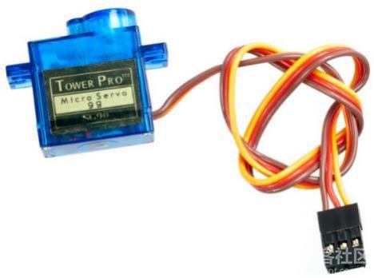
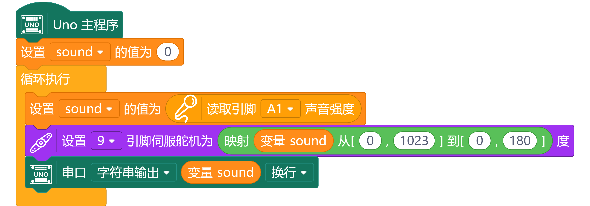
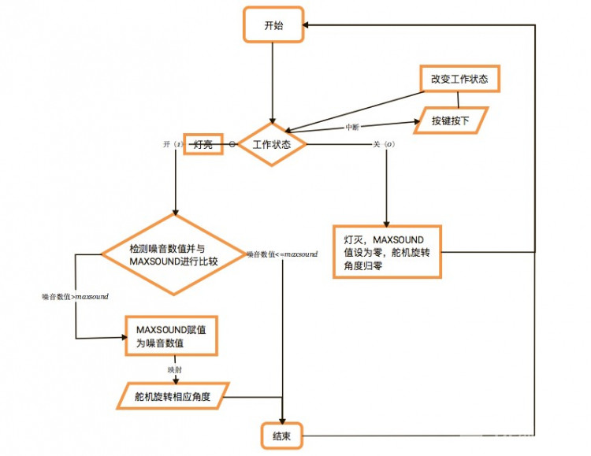
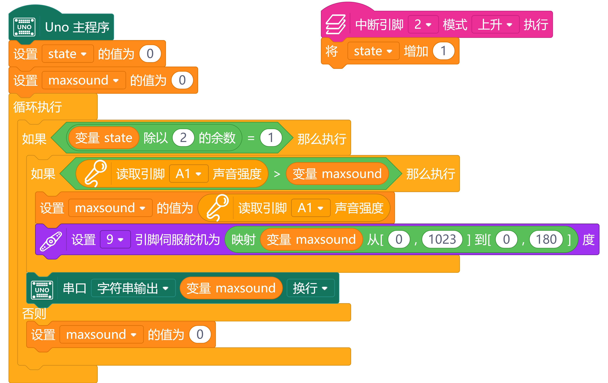

# 项目九 噪音计

生活中我们可以看到一些仪器上指针——时钟、电压表、电流表、汽车上的转速表……

Arduino 套件中也有一个元件可以模拟指针，它就是舵机。

 

- 舵机是由直流电机、减速齿轮组、传感器和控制电路组成的一套自动控制系统
- 通过发送信号，指定输出轴旋转角度
- 套件中舵机最大旋转角度：180° 

这是 Mind+ 软件中控制舵机的程序块：


## 学习目标： 

1． 元件    

- 舵机
- 模拟声音传感器
- 按钮

2．Mind+ 程序模块

- 设置引脚伺服舵机
- 读取引脚声音强度
- 映射
- 变量
- 串口输出

3．程序设计

- 顺序结构
- 循环结构
- 条件判断 

## 任务 1——制作一个噪音计 

### 实现功能

根据噪音的大小，使舵机实时转动到不同位置。

### 思路解析

声音传感器读到的是模拟量，模拟量的范围是 0 到 1023。假定舵机的最大角度是 180°，那么，如果声音传感器读到的值是 0，那么舵机就会转动到 0°；如果声音传感器读到的值是 1023，那么舵机就会转动到 180°。这里就可以使用 Arduino 的 map 函数来实现。
    
```arduino
map(analogRead(A1), 0, 1023, 0, 180)
```

### 硬件连接

舵机—9；模拟声音传感器—A1。注意插线时的颜色对应（黄色对应绿色）。 

### 程序编写

 


## 任务 2——探测最大噪音 

### 实现功能

探测噪音的最大值。用户按下按键后开始工作，记录最大值，舵机转动到指示位置。

再次按下按键停止记录，舵机回到初始位置。

### 思路解析



这里有两点需要注意：

一、如何使按键随时改变工作状态？需要用到中断函数 。

在这个程序中，我们主要需要用一个 state 变量来判断工作状态，若 state 值为 1（即开）各部分按要求工作，若 state 值为 0（即关）则不记录噪音值，舵机归零。

在工作过程中我们还需随时检测按键有没有被按下以改变 state 的值；噪音计和舵机的工作状态与按键状态是两个可以独立运行的部分（没有什么明显的逻辑关系语句可以把两个部分建立联系）。

因此，我们考虑用中断函数，即在工作或停止工作过程中随时检测按键状态（在用按键控制复杂的元件的开关状态时经常使用中断函数）。

二、如何统计最大值？需要用到变量。

在这个程序中，我们需要一个变量来记录噪音值，这个变量的初始值为 0。

当本次循环测量的噪音值大于噪音变量的值时，噪音变量就更新为本次循环测量到的值，并把舵机转到相应位置。

当本次循环测量的噪音值小于或等于噪音变量的值时，不做任何动作。

### 硬件连接

按钮模块—2；舵机—9；模拟声音传感器—A1。注意插线时的颜色对应。 

### 程序编写

 

利用这个小工具，大家来比试下谁的嗓门大吧！
