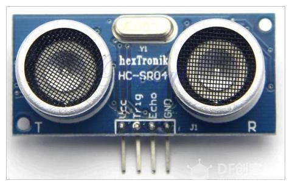
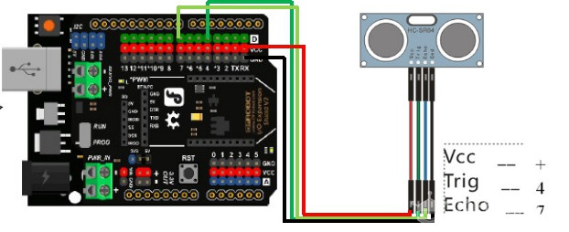

# 项目十一 另类电子琴

## 学习目标：

1． 元件

- 红外遥控模块（红外遥控器，红外线接收传感器）
- LED 模块

2．Mind+ 程序模块    

- 设置红外编码的值    
- 读取引脚红外接收值
- 变量
- 串口输出

3．程序设计

- 顺序结构
- 循环结构
- 条件判断

电子琴想必大家都见过，但是，你是否玩过我们即将介绍的另类电子琴呢？这个电子琴里有一个重要的元件——超声波测距仪。

超声波测距仪：

1. 超声波是一种振动频率高于声波的机械波，具有频率高、波长短、绕射现象小，特别是方向性好、能够成为射线而定向传播等特点。
2. 由于超声波指向性强，能量消耗缓慢，在介质中传播的距离较远，因而超声波经常用于距离的测量，如测距仪和物位测量仪等都可以通过超声波来实现。
3. 测距原理：通过超声波发射装置发出超声波，根据接收器接到超声波时的时间差就可以知道距离了。超声波发射器向某一方向发射超声波，在发射时刻的同时开始计时，超声波在空气中传播，途中碰到障碍物就立即返回来，超声波接收器收到反射波就立即停止计时。 超声波在空气中的传播速度为 340m/s，根据计时器记录的时间t，就可以计算出发射点距障碍物的距离(s)，即：s=340t/2。

下面这段程序，能够将测到的距离存储到一个变量里，并通过串口显示。

## 任务 1——制作另类电子琴

### 实现功能

根据距离变化发出不同的音

### 硬件连接

蜂鸣器—8；超声波—（下图）

针脚接线VCC5VTrig数字口#4（发射端）Echo数字口#7（接收端）GNDGND

## 程序编写课后作业

1．制作一个电子琴：使它发出更多的音