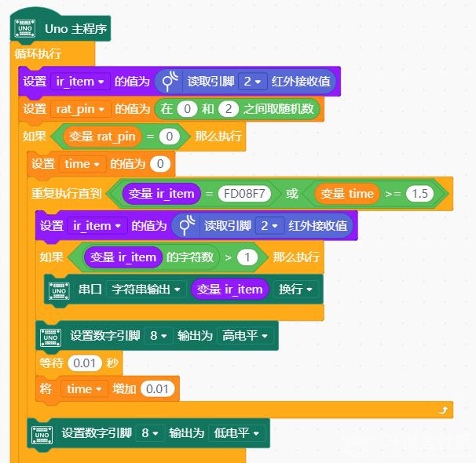
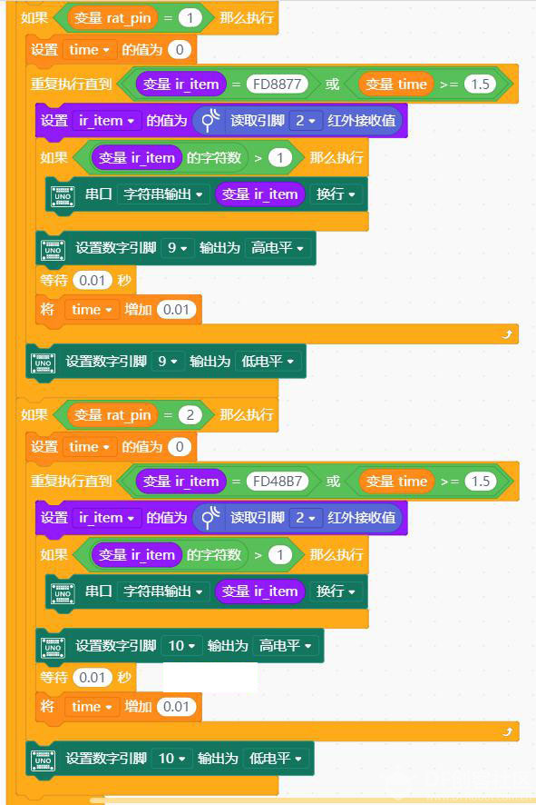
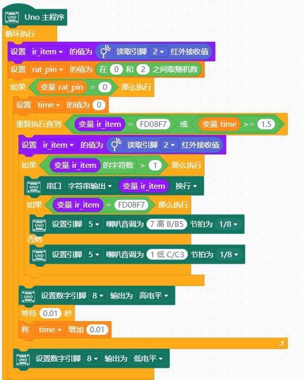
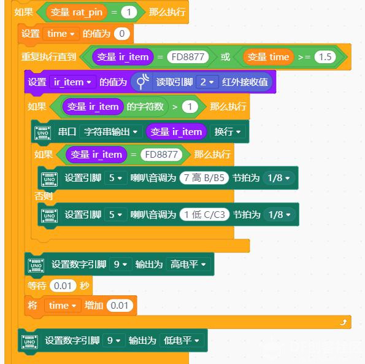
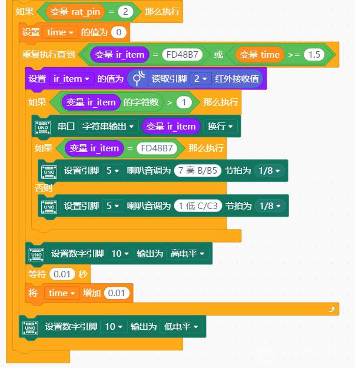

# 项目十四 打地鼠游戏

## 学习目标

1．元件

- 红外接收模块
- LED
- 蜂鸣器

2．Mind+ 程序模块 

- 设置数字引脚输出
- 读取引脚红外接收值
- 设置引脚喇叭音调
- 串口输出
- 变量

3．程序设计

- 顺序结构
- 循环结构
- 条件循环

在我的同龄人中，几乎所有人都玩过一个很有意思的游戏，它叫打地鼠。现在我将这个游戏介绍给你。在你的面前有五六个小洞，洞的里面藏着地鼠。它们会时不时地蹿出来，企图去周围的庄稼里偷吃。这时你就要用手中的小锤子把它们敲回洞里去，以免庄稼受到伤害。一开始它们一只一只地出现，到了后来，它们越来越猖狂，两三只同时往外冒，考验你的反应速度的时候到了……

## 任务 1——打地鼠初步

### 实现功能

使用套件中的 3 个 LED 灯代表 3 个洞，当灯亮时代表有地鼠从洞中钻出。让遥控器上的 3 个按键对应三个洞，按下按键即代表用锤子砸向哪个洞。

本任务中要求完成简单的打地鼠游戏 —— 一次出现一只地鼠，玩家要在规定的时间内按下相应按键。由于这仅仅是一个初步的游戏，所以即使玩家没有在规定的时间内按下相应按键，游戏还是会继续进行——当前亮着的灯熄灭，又有新的灯亮起。

### 硬件连接

3 个 LED—8, 9, 10；红外接收模块—2

### 程序编写

程序中使用遥控器上的1、2、3按键依次控制8、9、10引脚。

## 任务 2——打地鼠进阶

### 实现功能

加入声音，打中高音，打错低音 。

在打地鼠初步的游戏中，你可能会发现，有时候，明明按下了对的按键，但是对应的 LED 灯还是亮着的。这很有可能是因为，两次生成的随机数是一样的。也就是说，在你按下按键后，灯其实熄灭了，但是进入了下一轮循环后又立刻亮了起来。对于这个问题，有两种解决办法，一种是在程序的末尾加一个延时的模块，让所有灯保持熄灭状态一段时间，这样玩家就能够注意到下一轮即将开始。

还有一种办法是，将蜂鸣器与主控板连接，当玩家打中地鼠，就让蜂鸣器播放一个很短的音，如果没打中，就播放另外一个音，以此达到向玩家反馈结果的目的。

这两种方法都能够达到目的，也有自己的优缺点，用哪一种，请你们自己做决定吧。 

### 硬件连接

3 个 LED—8, 9, 10；蜂鸣器—5;红外接收模块—2

### 程序编写

蜂鸣器的音高是通过频率进行调节的，我们实现了让蜂鸣器根据玩家设定的频率播放不同声音的功能。不足之处在于，播放出来的声音不是很好听。不过，我们至少可以达到播放不同音高的声音以提醒玩家的目的了。

## 课后作业

### 实现功能

加入闯关计分功能，关卡数和分数在液晶屏上显示

### 硬件连接

在任务 2 的硬件连接基础上增加液晶显示屏模块，连接方式参考项目十二（硬件连接）

### 程序编程

参考本节任务 2 中的程序