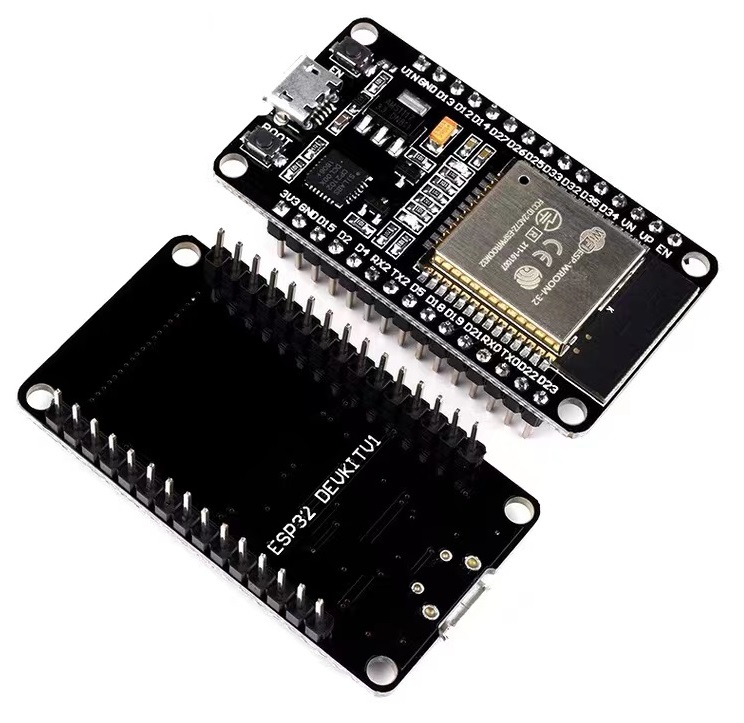
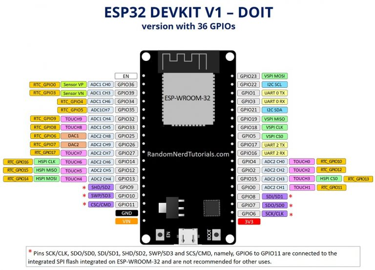

## ESP32 Devkit V1 Introduction

If you are playing with ESP32 development boards, you will find the most popular, cheap, and easy to get one is the ESP32 Devkit V1. Maybe you even didn't pay attention to that. But while you check your board with below picture, you will find I'm right!

That ESP32 is sell about 20RMB, that equal to 3 USD, in China, even some seller included shiping fee. Of course, I means free shipping in China range.

I dont't know who the original designer of that board, seems it not from espressif offical, their design is different from that one.

That maybe the reason why this develepment board is so popular, but we can't find the detail technical information about it. Looks like it supose all of us know it. If you want to got the deep looking inside of it, it will be hard for us to find the detail information. We don't know does the document is same as the board we bought.

So in this article, I will try to give you some detailed technical information about that board, including schematic, pinout,  dimension and more. Hope it can help you to get the deep understanding of that board.

## How to identify the ESP32 Devkit V1

The main sign of the ESP32 Devkit V1 is the following:

- The ESP module is **ESP-WROOM-32**. If you are interested in what ESP WROOM-32 is, you can check section [ESP32 Module](#esp32-module).
- The text on back of the board is **ESP32 Devkit V1**.
- There are two big devices on each side of the USB connector. One is the 4 pins LDO, the other one is the UARt to USB converter Chip.
- Interestingly, there is a yellow capacitor on the board. Even they are manufactured by different manufacturer.

If your tested board with above characteristics, you can be sure that you are using the ESP32 Devkit V1.

If you need further confirmation, you can check the pinout of the board, I will show you the picture later. Briefly, there are 15 pins on each side of the board.

## ESP32 Module
If you don't have interesting about ESP32 module currently, you can skip this section. You can read it while you need.

Befor introducing ESP32 devkit V1, I will try to introduce the ESP32 module on it first. As I said before, the ESP32 devkit V1 is using ESP32-WROOM-32 module. Maybe you will find some develop board is using differnt ESP32 module. So what are the differences between them?

I don't want make this article too long, so I will only introduce the ESP32-WROOM-32 module.

- CPU of ESP32-WROOM-32 is Xtensa® dual-core 32-bit LX6. That is the different from ESP8266 serial module.
- PSRAM of ESP32-WROOM-32 is 0MB, while the PSRAM of ESP32-WROVER-32 is 8MB.

And then what the other letters after 32 stand for? For example, the **ESP32-WROOM-32D-N4**.

- **U**: If there is a letter **U** after -32, this means the module is with IPEX connection on the board. You need to connect a wifi antenna to the module. Otherwise, it is with PCB wifi anntenna.
- **D**: Seems this letter stands for different Certification of the module. Such as Wi-Fi Certification, Bluetooth Certification, RF Certification, etc. So 32D or 32E is the same for testing.
- **N**: Operation temperature is -40°C~85°C. While **H** is -40°C~105°C.
- **4**: The Flash is 4MB. While **16** means the flash is 16MB.

So we can find ESP32 Devkit V1 is using ESP32-WROOM-32 module, with PCB Wifi antenna, normal operation temperature range -40°C~85°C, and the Flash is 4MB. Which is the chipest one.

## ESP32 Chip Performance

You can also skip this section at the beginning.

Then, let's talk about the chip performance of ESP32. It decides the performance of the board.

| Series      |               | ESP32                                                |
| ----------- | ------------- | ---------------------------------------------------- |
| CPU         |               | Xtensa® dual-core 32-bit LX6                        |
| Core        |               | 2                                                    |
| Freq. (MHz) |               | 240                                                  |
| Voltage (V) |               | 3.0 ~ 3.6                                            |
| Temp. (℃)  |               | -40 ℃ ~ 85 ℃                                       |
| Wireless    | Wi-Fi         | IEEE 802.11 b/g/n; 2.4 GHz; HT20/40; up to 150 Mbps |
|             | Bluetooth     | BR/EDR + Bluetooth LE v4.2                           |
| Memory      | SRAM (KB)     | 520                                                  |
|             | ROM (KB)      | 448                                                  |
|             | RTC SRAM (KB) | 16                                                   |
|             | Flash (MB)    | 4                                                    |
|             | PSRAM (MB)    | 0                                                    |
| Peripherals | ADC           | 2*12-bit ADC, 18 channels                            |
|             | DAC           | 2*8-bit DAC                                          |
|             | Touch         | 10                                                   |
|             | Temp Sensor   | 0                                                    |
|             | GPIO          | 26                                                   |
|             | UART          | 3                                                    |
|             | SPI           | 4                                                    |
|             | SDIO HOST     | 1                                                    |
|             | SDIO SLAVE    | 1                                                    |
|             | I2C           | 2                                                    |
|             | I2S           | 2                                                    |
|             | RMT           | 1*8 channels                                         |
|             | LED PWM       | 2*8 channels                                         |
|             | MCPWM         | 2                                                    |
|             | USB OTG       | 0                                                    |
|             | Hall          | 1                                                    |
|             | Ethernet      | 1                                                    |
|             | TWAI          | 1                                                    |
|             | JTAG          | YES                                                  |
|             | Camera        | 1*DVP 8/16-bit                                       |

## ESP32 Devkit V1 Schematic

Now, I think you should have an overview of the ESP32 module, so I will show you the schematic of the ESP32 Devkit V1.

ESP32 DEVKIT DOIT

ESP32 DEVKIT DOIT开发板，由于价格便宜及性能稳定，我们大部分实验将使用该开发板。但是其他使用ESP-WROOM-32芯片的ESP32开发板与我们介绍的方法兼容。

ESP32 DEVKIT DOIT开发板如下

背面标识ESP32 DEVKITV1

原理图链接

https://github.com/Nicholas3388/LuaNode

配置

| **Microcontroller** | ESP32  |
| ------------------------- | ------ |
| **Frequency**       | 240MHz |
| **Flash**           | 4MB    |
| **RAM**             | 320KB  |
| **Vendor**          | DOIT   |

## ESP32引脚指南

使用ESP32开发板首先需了解其引脚的分布及对应编号。ESP32 Devkit V1有两种版本，32引脚和36引脚的版本。两种版本对应的引脚名称如下：

**具有30个GPIO的版本**

**具有36个GPIO的版本**

!!! tip
    开发板上印的引脚编号为D0, D1, ...，它代表的含义就是GPIO0, GPIO1, ...

要了解有关ESP32 GPIO的更多信息，请阅读我们的GPIO参考指南： ESP32引脚参考。

## 软件开发环境

ESP32可以在不同的编程环境中进行编程。您可以使用：

- Arduino IDE
- Espressif IDF（IoT开发框架）
- Micropython
- JavaScript
- LUA
- …
