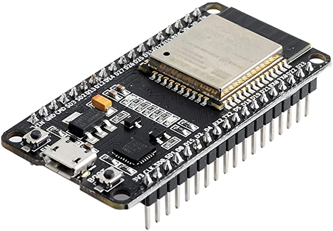
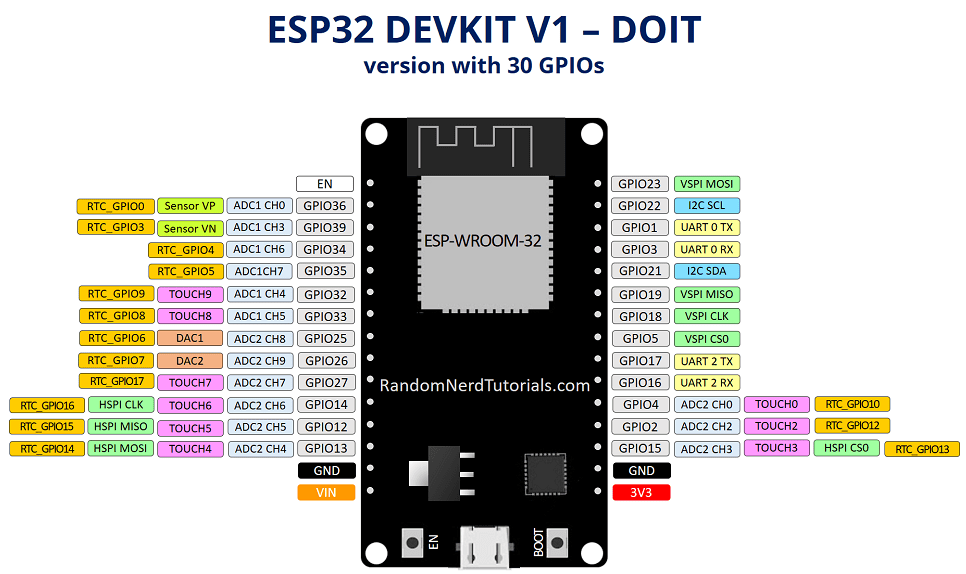
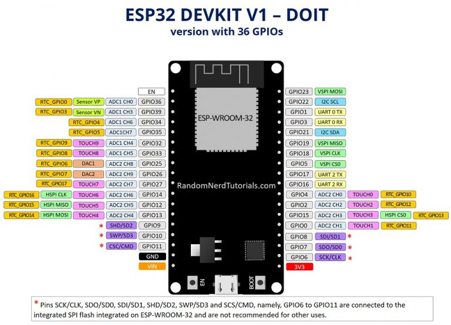

ESP32是它ESP8266的后继产品，显著的区别是ESP32拥有双核，及支持蓝牙。ESP32与ESP8266之间的差异： [ESP32与ESP8266 –优缺点](https://makeradvisor.com/esp32-vs-esp8266/)

## ESP32 技术指标

关于ESP32关键参数：

- ESP32是双核，这意味着它有2个处理器。
- 具有Wi-Fi和内置蓝牙。
- 运行32位程序。
- 时钟频率可以高达240MHz，并且具有512 kB RAM。
- 该特定板有30或36个引脚，每行15个。
- 它还具有多种可用的外设，例如：电容式触摸，ADC，DAC，UART，SPI，I2C等。
- 它带有内置霍尔效应传感器和内置温度传感器。

## ESP32 DEVKIT DOIT

ESP32 DEVKIT DOIT开发板，由于价格便宜及性能稳定，我们大部分实验将使用该开发板。但是其他使用ESP-WROOM-32芯片的ESP32开发板与我们介绍的方法兼容。

ESP32 DEVKIT DOIT开发板如下

背面标识ESP32 DEVKITV1

原理图链接

https://github.com/Nicholas3388/LuaNode

配置

| **Microcontroller** | ESP32                                                        |
| ------------------- | ------------------------------------------------------------ |
| **Frequency**       | 240MHz                                                       |
| **Flash**           | 4MB                                                          |
| **RAM**             | 320KB                                                        |
| **Vendor**          | DOIT |

## ESP32引脚指南

使用ESP32开发板首先需了解其引脚的分布及对应编号。ESP32 Devkit V1有两种版本，32引脚和36引脚的版本。两种版本对应的引脚名称如下：

**具有30个GPIO的版本**

**具有36个GPIO的版本**

!!! tip
    开发板上印的引脚编号为D0, D1, ...，它代表的含义就是GPIO0, GPIO1, ...

要了解有关ESP32 GPIO的更多信息，请阅读我们的GPIO参考指南： ESP32引脚参考。

## 软件开发环境

ESP32可以在不同的编程环境中进行编程。您可以使用：

- Arduino IDE
- Espressif IDF（IoT开发框架）
- Micropython
- JavaScript
- LUA
- …

