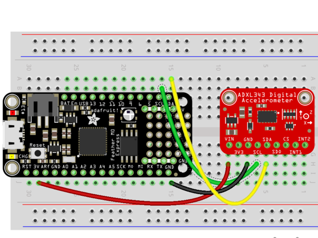

# 总览


ADXL345是一款低功耗，三轴MEMS加速度计模块，具有I2C和SPI接口。这些模块的Adafruit Breakout板载板载3.3v电压调节和电平转换功能，使其易于与Arduino等5v微控制器接口。

ADXL345具有4种灵敏度范围，从+/- 2G到+/- 16G。它支持10Hz至3200Hz的输出数据速率。

[ADXL345数据表](http://www.analog.com/static/imported-files/data_sheets/ADXL345.pdf)

## 工作原理

## MEMS-微机电系统

该传感器由硅晶片上的微机械结构组成。该结构由多晶硅弹簧悬挂，当在X，Y和/或Z轴上受到加速时，多晶硅弹簧可以使该结构在任何方向上平稳偏转。挠曲会导致固定板和连接到悬挂结构的板之间的电容发生变化。每个轴上的电容变化都会转换为与该轴上的加速度成比例的输出电压。

https://learn.adafruit.com/assets/6359

# 组装与接线

https://learn.adafruit.com/assets/6362

评估板带有所有预焊接的表面安装组件。随附的接头板可以焊接，以便在面包板上或带有0.1英寸连接器的情况下方便使用。但是，对于承受极高加速度，冲击或振动的应用，建议使用锁定连接器或直接焊接。

#  部件：

| [](https://learn.adafruit.com/assets/6363) | 放置标题：如有必要，将页眉切成适当的大小。然后将插头（长针向下）插入面包板，以稳定其焊接性。 |
| ------------------------------------------------------------ | ------------------------------------------------------------ |
| [](https://learn.adafruit.com/assets/6364) | 添加分组讨论：对齐分线板，并将其放在面包板上的排针上。       |
| [](https://learn.adafruit.com/assets/6365) | 还有焊锡！确保焊接所有引脚以确保良好的电气接触。             |

# I2C接线：

ADXL345分支的I2C地址为0x53。只要每个设备具有唯一的地址，它就可以与其他I2C设备共享I2C总线。I2C通信仅需要4个连接：

- GND->GND
- VIN->+5v
- SDA->SDA (GPIO 21)
- SCL->SCL (GPIO 22)

Adafruit分支具有电平转换和调节电路，因此您可以从3-5V供电，并为i2c使用3V或5V逻辑电平


https://learn.adafruit.com/assets/6366

# 编程和校准

# 安装库：

下载[ADXL345库](https://github.com/adafruit/Adafruit_ADXL345)并安装它。如果尚未安装[Adafruit传感器库，](https://github.com/adafruit/Adafruit_Sensor)则也将需要它。

[本指南](http://learn.adafruit.com/adafruit-all-about-arduino-libraries-install-use)将帮助您完成安装过程。

# 测试：

单击“File->Examples->Adafruit_ADXL345->sensortest”以从库中加载示例。

```c
#include <Wire.h>
#include <Adafruit_Sensor.h>
#include <Adafruit_ADXL345_U.h>

/* Assign a unique ID to this sensor at the same time */
Adafruit_ADXL345_Unified accel = Adafruit_ADXL345_Unified(12345);

void displaySensorDetails(void)
{
  sensor_t sensor;
  accel.getSensor(&sensor);
  Serial.println("------------------------------------");
  Serial.print  ("Sensor:       "); Serial.println(sensor.name);
  Serial.print  ("Driver Ver:   "); Serial.println(sensor.version);
  Serial.print  ("Unique ID:    "); Serial.println(sensor.sensor_id);
  Serial.print  ("Max Value:    "); Serial.print(sensor.max_value); Serial.println(" m/s^2");
  Serial.print  ("Min Value:    "); Serial.print(sensor.min_value); Serial.println(" m/s^2");
  Serial.print  ("Resolution:   "); Serial.print(sensor.resolution); Serial.println(" m/s^2");  
  Serial.println("------------------------------------");
  Serial.println("");
  delay(500);
}

void displayDataRate(void)
{
  Serial.print  ("Data Rate:    "); 
  
  switch(accel.getDataRate())
  {
    case ADXL345_DATARATE_3200_HZ:
      Serial.print  ("3200 "); 
      break;
    case ADXL345_DATARATE_1600_HZ:
      Serial.print  ("1600 "); 
      break;
    case ADXL345_DATARATE_800_HZ:
      Serial.print  ("800 "); 
      break;
    case ADXL345_DATARATE_400_HZ:
      Serial.print  ("400 "); 
      break;
    case ADXL345_DATARATE_200_HZ:
      Serial.print  ("200 "); 
      break;
    case ADXL345_DATARATE_100_HZ:
      Serial.print  ("100 "); 
      break;
    case ADXL345_DATARATE_50_HZ:
      Serial.print  ("50 "); 
      break;
    case ADXL345_DATARATE_25_HZ:
      Serial.print  ("25 "); 
      break;
    case ADXL345_DATARATE_12_5_HZ:
      Serial.print  ("12.5 "); 
      break;
    case ADXL345_DATARATE_6_25HZ:
      Serial.print  ("6.25 "); 
      break;
    case ADXL345_DATARATE_3_13_HZ:
      Serial.print  ("3.13 "); 
      break;
    case ADXL345_DATARATE_1_56_HZ:
      Serial.print  ("1.56 "); 
      break;
    case ADXL345_DATARATE_0_78_HZ:
      Serial.print  ("0.78 "); 
      break;
    case ADXL345_DATARATE_0_39_HZ:
      Serial.print  ("0.39 "); 
      break;
    case ADXL345_DATARATE_0_20_HZ:
      Serial.print  ("0.20 "); 
      break;
    case ADXL345_DATARATE_0_10_HZ:
      Serial.print  ("0.10 "); 
      break;
    default:
      Serial.print  ("???? "); 
      break;
  }  
  Serial.println(" Hz");  
}

void displayRange(void)
{
  Serial.print  ("Range:         +/- "); 
  
  switch(accel.getRange())
  {
    case ADXL345_RANGE_16_G:
      Serial.print  ("16 "); 
      break;
    case ADXL345_RANGE_8_G:
      Serial.print  ("8 "); 
      break;
    case ADXL345_RANGE_4_G:
      Serial.print  ("4 "); 
      break;
    case ADXL345_RANGE_2_G:
      Serial.print  ("2 "); 
      break;
    default:
      Serial.print  ("?? "); 
      break;
  }  
  Serial.println(" g");  
}

void setup(void) 
{
#ifndef ESP8266
  while (!Serial); // for Leonardo/Micro/Zero
#endif
  Serial.begin(115200);
  Serial.println("Accelerometer Test"); Serial.println("");
  
  /* Initialise the sensor */
  if(!accel.begin())
  {
    /* There was a problem detecting the ADXL345 ... check your connections */
    Serial.println("Ooops, no ADXL345 detected ... Check your wiring!");
    while(1);
  }

  /* Set the range to whatever is appropriate for your project */
  accel.setRange(ADXL345_RANGE_16_G);
  // accel.setRange(ADXL345_RANGE_8_G);
  // accel.setRange(ADXL345_RANGE_4_G);
  // accel.setRange(ADXL345_RANGE_2_G);
  
  /* Display some basic information on this sensor */
  displaySensorDetails();
  
  /* Display additional settings (outside the scope of sensor_t) */
  displayDataRate();
  displayRange();
  Serial.println("");
}

void loop(void) 
{
  /* Get a new sensor event */ 
  sensors_event_t event; 
  accel.getEvent(&event);
 
  /* Display the results (acceleration is measured in m/s^2) */
  Serial.print("X: "); Serial.print(event.acceleration.x); Serial.print("  ");
  Serial.print("Y: "); Serial.print(event.acceleration.y); Serial.print("  ");
  Serial.print("Z: "); Serial.print(event.acceleration.z); Serial.print("  ");Serial.println("m/s^2 ");
  delay(10);
}
```

然后单击编译/上传按钮进行编译并将程序上传到Arduino。您应该看到类似于以下的输出。观察移动开发板时值的变化。


# 校准：

ADXL芯片在工厂已校准至足以满足大多数用途的精度水平。对于要求更高精确度的关键应用，您可能希望自己重新校准传感器。

校准不会改变传感器的输出。但是，它告诉您在每个轴上两个方向上已知的稳定参考力下传感器的输出是什么。知道了这一点，您可以从传感器读数计算出校正后的输出。


## 重力作为校准参考

加速度可以以重力或“ G”为单位进行测量，其中1G表示在地球表面的重力。重力是一个相对稳定的力，可为地面住宅的接地提供方便和可靠的校准参考。

## 校准方法：

要将传感器校准为重力参考，需要确定每个轴与重力拉力轴精确对准时的传感器输出。实验室质量校准使用精密定位夹具。这里描述的方法很简单，仅用一块木头就能获得令人惊讶的好结果。


## 安装传感器：

首先将传感器牢固地安装在模块或盒子上。只要所有侧面成直角，大小都不重要。该材料并不重要，只要它相当坚硬即可。


## 加载校准草图：

加载并运行下面的校准草图。打开串行监视器，然后等待提示。

| [](https://learn.adafruit.com/assets/6465) | 定位块： 将块放置在坚固的平面上，例如坚固的桌子上。在串行监视器中键入一个字符，然后按回车键。草图将在该轴上进行测量并打印结果。 |
| ------------------------------------------------------------ | ------------------------------------------------------------ |
| [](https://learn.adafruit.com/assets/6467) | 重新定位块：旋转块，使桌子的另一侧平坦，然后键入另一个键以测量该轴。 |
| [](https://learn.adafruit.com/assets/6468) | 重复：对块的所有六个侧面重复上述操作，以测量每个轴的正向和负向。 |
| [](https://learn.adafruit.com/assets/6469) | *（暗示：）**对于被分线板和/或电线阻塞的侧面，在读取数据的同时将模块向上压在桌子底部。* |

## 校准结果：

一旦对所有六个面进行了采样，串行监视器中打印的值将代表每个轴上+/- 1G力的实际测量值。这些值可用于重新缩放读数，以提高准确性。

## 校准草图：

```c
#include <Wire.h>
#include <Adafruit_Sensor.h>
#include <Adafruit_ADXL345_U.h>

/* Assign a unique ID to this sensor at the same time */
Adafruit_ADXL345_Unified accel = Adafruit_ADXL345_Unified(12345);


float AccelMinX = 0;
float AccelMaxX = 0;
float AccelMinY = 0;
float AccelMaxY = 0;
float AccelMinZ = 0;
float AccelMaxZ = 0;


void setup(void) 
{
  Serial.begin(9600);
  Serial.println("ADXL345 Accelerometer Calibration"); 
  Serial.println("");
  
  /* Initialise the sensor */
  if(!accel.begin())
  {
    /* There was a problem detecting the ADXL345 ... check your connections */
    Serial.println("Ooops, no ADXL345 detected ... Check your wiring!");
    while(1);
  }
}

void loop(void)
{
    Serial.println("Type key when ready..."); 
    while (!Serial.available()){}  // wait for a character
    
    /* Get a new sensor event */ 
    sensors_event_t accelEvent;  
    accel.getEvent(&accelEvent);
    
    if (accelEvent.acceleration.x < AccelMinX) AccelMinX = accelEvent.acceleration.x;
    if (accelEvent.acceleration.x > AccelMaxX) AccelMaxX = accelEvent.acceleration.x;
    
    if (accelEvent.acceleration.y < AccelMinY) AccelMinY = accelEvent.acceleration.y;
    if (accelEvent.acceleration.y > AccelMaxY) AccelMaxY = accelEvent.acceleration.y;
  
    if (accelEvent.acceleration.z < AccelMinZ) AccelMinZ = accelEvent.acceleration.z;
    if (accelEvent.acceleration.z > AccelMaxZ) AccelMaxZ = accelEvent.acceleration.z;
  
    Serial.print("Accel Minimums: "); Serial.print(AccelMinX); Serial.print("  ");Serial.print(AccelMinY); Serial.print("  "); Serial.print(AccelMinZ); Serial.println();
    Serial.print("Accel Maximums: "); Serial.print(AccelMaxX); Serial.print("  ");Serial.print(AccelMaxY); Serial.print("  "); Serial.print(AccelMaxZ); Serial.println();

    while (Serial.available())
    {
      Serial.read();  // clear the input buffer
    }
}
```

## 典型校准输出：

下载： [文件](https://learn.adafruit.com/pages/1512/elements/666379/download)

[复制代码](https://learn.adafruit.com/adxl345-digital-accelerometer?view=all#)

```
ADXL345 加速度计校准  准备好时键入键...加速最小值：0.00 0.00 0.00      加速最大值：0.12 0.20 1.14      准备好时键入键...加速最小值：0.00 0.00 0.00      加速最大值：0.12 0.20 1.14      准备好时键入键...加速最小值：0.00 0.00 0.00      加速最大值：0.12 0.20 1.14      准备好时键入键...加速最小值：0.00 0.00 0.00      加速最大值：0.12 0.20 1.14      准备好时键入键...阿塞尔最低金额：0.00 0.00 - 0.24      加速最大值：0.12 1.37 1.14      准备好时键入键...阿塞尔最低金额：0.00 0.00 - 0.24      加速最大值：0.12 1.37 1.14      准备好时键入键...阿塞尔最低金额：0.00 - 1.22 - 0.27      加速最大值：0.12 1.37 1.14      准备好时键入键...阿塞尔最低金额：0.00 - 1.22 - 0.27      加速最大值：0.12 1.37 1.14      准备好时键入键...阿塞尔最低金额：- 1.18 - 1.22 - 0.27      加速最大值：0.12 1.37 1.14      准备好时键入键...
```

校准草图的结果可用于进行两点校准，如下所述： [两点校准](https://learn.adafruit.com/calibrating-sensors/two-point-calibration)

# 图书馆参考

# **构造函数：**

**Adafruit_ADXL345(int32_t sensorID = -1)**

构造ADXL345设备驱动程序对象的实例。“ sensorID”是设备标识符。在每次调用getEvent（）时，它将在sensor_event中返回该值。sensorID对驱动程序或设备的操作没有影响，但是在管理具有多个传感器的系统中的传感器事件时很有用。

# 初始化（）

bool begin(void)

begin（）函数初始化与设备的通信。如果成功连接到ADXL345，则返回值为“ true”。

# **传感器详细信息：**

**无效的getSensor（sensor_t \*）;
**
getSensor（）函数返回有关传感器的基本信息。有关sensor_t结构的详细信息，请参阅Adafruit Sensor Library 的[自述文件](https://github.com/adafruit/Adafruit_Sensor)。


# **获取并设置工作范围：**

void setRange（range_t range）
setRange（）函数设置传感器的操作范围。值越高，测量范围越广。较低的值将具有更高的灵敏度。

有效范围常数是：

- ADXL345_RANGE_16_G
- ADXL345_RANGE_8_G
- ADXL345_RANGE_4_G
- ADXL345_RANGE_2_G (default value)

range_t getRange（void）;
getRange（）函数返回由setRange（）设置的当前操作范围

# **获取和设置数据速率：**

**void setDataRate（dataRate_t dataRate）;
**
setDataRate（）函数设置传感器输出更新的速率。高于100 Hz的速率将显示增加的噪声。低于6.25 Hz的速率将对温度变化更加敏感。有关详细信息，请参见[数据表](http://www.analog.com/static/imported-files/data_sheets/ADXL345.pdf)。

有效数据速率常数为：

**ADXL345_DATARATE_3200_HZ**
**ADXL345_DATARATE_1600_HZ**
**ADXL345_DATARATE_800_HZ**
**ADXL345_DATARATE_400_HZ**
**ADXL345_DATARATE_200_HZ**
**ADXL345_DATARATE_100_HZ**
**ADXL345_DATARATE_50_HZ**
**ADXL345_DATARATE_25_HZ**
**ADXL345_DATARATE_12_5_HZ**
**ADXL345_DATARATE_6_25HZ**
**ADXL345_DATARATE_3_13_HZ**
**ADXL345_DATARATE_1_56_HZ**
**ADXL345_DATARATE_0_78_HZ**
**ADXL345_DATARATE_0_39_HZ**
**ADXL345_DATARATE_0_20_HZ**
**ADXL345_DATARATE_0_10_HZ**（默认值）

**dataRate_t getDataRate（void）;
**getDataRate（）函数返回由setDataRate（）设置的当前数据速率。

# **读取传感器事件：**

void getEvent(sensors_event_t*);

getEvent（）函数以sensor_event的形式返回下一个可用的读数。sensor_event包含传递给构造函数的sensor_id以及来自加速度计的X，Y和Z轴读数。有关sensor_events的更多信息，请参见Adafruit Sensor Library 的[自述文件](https://github.com/adafruit/Adafruit_Sensor)。

******

# Python和CircuitPython

[卡特尼·伦博](https://learn.adafruit.com/users/kattni)

将ADXL343或ADXL345与Python和CircuitPython以及[Adafruit CircuitPython ADXL34x](https://github.com/adafruit/Adafruit_CircuitPython_ADXL34x)模块一起使用很容易。该模块使您可以轻松编写Python代码，以读取突破中的加速度，敲击，运动等信息。

[由于我们的CircuitPython-for-Python兼容性库Adafruit_Blinka，](https://learn.adafruit.com/circuitpython-on-raspberrypi-linux)您可以将此传感器与任何CircuitPython微控制器板或具有GPIO和Python的计算机一起使用。

ADXL343和ADXL345上的引脚排列略有不同，但芯片基本相同。此页面包括每个接线图的不同接线图。除了初始化适当的芯片外，两者的代码都相同！

## CircuitPython微控制器接线

首先，完全按照上一页中的说明接线。这是将ADXL343连接到羽毛M0的示例：

| [](https://learn.adafruit.com/assets/71598) | 连接 **SCL**上的羽毛，以 **SCL**的ADXL343连接 **SDA**的羽毛 **SDA**的ADXL343连接 **GND**的羽毛到 **GND**的ADXL343连接 **3.3V**的羽毛到 **VIN**的ADXL343 |
| ------------------------------------------------------------ | ------------------------------------------------------------ |
|                                                              |                                                              |

下面是将ADXL345连接到Feather M0的示例：

| [](https://learn.adafruit.com/assets/82173) | 连接 **SCL**上的羽毛，以 **SCL**的ADXL345连接 **SDA**的羽毛 **SDA**的ADXL345连接 **GND**的羽毛到 **GND**的ADXL345将羽毛上的**3.3V**连接 到 ADXL345上的**VIN** |
| ------------------------------------------------------------ | ------------------------------------------------------------ |
|                                                              |                                                              |

## Python电脑接线

由于  您可以使用*数十种* Linux计算机/主板，因此我们将展示Raspberry Pi的接线。对于其他平台， [请访问Linux上CircuitPython指南，以了解您的平台是否受支持](https://learn.adafruit.com/circuitpython-on-raspberrypi-linux)。 

下图显示了连接到ADXL343的Raspberry Pi：

| [](https://learn.adafruit.com/assets/71600) | 连接 **SCL**的RPI到 **SCL**的ADXL343连接 **SDA**上的RPI **SDA**的ADXL343连接 **GND**上的RPI **GND**的ADXL343连接 **3.3V**上的RPI **VIN**的ADXL343 |
| ------------------------------------------------------------ | ------------------------------------------------------------ |
|                                                              |                                                              |

下图显示了连接到ADXL345的Raspberry Pi：

| [](https://learn.adafruit.com/assets/82175) | 连接 **SCL**的RPI到 **SCL**的ADXL345连接 **SDA**的RPI到**SDA**的ADXL345连接 **GND**的RPI到**GND**的ADXL345将RPi上的**3.3V**连接 到ADXL345上的**VIN** |
| ------------------------------------------------------------ | ------------------------------------------------------------ |
|                                                              |                                                              |

## 库安装

您需要在CircuitPython板上安装[Adafruit CircuitPython ADXL34x](https://github.com/adafruit/Adafruit_CircuitPython_ADXL34x)库。

首先，请确保 为您的电路板运行 [最新版本的Adafruit CircuitPython](https://learn.adafruit.com/welcome-to-circuitpython/installing-circuitpython)。

接下来，您需要安装必要的库以使用硬件-仔细按照以下步骤从[Adafruit的CircuitPython库捆绑包中](https://circuitpython.org/libraries)查找和安装这些库 。我们的CircuitPython入门指南上有 [一个很棒的页面，介绍如何安装库包](https://learn.adafruit.com/welcome-to-circuitpython/circuitpython-libraries)。

对于Trinket M0或Gemma M0等非表达板，您需要从捆绑包中手动安装必要的库：

- **adafruit_adxl34x.mpy**
- **adafruit_bus_device**

在继续之前，请确保您开发板的lib文件夹或根文件系统已 复制了**adafruit_adxl34x.mpy** 和 **adafruit_bus_device** 文件和文件夹 。

接下来， [连接到开发板的串行REPL， ](https://learn.adafruit.com/micropython-basics-how-to-load-micropython-on-a-board/serial-terminal)以便您在CircuitPython **>>>**提示符下。

## ADXL34x库的Python安装

您需要安装**Adafruit_Blinka**库，该库在Python中提供了CircuitPython支持。这可能还需要在您的平台上启用I2C并验证您正在运行[Python3](https://learn.adafruit.com/circuitpython-on-raspberrypi-linux)。 [由于每个平台都有所不同，并且Linux经常更改，请访问Linux上的CircuitPython指南以使您的计算机准备就绪](https://learn.adafruit.com/circuitpython-on-raspberrypi-linux)！

完成后，从命令行运行以下命令：

- `sudo pip3 install adafruit-circuitpython-adxl34x`

如果您的默认Python是版本3，则可能需要运行“ pip”。只要确保您不尝试在Python 2.x上使用CircuitPython，就不支持它！

## CircuitPython和Python的用法

为了演示突破的用法，我们将对其进行初始化，并从开发板的Python REPL中读取加速度以及更多信息。

运行以下代码以导入必要的模块并创建I2C对象：

下载： [文件](https://learn.adafruit.com/pages/17564/elements/3042564/download)

[复制代码](https://learn.adafruit.com/adxl345-digital-accelerometer?view=all#)

```python
导入时间进口板进口业务导入adafruit_adxl34x i2c = busio 。I2C （板。SCL ，板。SDA ）
```

如果您使用的是**ADXL343**，请运行以下命令以使用**中断**初始化I2C连接：

下载： [文件](https://learn.adafruit.com/pages/17564/elements/3042566/download)

[复制代码](https://learn.adafruit.com/adxl345-digital-accelerometer?view=all#)

```python
加速度计= adafruit_adxl34x 。ADXL343 （i2c ）
```

如果您使用的是**ADXL345**，请运行以下命令以使用**中断**初始化I2C连接：

下载： [文件](https://learn.adafruit.com/pages/17564/elements/3042567/download)

[复制代码](https://learn.adafruit.com/adxl345-digital-accelerometer?view=all#)

```python
加速度计= adafruit_adxl34x 。ADXL345 （i2c ）
```

现在，您可以使用以下任何一种方法从突破中读取值并启用其功能：

- **加速度** -x，y和z轴上的加速度值
- **enable_motion_detection-**启用运动检测。允许设置阈值。阈值默认为18。
- **enable_tap_detection-**启用点击检测。允许单击或双击检测。
- **enable_freefall_detection-**启用自由落体检测。允许设置阈值和时间。阈值默认为10，时间默认为25。
- **事件** -用于在启用运动检测，敲击检测和自由落体检测时读取事件。需要指定您尝试读取的事件。

要打印加速度值：

下载： [文件](https://learn.adafruit.com/pages/17564/elements/3042570/download)

[复制代码](https://learn.adafruit.com/adxl345-digital-accelerometer?view=all#)

```python
而True ：     打印（加速度计。加速度）    时间。睡眠（0.2 ）
```

[](https://learn.adafruit.com/assets/82176)

这是使用CircuitPython从ADXL343和ADXL345读取加速度值的全部内容！

## 完整示例代码

下载： [Project Zip ](https://learn.adafruit.com/pages/17564/elements/3042560/download?type=zip)或 [adxl34x_simpletest.py ](https://learn.adafruit.com/pages/17564/elements/3042560/download)| [ 在Github上查看](https://github.com/adafruit/Adafruit_CircuitPython_ADXL34x/blob/master/examples/adxl34x_simpletest.py)

[复制代码](https://learn.adafruit.com/adxl345-digital-accelerometer?view=all#)

```
导入时间进口板进口业务导入adafruit_adxl34x i2c = busio 。I2C （板。SCL ，板。SDA ） ＃适用于ADXL343加速度计= adafruit_adxl34x 。ADXL343 （i2c ）＃适用于ADXL345＃加速度计= adafruit_adxl34x.ADXL345（i2c） 而True ：     打印（“％f％f％f” ％加速度计。加速度）     时间。睡眠（0.2 ）
```

## 运动，点击和自由落体

GitHub上提供了启用和使用运动，点击和自由落体的示例：

- [ADXL343和ADXL345上的运动检测](https://github.com/adafruit/Adafruit_CircuitPython_ADXL34x/blob/master/examples/adxl34x_motion_detection_test.py)
- [ADXL343和ADXL345上的抽头检测](https://github.com/adafruit/Adafruit_CircuitPython_ADXL34x/blob/master/examples/adxl34x_tap_detection_test.py)
- [ADXL343和ADXL345上的自由落体检测](https://github.com/adafruit/Adafruit_CircuitPython_ADXL34x/blob/master/examples/adxl34x_freefall_detection_test.py)

将任何文件另存为**CircuitPython**板上的code.py，或从Linux计算机上的Python REPL运行它们，以进行尝试。

# 资料下载

[丹尼·诺森诺维兹（Danny Nosonowitz）](https://learn.adafruit.com/users/DannyN)

# 档案

- [ADXL345数据表](http://www.analog.com/static/imported-files/data_sheets/ADXL345.pdf)
- [Adafruit Fritzing库中的Fritzing对象](https://github.com/adafruit/Fritzing-Library)
- [GitHub上的EagleCAD PCB文件](https://github.com/adafruit/Adafruit_ADXL345_PCB)

# 原理图和装配图

[](https://learn.adafruit.com/assets/36127)

[](https://learn.adafruit.com/assets/36128)

本指南于2013年3月26日首次发布。最后于2013年3月26日更新。