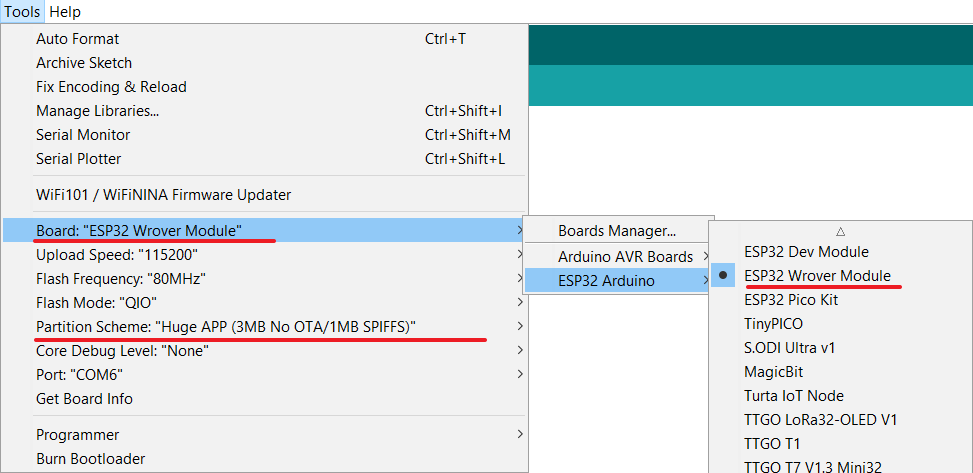
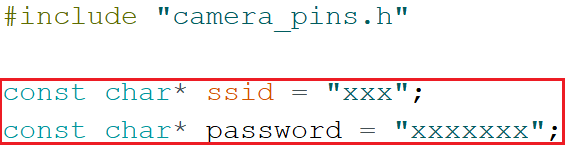
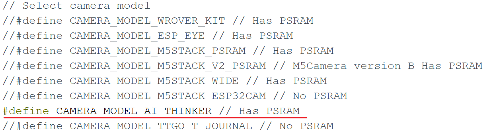

## ESP32 CAM 实例程序 人脸识别 

## 配置Arduino IDE

### Arduino装ESP32开发环境

文件–>首选项–>附加开发板管理网址 输入`https://dl.espressif.com/dl/package_esp32_index.json`

工具–>开发板–>开发板管理器 搜索esp32，点击下载安装，安装过程会hin慢。自行其它安装方法结果也不一定能用。。。。别问，问就是我

### 选择开发板

工具–>开发板，选择ESP32 Wrover Module

### 选择Partition Scheme

工具–>Partition scheme，选择Huge APP

## 示例程序修改

### 载入实例程序

文件–> 示例–> ESP32 Camera–> CameraWebServer

### 修改wifi信息

wifi名称和密码改为自家wifi路由器的

### 修改摄像头模块

市面上大多用的是安可信的，所以选择第五个。

上传程序后，打开串口监控，看到如下信息：

### 网页界面

按照串口输出的提示信息，在电脑上打开网页。

