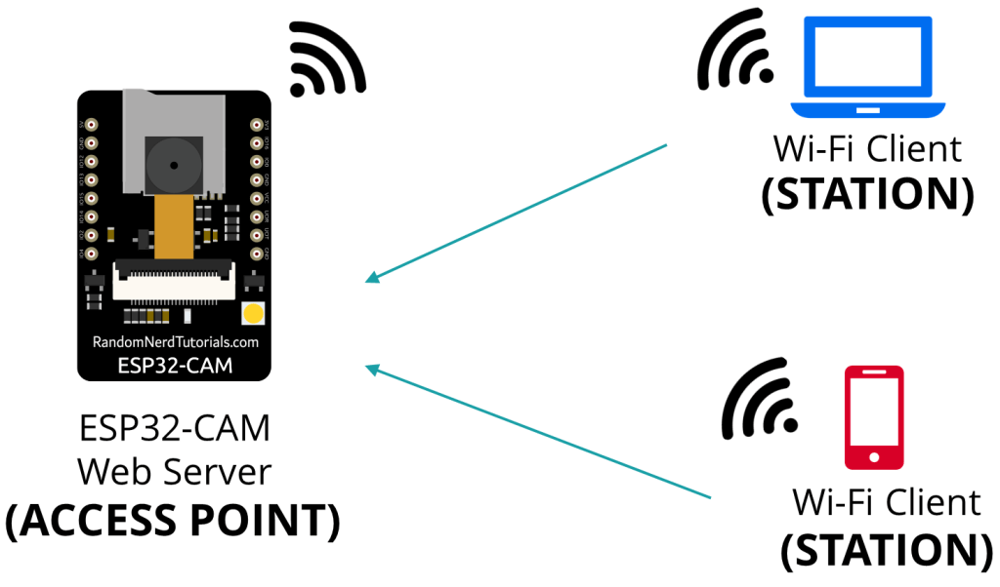
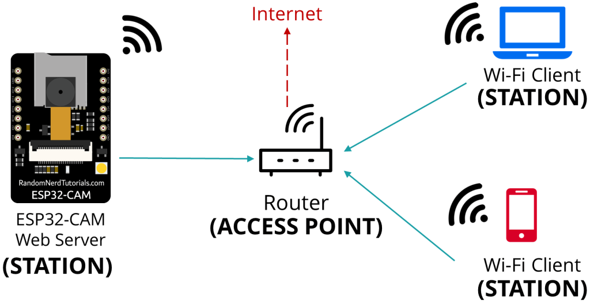

# ESP32 连接Wifi

## 手动配置wifi节点

这种方式是在代码中配置好wifi的名称和密码，在刷到ESP32中，开机后自动连接此wifi

```arduino
#include <WiFi.h>

const char* ssid     = "SSID";         // The SSID (name) of the Wi-Fi network you want to connect to
const char* password = "PASSWORD";     // The password of the Wi-Fi network

void setup()
{

  Serial.begin(115200);

  WiFi.begin(ssid, password);             // Connect to the network
  Serial.print("Connecting to ");
  Serial.print(ssid);

  while (WiFi.status() != WL_CONNECTED) { // Wait for the Wi-Fi to connect
    delay(500);
    Serial.print('.');
  }

  Serial.println('\n');
  Serial.println("Connection established!");
  Serial.print("IP address:\t");
  Serial.println(WiFi.localIP());         // Send the IP address of the ESP8266 to the computer
}

void loop()
{

}
```

这种配置方式简单，但是不够灵活。

## AP模式，通过手机配置Wifi

## 通过手机APP配网SmartConfig

TI发明的“ SmartConfig”。这种方式下，手机APP广播wifi信息，ESP32接收到信息后配置wifi信息。

缺点是用户需安装APP。

手机安装APP

- Android: IOT_Espressif 
- IOS: Espressif Esptouch

ESP32 代码

```arduino
#include "WiFi.h"

void setup() {
  Serial.begin(115200);

  //Init WiFi as Station, start SmartConfig
  WiFi.mode(WIFI_AP_STA);
  WiFi.beginSmartConfig();

  //Wait for SmartConfig packet from mobile
  Serial.println("Waiting for SmartConfig.");
  while (!WiFi.smartConfigDone()) {
    delay(500);
    Serial.print(".");
  }

  Serial.println("");
  Serial.println("SmartConfig received.");

  //Wait for WiFi to connect to AP
  Serial.println("Waiting for WiFi");
  while (WiFi.status() != WL_CONNECTED) {
    delay(500);
    Serial.print(".");
  }

  Serial.println("WiFi Connected.");

  Serial.print("IP Address: ");
  Serial.println(WiFi.localIP());
}

void loop() {
  // put your main code here, to run repeatedly:

}
```

或者通过微信配网


## 微

## 蓝⽛配⽹

通过蓝牙连接ESP32，然后将wifi信息发送给ESP32。这种方式和SmartConfig类似，需手机APP支持。而且还在蓝牙和wifi中切换，不如SmartConfig方便，不介绍了。

## ESP32 AP 和 SAT模式

AP 是 Access Point 的简称，SAT 是 Station的简称。这两种模式的区别如下图。





可以看到AP模式下，不通过路由器，客户端直接连到ESP32。

而SAT模式下，ESP32和客户端都连接到路由器，再互相访问。

因为，在AP模式下，ESP32不再进一步连接到互联网，所以称为软AP (soft Access Point)。这就是说无法从互联网下载js文件或其他资源。

实例程序：

**File** > **Examples** > **ESP32** > **Camera** > **CameraWebServer**.