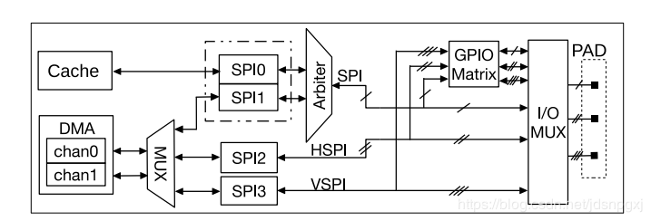
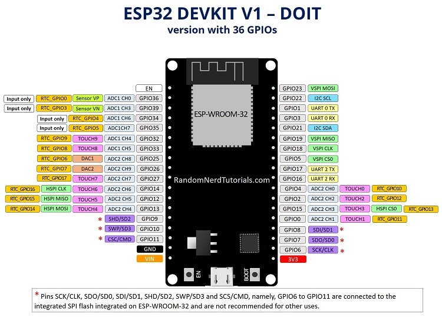
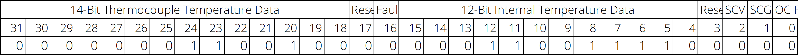

# ESP32 温度测量仪

MAX31855 使用 SPI 接口。

## ESP32 SPI



SPI0 控制器作为 cache 访问外部存储单元接口使用， SPI1 作为主机使用， SPI2 和 SPI3 控制器既可作为主机使用又可作为从机使用。作主机使用时，每个 SPI 控制器可以使用多个片选信号 (CS0~CS2) 来连接多个 SPI 从机设备。

SPI相当于SPI0或SPI1，HSPI相当于SPI2，VSPI相当于SPI3。

ESP32 SPI 控制器的 IO 接口：

|          | MOSI | MISO | CLK | CS  |
| -------- | -------- | -------- | ------- | ------- |
| **VSPI** | GPIO 23  | GPIO 19  | GPIO 18 | GPIO 5  |
| **HSPI** | GPIO 13  | GPIO 12  | GPIO 14 | GPIO 15 |

ESP32的接口如下图。



## MAX31885模块

MAX31885 模块有两个输入口，连接热电偶，6个输出口。各Pin脚含义如下表：

| MAX31855 | Function                                                     |
| :------- | :----------------------------------------------------------- |
| Vin      | 3~5V Power-Supply Voltage                                    |
| 3VO      | 3.3V out                                                     |
| GND      | GND                                                          |
| DO       | SO, MISO, Serial-Data Output                                 |
| CS       | Active-Low Chip Select. Set CS low to enable the serial interface. |
| CLK      | Serial-Clock Input                                           |

模块的使用方式可以参考MAX31885文档的介绍。

对于多个模块，DO，CLK是共用的，CS选定某个模块。

## 接线图

|          |      |      | MISO        | MOSI        | CLK         | CS         |
| -------- | ---- | ---- | ----------- | ----------- | ----------- | ---------- |
| ESP 32   | 3V3  | GND  | GPIO  19/12 | GPIO  23/13 | GPIO  18/14 | GPIO  5/15 |
| MAX31855 | Vin  | GND  | DO          |             | CLK         | CS         |


## 代码

```c++
#include <SPI.h>
#include <WiFi.h>
#include "MAX31855.h"

int32_t rawData  = 0;

MAX31855 myMAX31855(5);   //chip select pin

void setup()
{

  Serial.begin(115200);

  /* start MAX31855 */
  myMAX31855.begin();

  while (myMAX31855.getChipID() != MAX31855_ID)
  {
    Serial.println(F("MAX31855 error")); //(F()) saves string to flash & keeps dynamic memory free
    delay(5000);
  }
  Serial.println(F("MAX31855 OK"));
}

void loop()
{
  while (myMAX31855.detectThermocouple() != MAX31855_THERMOCOUPLE_OK)
  {
    switch (myMAX31855.detectThermocouple())
    {
      case MAX31855_THERMOCOUPLE_SHORT_TO_VCC:
        Serial.println(F("Thermocouple short to VCC"));
        break;

      case MAX31855_THERMOCOUPLE_SHORT_TO_GND:
        Serial.println(F("Thermocouple short to GND"));
        break;

      case MAX31855_THERMOCOUPLE_NOT_CONNECTED:
        Serial.println(F("Thermocouple not connected"));
        break;

      case MAX31855_THERMOCOUPLE_UNKNOWN:
        Serial.println(F("Thermocouple unknown error, check spi cable"));
        break;
    }
    delay(5000);
  }

  rawData = myMAX31855.readRawData();

  Serial.print(F("Cold Junction: "));
  Serial.println(myMAX31855.getColdJunctionTemperature(rawData));

  Serial.print(F("Thermocouple: "));
  Serial.println(myMAX31855.getTemperature(rawData));

  delay(5000);
}
```
MAX31855.h
```c++
/***************************************************************************************************/
/*
   This is an Arduino library for 14-bit MAX31855 K-Thermocouple to Digital Converter
   with 12-bit Cold Junction Compensation conneted to hardware 5Mhz SPI with maximum sampling
   rate ~9..10Hz.
   - MAX31855 maximum power supply voltage is 3.6v
   - K-type thermocouples have an absolute accuracy of around ±2°C..±6°C.
   - Measurement tempereture range -200°C..+700°C ±2°C or -270°C..+1372°C ±6°C
     with 0.25°C resolution/increment.
   - Cold junction compensation range -40°C..+125° ±3°C with 0.062°C resolution/increment.
     Optimal performance of cold junction compensation happends when the thermocouple cold junction
     & the MAX31855 are at the same temperature. Avoid placing heat-generating devices or components
     near the converter because this may produce an errors.
   - It is strongly recommended to add a 10nF/0.01mF ceramic surface-mount capacitor, placed across
     the T+ and T- pins, to filter noise on the thermocouple lines.
     
   written by : enjoyneering79
   sourse code: https://github.com/enjoyneering/MAX31855
   This sensor uses SPI bus to communicate, specials pins are required to interface
   Board:                                    MOSI        MISO        SCLK         SS, don't use for CS   Level
   Uno, Mini, Pro, ATmega168, ATmega328..... 11          12          13           10                     5v
   Mega, Mega2560, ATmega1280, ATmega2560... 51          50          52           53                     5v
   Due, SAM3X8E............................. ICSP4       ICSP1       ICSP3        x                      3.3v
   Leonardo, ProMicro, ATmega32U4........... 16          14          15           x                      5v
   Blue Pill, STM32F103xxxx boards.......... PA17        PA6         PA5          PA4                    3v
   NodeMCU 1.0, WeMos D1 Mini............... GPIO13/D7   GPIO12/D6   GPIO14/D5    GPIO15/D8*             3v/5v
   ESP32.................................... GPIO23/D23  GPIO19/D19  GPIO18/D18   x                      3v
                                             *most boards has 10-12kOhm pullup-up resistor on GPIO2/D4 & GPIO0/D3
                                              for flash & boot
   Frameworks & Libraries:
   ATtiny  Core          - https://github.com/SpenceKonde/ATTinyCore
   ESP32   Core          - https://github.com/espressif/arduino-esp32
   ESP8266 Core          - https://github.com/esp8266/Arduino
   STM32   Core          - https://github.com/stm32duino/Arduino_Core_STM32
                         - https://github.com/rogerclarkmelbourne/Arduino_STM32
   GNU GPL license, all text above must be included in any redistribution,
   see link for details  - https://www.gnu.org/licenses/licenses.html
*/
/***************************************************************************************************/

#ifndef MAX31855_h
#define MAX31855_h

#if defined(ARDUINO) && ((ARDUINO) >= 100) //arduino core v1.0 or later
#include <Arduino.h>
#else
#include <WProgram.h>
#endif

#if defined(__AVR__)
#include <avr/pgmspace.h>                  //use for PROGMEM Arduino AVR
#elif defined(ESP8266)
#include <pgmspace.h>                      //use for PROGMEM Arduino ESP8266
#elif defined(_VARIANT_ARDUINO_STM32_)
#include <avr/pgmspace.h>                  //use for PROGMEM Arduino STM32
#endif

#ifndef  MAX31855_SOFT_SPI                 //enable upload hw driver spi.h
#include <SPI.h>
#endif


#define MAX31855_CONVERSION_POWER_UP_TIME   200    //in milliseconds
#define MAX31855_CONVERSION_TIME            100    //in milliseconds, 9..10Hz sampling rate 
#define MAX31855_THERMOCOUPLE_RESOLUTION    0.25   //in °C per dac step
#define MAX31855_COLD_JUNCTION_RESOLUTION   0.0625 //in °C per dac step


#define MAX31855_ID                         31855
#define MAX31855_FORCE_READ_DATA            7      //force to read the data, 7 is unique because d2d1d0 can't be all high at the same time
#define MAX31855_ERROR                      2000   //returned value if any error happends

#define MAX31855_THERMOCOUPLE_OK            0
#define MAX31855_THERMOCOUPLE_SHORT_TO_VCC  1
#define MAX31855_THERMOCOUPLE_SHORT_TO_GND  2
#define MAX31855_THERMOCOUPLE_NOT_CONNECTED 3
#define MAX31855_THERMOCOUPLE_UNKNOWN       4


class MAX31855
{
  public:
   MAX31855(uint8_t cs);

           void     begin(void);
           uint8_t  detectThermocouple(int32_t rawValue = MAX31855_FORCE_READ_DATA);
           uint16_t getChipID(int32_t rawValue = MAX31855_FORCE_READ_DATA);
           float    getTemperature(int32_t rawValue = MAX31855_FORCE_READ_DATA);
           float    getColdJunctionTemperature(int32_t rawValue = MAX31855_FORCE_READ_DATA);
   virtual int32_t  readRawData(void);
 
  private:

  protected:
   uint8_t _cs;
};

#endif
```

MAX31855.cpp
```c++
/***************************************************************************************************/
/*
   This is an Arduino library for 14-bit MAX31855 K-Thermocouple to Digital Converter
   with 12-bit Cold Junction Compensation conneted to hardware 5Mhz SPI with maximum sampling
   rate ~9..10Hz.
   - MAX31855 maximum power supply voltage is 3.6v
   - K-type thermocouples have an absolute accuracy of around ±2°C..±6°C.
   - Measurement tempereture range -200°C..+700°C ±2°C or -270°C..+1372°C ±6°C
     with 0.25°C resolution/increment.
   - Cold junction compensation range -40°C..+125° ±3°C with 0.062°C resolution/increment.
     Optimal performance of cold junction compensation happends when the thermocouple cold junction
     & the MAX31855 are at the same temperature. Avoid placing heat-generating devices or components
     near the converter because this may produce an errors.
   - It is strongly recommended to add a 10nF/0.01mF ceramic surface-mount capacitor, placed across
     the T+ and T- pins, to filter noise on the thermocouple lines.

   written by : enjoyneering79
   sourse code: https://github.com/enjoyneering/MAX31855
   This sensor uses SPI bus to communicate, specials pins are required to interface
   Board:                                    MOSI        MISO        SCLK         SS, don't use for CS   Level
   Uno, Mini, Pro, ATmega168, ATmega328..... 11          12          13           10                     5v
   Mega, Mega2560, ATmega1280, ATmega2560... 51          50          52           53                     5v
   Due, SAM3X8E............................. ICSP4       ICSP1       ICSP3        x                      3.3v
   Leonardo, ProMicro, ATmega32U4........... 16          14          15           x                      5v
   Blue Pill, STM32F103xxxx boards.......... PA17        PA6         PA5          PA4                    3v
   NodeMCU 1.0, WeMos D1 Mini............... GPIO13/D7   GPIO12/D6   GPIO14/D5    GPIO15/D8*             3v/5v
   ESP32.................................... GPIO23/D23  GPIO19/D19  GPIO18/D18   x                      3v
                                              most boards has 10-12kOhm pullup-up resistor on GPIO2/D4 & GPIO0/D3
                                              for flash & boot
   Frameworks & Libraries:
   ATtiny  Core          - https://github.com/SpenceKonde/ATTinyCore
   ESP32   Core          - https://github.com/espressif/arduino-esp32
   ESP8266 Core          - https://github.com/esp8266/Arduino
   STM32   Core          - https://github.com/stm32duino/Arduino_Core_STM32
                         - https://github.com/rogerclarkmelbourne/Arduino_STM32
   GNU GPL license, all text above must be included in any redistribution,
   see link for details  - https://www.gnu.org/licenses/licenses.html
*/
/***************************************************************************************************/

#include "MAX31855.h"


/**************************************************************************/
/*
    MAX31855()
    Constructor for hardware read only SPI
    NOTE:
    - cs is chip select, set cs low to enable serial interface
*/
/**************************************************************************/
MAX31855::MAX31855(uint8_t cs)
{
  _cs = cs; //cs chip select
}

/**************************************************************************/
/*
    begin()
    Initializes & configures hardware SPI
*/
/**************************************************************************/
void MAX31855::begin(void)
{
  pinMode(_cs, OUTPUT);
  digitalWrite(_cs, HIGH);                  //disables SPI interface for MAX31855, but it will initiate measurement/conversion

  SPI.begin();                              //setting hardware SCK, MOSI, SS to output, pull SCK, MOSI low & SS high

  delay(MAX31855_CONVERSION_POWER_UP_TIME);
}

/**************************************************************************/
/*
    detectThermocouple()
    Checks if thermocouple is open, shorted to GND, shorted to VCC
    Return:
    - 0 OK
    - 1 short to VCC
    - 2 short to GND
    - 3 not connected
    NOTE:
    - bit D16 is normally low & goes high if thermocouple is open, shorted to GND or VCC
    - bit D2  is normally low & goes high to indicate a hermocouple short to VCC
    - bit D1  is normally low & goes high to indicate a thermocouple short to GND
    - bit D0  is normally low & goes high to indicate a thermocouple open circuit
*/
/**************************************************************************/
uint8_t MAX31855::detectThermocouple(int32_t rawValue)
{
  if (rawValue == MAX31855_FORCE_READ_DATA) rawValue = readRawData();

  if (bitRead(rawValue, 16) == 1)
  {
    if      (bitRead(rawValue, 2) == 1) return MAX31855_THERMOCOUPLE_SHORT_TO_VCC;
    else if (bitRead(rawValue, 1) == 1) return MAX31855_THERMOCOUPLE_SHORT_TO_GND;
    else if (bitRead(rawValue, 0) == 1) return MAX31855_THERMOCOUPLE_NOT_CONNECTED;
    else                                return MAX31855_THERMOCOUPLE_UNKNOWN;
  }
  return MAX31855_THERMOCOUPLE_OK;
}

/**************************************************************************/
/*
    getChipID()
    Checks chip ID
    NOTE:
    - bit D17, D3 always return zero & can be used as device ID
*/
/**************************************************************************/
uint16_t MAX31855::getChipID(int32_t rawValue)
{
  if (rawValue == MAX31855_FORCE_READ_DATA) rawValue = readRawData();

  if (bitRead(rawValue, 17) == 0 && bitRead(rawValue, 3) == 0) return MAX31855_ID;

  return 0;
}

/**************************************************************************/
/*
    getTemperature()
    Reads Temperature, C
    NOTE:
    - range -200°C..+700°C ±2°C or -270°C..+1372°C ±6°C with 0.25°C
      resolution/increment
    - thermocouple temperature data is 14-bit long
    - bit D31 is the thermocouple temperature sign bit "+" is high & "-" is low,
      if T+ and T- are unconnected it goes low
    - bits D30..D18 contain the converted temperature in the order of MSB to LSB,
      if T+ and T- are unconnected they go high
    - it is strongly recommended to add a 10nF/0.01mF ceramic surface-mount
      capacitor, placed across the T+ and T- pins, to filter noise on the
      thermocouple lines
*/
/**************************************************************************/
float MAX31855::getTemperature(int32_t rawValue)
{
  if (rawValue == MAX31855_FORCE_READ_DATA) rawValue = readRawData();

  if (detectThermocouple(rawValue) != MAX31855_THERMOCOUPLE_OK || getChipID(rawValue) != MAX31855_ID) return MAX31855_ERROR;

  rawValue = rawValue >> 18; //clear D17..D0 bits

  return (float)rawValue * MAX31855_THERMOCOUPLE_RESOLUTION;
}

/**************************************************************************/
/*
    getColdJunctionTemperature()
    Reads Temperature, C
    NOTE:
    - range -40°C..+125° ±3°C with 0.062°C resolution/increment
    - chip internal temperature data is 12-bit long
    - bit D15 is cold-junction temperature sign bit "+" is high & "-" is low
    - bits D14..D4 contain cold-junction temperature in the order of MSB to LSB
*/
/**************************************************************************/
float MAX31855::getColdJunctionTemperature(int32_t rawValue)
{
  if (rawValue == MAX31855_FORCE_READ_DATA) rawValue = readRawData();

  if (getChipID(rawValue) != MAX31855_ID) return MAX31855_ERROR;

  rawValue = rawValue & 0x0000FFFF; //clear D31..D16 bits
  rawValue = rawValue >> 4;         //clear D3...D0  bits

  return (float)rawValue * MAX31855_COLD_JUNCTION_RESOLUTION;
}

/**************************************************************************/
/*
    readRawData()
    Reads raw data from MAX31855 via hardware SPI
    NOTE:
    - read of the cold-junction compensated thermocouple temperature requires
      14 clock cycles
    - read of the cold-junction compensated thermocouple temperature & reference
      junction temperatures requires 32 clock cycles
    - forcing CS low immediately stops any conversion process, force CS high
      to initiate a new measurement process
    - set CS low to enable the serial interface & force to output the first bit on the SO pin,
      apply 14/32 clock signals at SCK to read the results at SO on the falling edge of the SCK
    - bit D31 is the thermocouple temperature sign bit "+" is high & "-" is low,
      if T+ & T- pins are unconnected it goes low
    - bits D30..D18 contain the converted temperature in the order of MSB to LSB,
      if T+ & T- pins are unconnected they go high
    - bit D17 is low to provide a device ID for the MAX31855
    - bit D16 is normally low & goes high if thermocouple is open, shorted to GND or VCC
    - bit D15 is cold-junction temperature sign bit "+" is high & "-" is low
    - bits D14..D4 contain cold-junction temperature in the order of MSB to LSB
    - bit D3 is is low to provide a device ID for the MAX31855
    - bit D2 is normally low & goes high to indicate a hermocouple short to VCC
    - bit D1 is normally low & goes high to indicate a thermocouple short to GND
    - bit D0 is normally low & goes high to indicate a thermocouple open circuit
    - arduino 8-bit AVR maximum SPI master clock speed is mcu speed/2,
      for 5v-16MHz/ProMini speed is 16000000/2=8MHz
    - arduino ESP8266 maximum SPI master clock speed is 80000000=80MHz
    - arduino STM32 maximum SPI master clock speed is mcu speed/2,
      for STM32F103C8 speed is 72000000/2=36MHz
    - SPI_MODE0 -> data available shortly after the rising edge of SCK
*/
/**************************************************************************/
int32_t MAX31855::readRawData(void)
{
  int32_t rawData = 0;

  //digitalWrite(_cs, LOW);                                          //stop  measurement/conversion
  //delayMicroseconds(1);                                            //5MHz  is 0.2μsec, do we need it???
  //digitalWrite(_cs, HIGH);                                         //start measurement/conversion

  delay(MAX31855_CONVERSION_TIME);

  SPI.beginTransaction(SPISettings(5000000, MSBFIRST, SPI_MODE0)); //up to 5MHz, read MSB first, SPI mode 0, see note

  digitalWrite(_cs, LOW);                                          //set software CS low to enable SPI interface for MAX31855

  for (uint8_t i = 0; i < 2; i++)                                  //read 32-bits via hardware SPI, in order MSB->LSB (D31..D0 bit)
  {
    rawData = (rawData << 16) | SPI.transfer16(0x0000);            //chip has read only SPI & MOSI not connected, so it doesn't metter what to send
  }

  digitalWrite(_cs, HIGH);                                         //disables SPI interface for MAX31855, but it will initiate measurement/conversion

  SPI.endTransaction();                                            //de-asserting hardware CS & free hw SPI for other slaves

  return rawData;
}
```

## 分析

例如，读出的32为数字为

00000001100100000001100111100000



可以计算出thermal Coupler的温度为

1100100 --> 100 -- 100/4=25C


https://help.aliyun.com/document_detail/146611.html?spm=a2c4g.11186623.6.881.51045800csO7yO#h2-url-1

