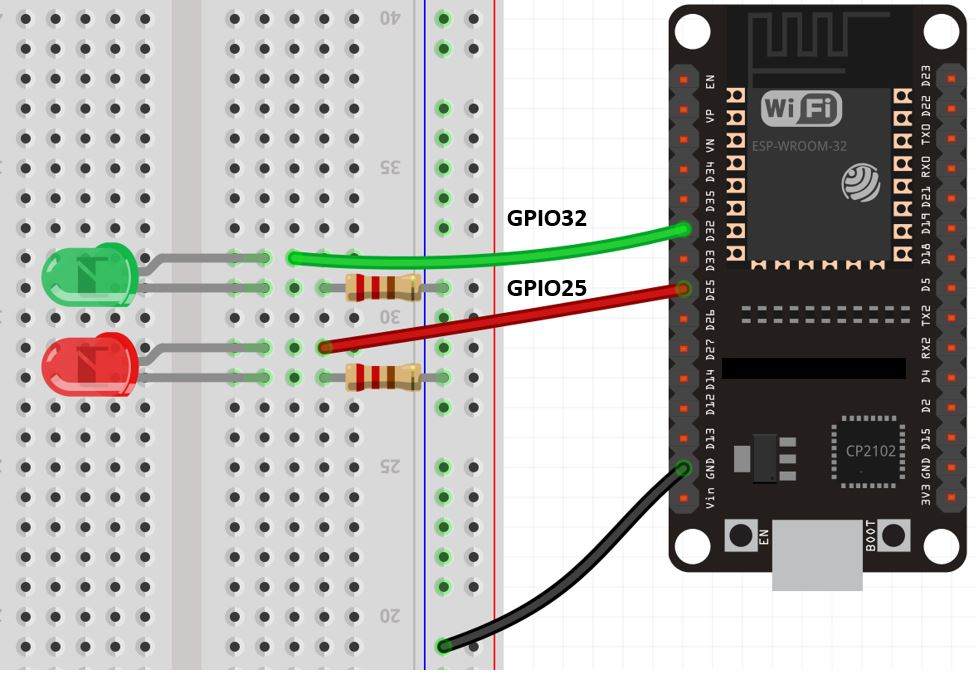

FreeRTOS是一款实时操作系统。对于单核计算机而言，一次只能执行一个进程。计算机实际上实在多个任务之间进行高速切换，让用户看上去一切像是在同时进行。

## 任务

任务是实时操作系统的基本模块，它们在自己的上下文中执行，调度程序负责决定单核CPU在某个时刻应该执行哪个任务。我们可以并行运行多个任务。

### 创建一个任务

```cpp
 xTaskCreate( TaskCode, TaskName, StackDepth, Parameter, priority, TaskHandle);
```

- TaskCode:指向任务函数的指针

- TaskName:任务的名称

- StackDepth:任务堆栈大小，以字节数表示。

- Parameter:指针，指向任务函数所接收的参数

- Priority:任务的优先级，数字越大优先级越高，默认最大32级（不定，可以自行去库文件修改），不同任务可以有相同优先级，够用的情况下，最大优先级越小越好

- TaskHandle:返回一个句柄，用于以后进行函数调用（比如要删除某个任务或者修改其优先级）时对任务的引用


该函数会返回**pdPass**（成功时）或错误代码

### 任务函数

任务函数就是我们自定义的功能函数，示例：

```
void taskOne( void * parameter )
```

!!! note

    任务函数不能有任何返回值，即应该定义成void。它们必须不包含return语句。


### 删除任务

使用`TaskDelte（句柄）`函数可以删除任务

## 实例演示

```c
void setup() {
  
  Serial.begin(112500);
  delay(1000);

  xTaskCreate(
                    taskOne,          /* Task function. */
                    "TaskOne",        /* String with name of task. */
                    10000,            /* Stack size in bytes. */
                    NULL,             /* Parameter passed as input of the task */
                    1,                /* Priority of the task. */
                    NULL);            /* Task handle. */


  xTaskCreate(
                    taskTwo,          /* Task function. */
                    "TaskTwo",        /* String with name of task. */
                    10000,            /* Stack size in bytes. */
                    NULL,             /* Parameter passed as input of the task */
                    1,                /* Priority of the task. */
                    NULL);            /* Task handle. */
}

void loop() {
    
  delay(1000);
}

void taskOne( void * parameter )

{
    
    for( int i = 0;i<10;i++ ){
    
        Serial.println("Hello from task 1");
        
        delay(1000);
    }
    Serial.println("Ending task 1");
    vTaskDelete( NULL );
}

void taskTwo( void * parameter)

{
    
    for( int i = 0;i<10;i++ ){    
        Serial.println("Hello from task 2");
        delay(1000);
    }
    Serial.println("Ending task 2");
    vTaskDelete( NULL );
}
```

## 指定任务执行的Core

默认情况下Arduino使用的是ESP32的Core1，Core0被用来处理wifi和Ble。

可以使用命令 `xPortGetCoreID()` 查看当前使用的Core。

```c
#include <Arduino.h>

void setup() {
  Serial.begin(115200);
  Serial.print("Run on core: "); 
  Serial.println(xPortGetCoreID());
  // put your setup code here, to run once:
}

void loop() {
  // put your main code here, to run repeatedly:
}
```

下面将讨论如何通过Free RTOS指定ESP32代码运行的Core。目标是在core0中每 0.5 秒闪烁一个 LED，在 core1 中每 1 秒闪烁一个 LED。

### 定义任务手柄

```
TaskHandle_t Task1; 
TaskHandle_t Task2;
```

在 setup() 函数中使用 `xTaskCreatePinnedToCore()` 函数为 core0 和 core1 创建任务。

```c
xTaskCreatePinnedToCore(Task1code,"Task1",10000,NULL,1,&Task1,0); 
xTaskCreatePinnedToCore(Task2code,"Task2",10000,NULL,1,&Task2,1); 
```

此函数有七个参数：

1. 第一个参数是将执行任务的函数的名称，例如Task1code或 Task2code。
2. 第二个参数是我们将分配给任务的名称，例如 Task1 或 Task2。
3. 分配给任务的堆栈大小，例如 10000。
4. 任务输入参数。
5. 任务的优先级， 0 表示最低优先级。
6. 前面定义的任务手柄，例如Task1 或Task 2
7. 指定该任务运行的core ID，例如 0 或 1，其中 0 是core 0，1 是core 1

### 定义任务函数

接下来定义两个任务，分别控制两个LED的闪烁。

```c
void Task1code( void * parameter ){
  Serial.print("Task1 running on core ");
  Serial.println(xPortGetCoreID());

  for(;;){
    digitalWrite(led_1, HIGH);
    delay(500);
    digitalWrite(led_1, LOW);
    delay(500);
  } 
}

void Task3code( void * parameter ){
  Serial.print("Task1 running on core ");
  Serial.println(xPortGetCoreID());

  for(;;){
    digitalWrite(led_2, HIGH);
    delay(1000);
    digitalWrite(led_2, LOW);
    delay(1000);
  } 
}
```

## 实践

按照如下方式连接两个LED到ESP32开发板。



完整代码

```arduino
#include <Arduino.h>

TaskHandle_t Task1;
TaskHandle_t Task2;

int led_1 = 32;
int led_2 = 25;

void setup()
{
  Serial.begin(115200);

  pinMode(led_1, OUTPUT);
  pinMode(led_2, OUTPUT);

  xTaskCreatePinnedToCore(Task1code, "Task1", 10000, NULL, 1, &Task1, 0);
  delay(10);
  xTaskCreatePinnedToCore(Task2code, "Task2", 10000, NULL, 1, &Task2, 1);
  delay(10);

  Serial.print("setup() is run on core: ");
  Serial.println(xPortGetCoreID());
  // put your setup code here, to run once:
}

void Task1code(void *parameter)
{
  Serial.print("Task1 is run on core: ");
  Serial.println(xPortGetCoreID());

  for (;;)
  {
    digitalWrite(led_1, HIGH);
    delay(500);
    digitalWrite(led_1, LOW);
    delay(500);
  }
}

void Task2code(void *parameter)
{
  Serial.print("Task2 is run on core: ");
  Serial.println(xPortGetCoreID());

  for (;;)
  {
    digitalWrite(led_2, HIGH);
    delay(1000);
    digitalWrite(led_2, LOW);
    delay(1000);
  }
}

void loop()
{
  // put your main code here, to run repeatedly:
}
```