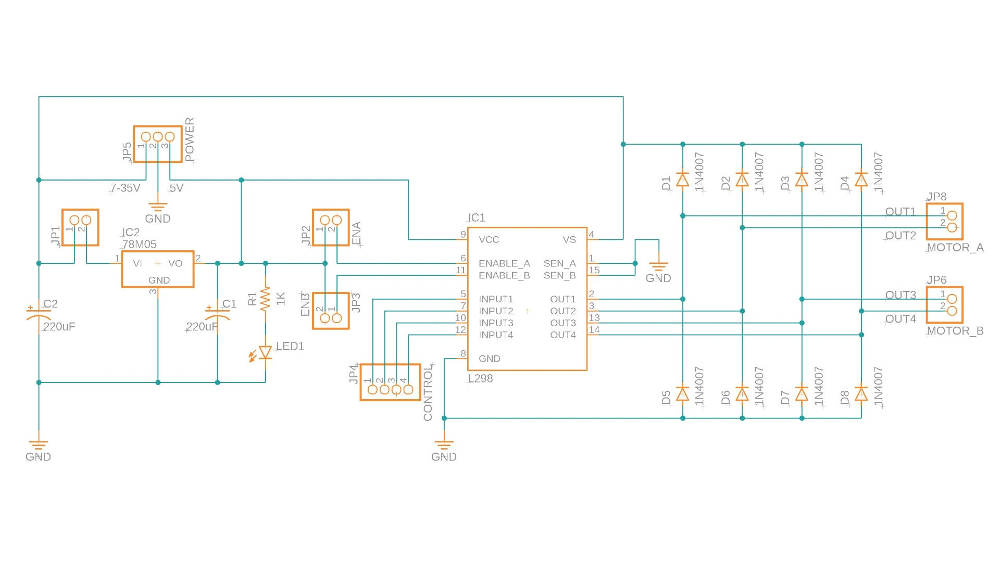
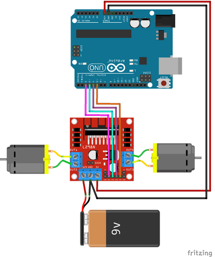
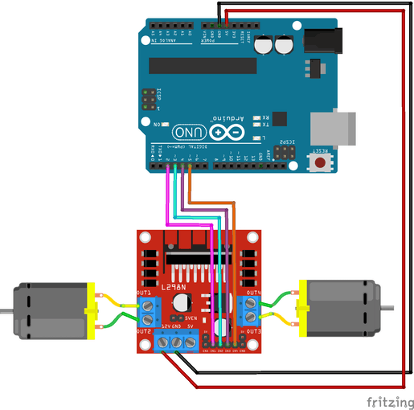
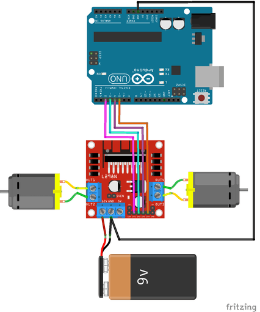

L298N是一种常用的直流电机驱动模块。PIN脚如下图：


L298N可以分别单独控制两路直流电机。

- IN1，IN2控制电机A
- IN3，IN4控制电机B

以电机A为例，控制方式如下表：

| IN1  | IN2  |旋转方式 | 
| -------- | ---- | ---- |
| 高   | 低   | 正转     |
|  低   | 高   |反转     |
| 高   | 高   | 停止     |
|  低   | 低   |停止     |

简单来说，IN1，IN2一高一低时电机转动，两者同时为高或同时为低时电机停止转动。

## L298N 驱动板引脚说明

- VCC +12V 引脚，为电机供电电源。输入电压可以在5~35V之间。请记住，如果 5V-EN 跳线已就位，则需要提供比电机实际电压要求多 2 伏的电压，以便获得电机的最大速度。
- GND 引脚，公共接地引脚。
- 5V 引脚，为L298N IC内部电路供电。
- OUT1 & OUT2引脚，连接到电机 A。
- OUT3 & OUT4引脚，连接到电机 B。
- IN1 & IN2引脚，用于控制电机A的旋转方向。当其中一个是高电平而另一个为低电平时，电机A将旋转。如果两个输入都为高电平或低电平，则电机 A 将停止。
- IN3 & IN4引脚，用于控制电机B的旋转方向。当其中一个是高电平而另一个为低电平时，电机B将旋转。如果两个输入都为高电平或低电平，则电机B将停止。
- ENA 引脚，用于控制电机A的速度，将此引脚拉至高电平（保持跳线到位）将使电机A旋转，将其拉低会使电机停止。卸下跳线帽并将此引脚连接到PWM输入将使我们能够控制电机A的速度。
- ENB 引脚，用于控制电机B的速度，将此引脚拉至高电平（保持跳线到位）将使电机B旋转，将其拉低会使电机停止。卸下跳线帽并将此引脚连接到PWM输入将使我们能够控制电机B的速度。

另外，模块上还有三个跳线帽：

- 5V EN
- 5V - EN A，将EN A接到5V
- 5V - EN B，将EN B接到5V

## 5V EN跳线帽

这里比较难理解的是5V EN跳线帽。L298N 驱动板的原理图如下：



L298N IC的工作电压为5V，所以我们必须提供5V的电压给芯片。而模块上有一个稳压器芯片L78M05，它可以将高电压转换为5V电压。5V EN跳线帽是图中的JP1，可以看出，它是给L78M05稳压芯片输入电压，如果断开L78M没有电压输入，不工作；接上跳线帽则L78M被供电，它提供5V输出，既可以给L298提供5V电源，也可以给外部其他电路提供5V电源。

!!! note

    L78M05的压降为2V，意味着如果要得到5V的输出电压，输入电压必须大于7V。
    
    L78M05的最大输入电压为35V，如果电机驱动电压大于35V，则不要使用这个稳压芯片来提供5V，要将跳线帽取掉，将稳压芯片的供电断掉。从其他途径给模块芯片供电。

因此和Arduino开发板连接时有多种供电配合方式。

### 用 L298N 给 Arduino 供电



### 用 Arduino 给 L298N 供电



如果Arduino在调试，接的是电脑USB的5V电压，这时候给电机的电压只有3V，可能驱动不了电机，使电机无法转动。

### Arduino 和 L298N 单独供电



不论哪种情况，Arduino 的地需和 L298N 的地相连。

!!! danger

    另外，如果跳线帽接上了，再不要将驱动板的5V与外部电源输入的5V相连了，不知道谁会烧了谁。

### 示例代码

这里采用 Arduino 给 L298N 供电为例，接线图如下：


```c
int motor1pin1 = 2;
int motor1pin2 = 3;

int motor2pin1 = 4;
int motor2pin2 = 5;

void setup() {
  // put your setup code here, to run once:
  pinMode(motor1pin1, OUTPUT);
  pinMode(motor1pin2, OUTPUT);
  pinMode(motor2pin1, OUTPUT);
  pinMode(motor2pin2, OUTPUT);
}

void loop() {
  // put your main code here, to run repeatedly:   
  digitalWrite(motor1pin1, HIGH);
  digitalWrite(motor1pin2, LOW);

  digitalWrite(motor2pin1, HIGH);
  digitalWrite(motor2pin2, LOW);
  delay(1000);

  digitalWrite(motor1pin1, LOW);
  digitalWrite(motor1pin2, HIGH);

  digitalWrite(motor2pin1, LOW);
  digitalWrite(motor2pin2, HIGH);
  delay(1000);
}
```

## 5V - EN A，5V - EN B 跳线帽

直流电机的转速和电压成正比，PWM就是改变占空比改变电压来改变转速。当然我们不能直接通过控制板的PWM输出来驱动电机，所以先将控制板的PWM信号发给L298N驱动板的EN A或EN B，再驱动板去控制供给电机的电压。通过这种方式可以控制电机速度。

如果5V - EN Ａ，5V - EN B 跳线帽接上了，则EN A， EN B的电压始终为5V，意味着供给电机的电压始终为最大值。因此，如果我们不需要控制电机转速，就可以将这两个跳线帽接上，就可以省两根控制信号线。

使用Arduino控制转速只需将EN A 或EN B与Arduino的PWM输出pin相连，代码如下。

```c
analogWrite(ENA_pin, 50);
```

