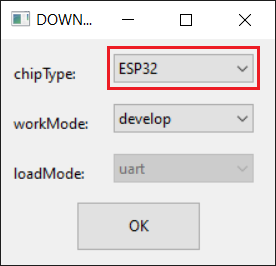

Sometimes we build the ESP32 project with IDE, such as platformIO, and then want to upload/flash firmware to ESP32 without source code.

First dolad the flash tool from ESP website, [the link](https://www.espressif.com/en/support/download/other-tools).

Chip type: ESP32

