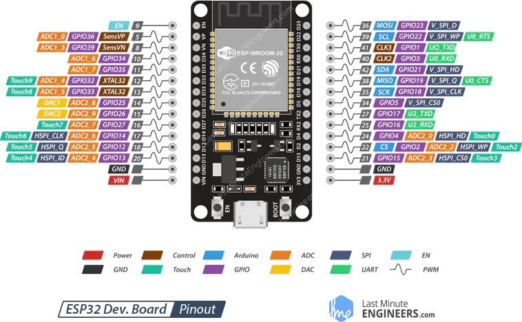
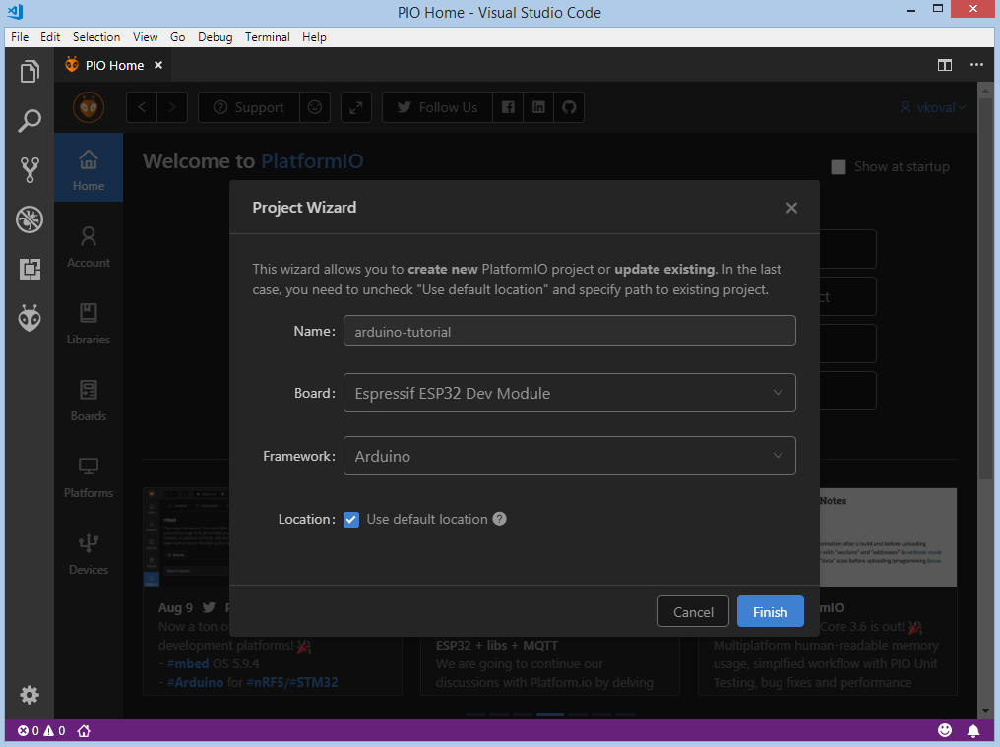
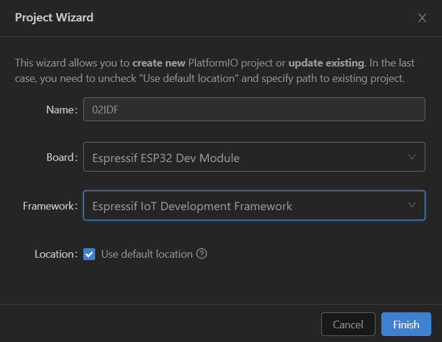

## 开发板

我购买的开发图片如下


背面标识ESP32 DEVKITV1

原理图链接

https://github.com/Nicholas3388/LuaNode

配置

| **Microcontroller** | ESP32                                                        |
| ------------------- | ------------------------------------------------------------ |
| **Frequency**       | 240MHz                                                       |
| **Flash**           | 4MB                                                          |
| **RAM**             | 320KB                                                        |
| **Vendor**          | [DOIT](http://www.doit.am/?utm_source=platformio.org&utm_medium=docs) |

开发板引脚




## 搭建开发环境

本文主要介绍使用VSCODE的 platformIO插件进行ESP32开发。分别介绍两种开发方式：

- 使用Arduino
- 使用ESP-idf

## 软件安装

- 安装VScode
- 安装插件platformIO IDE
- 在platforms中安装esp32插件 Espressif 32
- 开发板型号espressif esp32 dev module

## 基于Ariduino框架

https://docs.platformio.org/en/latest/tutorials/espressif32/arduino_debugging_unit_testing.html#tutorial-espressif32-arduino-debugging-unit-testing

### 新建项目

在platform中新建项目。开发板选择ESP32-DevKitC，Framework选择Arduino。



在src目录中创建文件main.cpp

```c
#include <Arduino.h>

void setup()
{
    Serial.begin(9600);
}

void loop()
{
    Serial.println("Hello world!");
    delay(1000);
}
```

### 编译，上传

编译

- `ctrl-alt-b`
- 或者左侧工具栏中的build

上传

- `ctrl-alt-u`
- 或者左侧工具栏中的upload

查看串口输出

- 左侧工具栏中的Monitor

如果看到监视器输出Hello world!则说明测试成功。

### 安装第三方包

1. 在Libraries中搜索，然后安装。
2. 直接将库文件放到lib文件夹下。注意文件夹名称和主文件名称一致。

## 基于ESP32 IDF框架

新建项目时开发框架选择 Espressif IoT Development Franmework



在`src`目录中新建文件`main.c` 

```c
/* WiFi softAP Example

   This example code is in the Public Domain (or CC0 licensed, at your option.)

   Unless required by applicable law or agreed to in writing, this
   software is distributed on an "AS IS" BASIS, WITHOUT WARRANTIES OR
   CONDITIONS OF ANY KIND, either express or implied.
*/
#include <string.h>
#include "freertos/FreeRTOS.h"
#include "freertos/task.h"
#include "esp_system.h"
#include "esp_wifi.h"
#include "esp_event.h"
#include "esp_log.h"
#include "nvs_flash.h"

#include "lwip/err.h"
#include "lwip/sys.h"

#define EXAMPLE_ESP_WIFI_SSID      "mywifissid"
#define EXAMPLE_ESP_WIFI_PASS      "mywifipass"
#define EXAMPLE_MAX_STA_CONN       (3)

static const char *TAG = "wifi softAP";

static void wifi_event_handler(void* arg, esp_event_base_t event_base,
                                    int32_t event_id, void* event_data)
{
    if (event_id == WIFI_EVENT_AP_STACONNECTED) {
        wifi_event_ap_staconnected_t* event = (wifi_event_ap_staconnected_t*) event_data;
        ESP_LOGI(TAG, "station "MACSTR" join, AID=%d",
                 MAC2STR(event->mac), event->aid);
    } else if (event_id == WIFI_EVENT_AP_STADISCONNECTED) {
        wifi_event_ap_stadisconnected_t* event = (wifi_event_ap_stadisconnected_t*) event_data;
        ESP_LOGI(TAG, "station "MACSTR" leave, AID=%d",
                 MAC2STR(event->mac), event->aid);
    }
}

void wifi_init_softap()
{
    tcpip_adapter_init();
    ESP_ERROR_CHECK(esp_event_loop_create_default());

    wifi_init_config_t cfg = WIFI_INIT_CONFIG_DEFAULT();
    ESP_ERROR_CHECK(esp_wifi_init(&cfg));

    ESP_ERROR_CHECK(esp_event_handler_register(WIFI_EVENT, ESP_EVENT_ANY_ID, &wifi_event_handler, NULL));

    wifi_config_t wifi_config = {
        .ap = {
            .ssid = EXAMPLE_ESP_WIFI_SSID,
            .ssid_len = strlen(EXAMPLE_ESP_WIFI_SSID),
            .password = EXAMPLE_ESP_WIFI_PASS,
            .max_connection = EXAMPLE_MAX_STA_CONN,
            .authmode = WIFI_AUTH_WPA_WPA2_PSK
        },
    };
    if (strlen(EXAMPLE_ESP_WIFI_PASS) == 0) {
        wifi_config.ap.authmode = WIFI_AUTH_OPEN;
    }

    ESP_ERROR_CHECK(esp_wifi_set_mode(WIFI_MODE_AP));
    ESP_ERROR_CHECK(esp_wifi_set_config(ESP_IF_WIFI_AP, &wifi_config));
    ESP_ERROR_CHECK(esp_wifi_start());

    ESP_LOGI(TAG, "wifi_init_softap finished. SSID:%s password:%s",
             EXAMPLE_ESP_WIFI_SSID, EXAMPLE_ESP_WIFI_PASS);
}

void app_main()
{
    //Initialize NVS
    esp_err_t ret = nvs_flash_init();
    if (ret == ESP_ERR_NVS_NO_FREE_PAGES || ret == ESP_ERR_NVS_NEW_VERSION_FOUND) {
      ESP_ERROR_CHECK(nvs_flash_erase());
      ret = nvs_flash_init();
    }
    ESP_ERROR_CHECK(ret);

    ESP_LOGI(TAG, "ESP_WIFI_MODE_AP");
    wifi_init_softap();
}
```

上传代码后，打开手机可以搜索到名称为mywifissid的wifi热点。

需注意在`platformio.ini`文件中设置串口传输速率为115200，否则监视输出会出现乱码

```ini
[env:esp32dev]
platform = espressif32
board = esp32dev
framework = espidf
monitor_speed = 115200
```

## 调试

进入调试模式需使用JTAG 线连接至开发板，接线方式如下

| ESP32 pin     | JTAG probe pin |
| ------------- | -------------- |
| 3.3V          | Pin 1(VTref)   |
| GPIO 9 (EN)   | Pin 3 (nTRST)  |
| GND           | Pin 4 (GND)    |
| GPIO 12 (TDI) | Pin 5 (TDI)    |
| GPIO 14 (TMS) | Pin 7 (TMS)    |
| GPIO 13 (TCK) | Pin 9 (TCK)    |
| GPIO 15 (TDO) | Pin 13 (TDO)   |

## 实例1 LED闪烁

```c
#include<Arduino.h>
#define LED 5

void setup() {
  // put your setup code here, to run once:
  pinMode(LED, OUTPUT);
}

void loop() {
  // put your main code here, to run repeatedly:
  digitalWrite(LED,HIGH); //高电平
  delay(1000); //等待1000毫秒
  digitalWrite(LED, LOW); //低电平
  delay(1000); //等待1000毫秒
}
```

## 实例2 按钮控制LED

```c
#include<Arduino.h>
#define LED 5
#define botton 0  

void setup() {
  // put your setup code here, to run once:
  pinMode(LED, OUTPUT);
  pinMode(botton,INPUT_PULLUP); //内部上拉
}

void loop() {
  // put your main code here, to run repeatedly:
  if(digitalRead(botton)){    
    digitalWrite(LED,HIGH); //高电平
    
  }else{
    digitalWrite(LED,LOW); //低电平
  
  }  
  
}
```


## 参考文档

https://juejin.im/collection/6845244081140924423