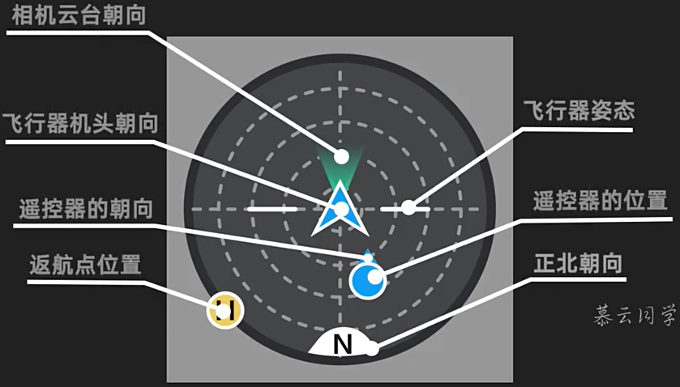

## 1. 飞行准备

- 安装螺旋桨，检查螺旋桨
- 移除云台保护罩
- 安装遥控器摇杆

## 2. 飞行控制

- 开机：短按一次行电池的电源按键，再长按直至开启
- 左摇杆：控制飞行器的升降和航向
- 右摇杆：控制飞行器前后左右的水平移动
- 起飞
  - 自动起飞
  - 手动起飞：将两个摇杆同时下拉到底，并向内或向外掰杆启动电机并使飞行器悬停。电机起转后，松开摇杆，并轻推左摇杆，控制飞行器起飞。
- 降落
  - 自动降落
  - 手动降落：将左右遥杆同时下拉到底
- 自动返航。开启智能返航、飞行器低电量触发智能低电量返航、或通讯信号丢失触发失控返航时，飞行器将自动返回返航点并降落

## 3. 遥控器按钮

- 拍照/录像切换按键
- 拍摄按键
- 云台俯仰角度控制拨轮
- 自动返航。长按此按键直到遥控器发出“嘀嘀”声，即可成功触发。再短按一次即可取消智能返航
- Fn
  - 单击，开启和关闭补光灯
  - 双击，使云台回中

## 智能跟随/聚焦 /兴趣点环绕

在空旷安全地带启动飞行器，使之飞至合适的高度并悬停。
进入 app 相机界面，直接在屏幕上框选想要跟随的目标。
选择聚焦 2.0。
点击拍摄按键开始拍摄。
画面可通过遥感和云台拨轮进行调整。
拍摄完成后，点击屏幕的“停止”按钮，或点击遥控器自动返航按钮退出该模式。

## 一键短片

将飞行器设置为普通档。
点击拍摄模式图标，选择 一键短片 — ...

## 桨叶保护罩

## 姿态球

- 返航点，无人机，遥控器三者的位置

- H图标变灰，表示GPS信号弱

- 飞行器姿态可以观察出，飞行器前进后退，左右倾斜。如果悬停状态下飞行器姿态不在中心，表示风力大

## 四旋翼飞行器结构和原理

