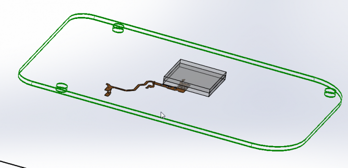
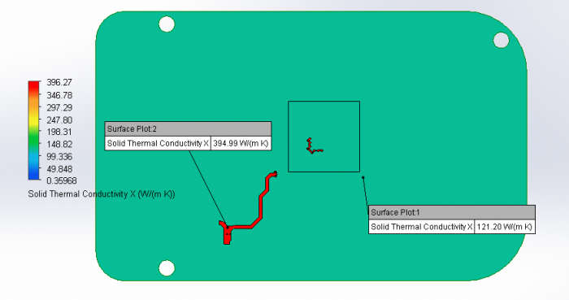
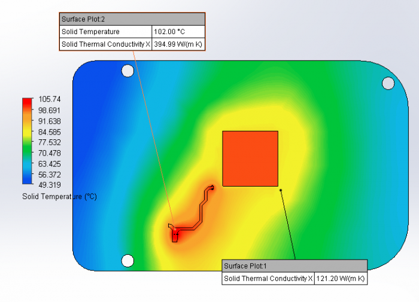
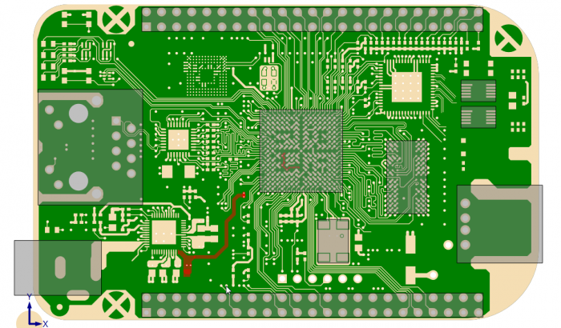
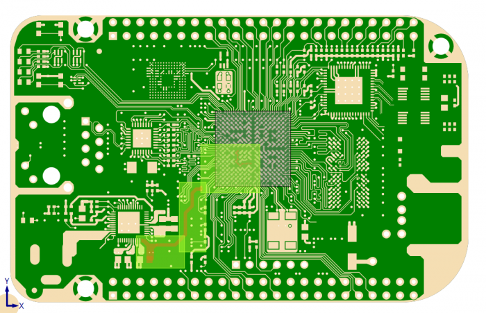
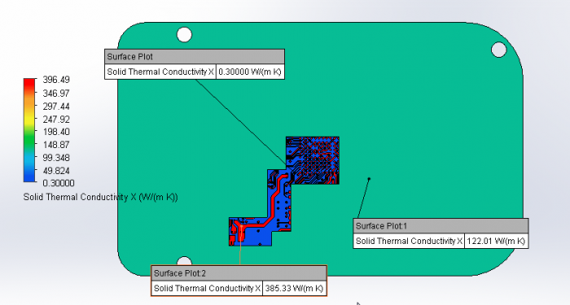
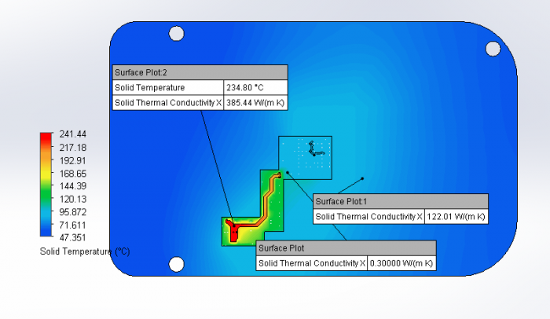

# Flotherm XT EDA Bridge

ODB ++文件是一个zip文件，其中包含许多描述PCB详细信息的文件夹/文件。如何检查 ODB++ 文件中的信息设置是否正确？

ODB++ 提供了一种智能的单一数据结构，用于将 PCB 设计转换为制造、组装和测试。它由 CAD 和 CAM 刀具供应商组成的活跃社区通过开放、包容的合作计划提供支持。

https://www.mentor.com/pcb/downloads/odb-plus-plus-viewer

我可以在FloEDA中打开odb ++（tgz文件），但设计中不存在介电层。当转移到XT（从FloEDA）时，所有金属层都堆叠在另一个之上，没有电介质，它们之间也没有通孔。

ODB++ 文件中缺少电介质文件的厚度信息。

此信息可以手动添加到 ODB++ 文件中。

通常在 odb++ 文件中，应包含介电厚度的信息。
检查 odbfolder\steps\job\layers\layer_name\attrlist 中每
层。如果存在并设置了".layer_dielectric"，则这是紧挨着被检测层下方的电介质层的厚度。

如果缺少".layer_dielectric"，只需手动添加信息并保存文本文件即可。

### 导入 ODB++：仅导入完全填充的过孔

ODB++文件不包含镀层铜厚度的信息

在制造过程中，不需要镀铜厚度的此信息，并且该信息不在ODB ++文件中

\1. ODB ++文件给出了钻头的直径。这对应于过孔的外径。

\2. 在导入 ODB++ 文件时，FloEDA 桥接器认为所有过孔都填充有铜材料。

## 焦耳热

**NOTE:** The Joule Heating analysis feature and Explicit Geometry Modeling (Thermal Territories) feature are only available with the Ultra License.

Here is the procedure that should be used to perform this analysis:

1.  Import the desired PCB design into FloEDA bridge (ODB++ or CCE file both contain explicit geometry)
2. Change Board Model Type to “Explicit”
3. Select desired net under “Power and Ground Nets”
   1. If desired net is not available, open “Power Nets Selector” to make desired net selectable.
4. Transfer FloEDA Bridge model to FloTHERM XT
5. Assign boundary conditions to the net (typically Electrical Condition for Joule Heating analysis)
6. Solve the model

For purposes of demonstration, instead of applying Joule Heating boundary conditions to the sample model, we applied a heat source. The resultant model performance will be the same.

Here is an example of the analysis using the procedure above. The first figure is the PCB (wireframe) with the desired net transferred separately. As can be seen, this net covers multiple layers.

 

 

 

The figure below shows the thermal conductivity of the material around the net. The net thermal conductivity is that of copper (395 W/m-K) while the thermal conductivity of the board material around net on this layer is based on the copper content of the layer.  In this case, the % copper is approximately 40% which results in a thermal conductivity of around 121 W/m-K.

 

 

The high thermal conductivity material surrounding the net results in the following thermal profile.

 

If you look at the actual net in the PCB, it is surrounded by FR4 which has a thermal conductivity of 0.3 W/m-K. In the figure below, the same net is shown in the PCB. The net is highlighted in red, and as can be seen it is surrounded by green color which is that of the FR4.

 

 

 

The current modeling method results in much higher thermal conductivity around the net being analyzed. This will result in lower predicted temperatures in the model than if the net were modeled correctly.

With the launch of FloTHERM XT V3.0, a new feature was added to FloEDA Bridge, **Thermal Territories**. Thermal Territories allows the user to transfer explicit geometry (FR4 and Copper) into designated volumes of a PCB. Thermal Territories are created around components on the board. So, in order to capture the explicit geometry around a net, the user will need to create components in the model to capture the geometry around the desired net. When the user creates the component, the created component can be filtered so the component is not transferred to FloTHERM XT but the Thermal Territory is transferred.

Due to the serpentine nature of the net above, using one Thermal Territory around the net would result in excessive explicit geometry being transferred to FloTHERM XT and increased processing time to perform material attribute Boolean operations. In this case, multiple Thermal Territories are created (with components filtered) to minimize the size or amount of explicit geometry.  Also, due to multiple layers of the net, all Thermal Territories are created with “All Layers” selected for the depth.

In the figure below, the net on Layer one is highlighted in red and the multiple Thermal Territories are highlighted in green. Since there is no grey box in the middle of the Thermal Territories, all of the components are “Filtered”. Even though there are three distinct Thermal Territories in FloEDA Bridge, when the model is transferred to FloTHERM XT, the dielectric will be modeled as one part and the explicit copper inside the Thermal Territories will be modeled as a separate part. Because the net is selected to be modeled explicitly, the net will be modeled separately and the geometry not repeated in the Thermal Territory explicit copper part.

 

Again, the “Depth to Layer” setting for all three Thermal Territories is “All Layers”.  The next figure shows the thermal conductivity of the material around the desired net after the model has been transferred to FloTHERM XT and solved.

 

As viewed in the above image, the material adjacent to the net to be analyzed now has a thermal conductivity of 0.3 W/m-K. This thermal isolation now results in a maximum temperature for the net to increase from 105.7 Degrees C to 242.2 Degrees C.

 

 

By accurately modeling the explicit geometry around the net, the resultant temperature is higher than analyzing just the PCB with the PCB NGSP (Non-Geometric SmartPart).

Here is the process to create a more accurate model:

1. Import the desired PCB design into FloEDA bridge (ODB++ or CCE files both contain explicit geometry)
2. Change the Board Model Type to “Explicit”
3. Select the desired net under “Power and Ground Nets”
   1. If the desired net is not available, open “Power Nets Selector” to make the desired net selectable.
4. Create New Component(s)
   1. Drag and size component to cover the net (if required use more than one component). Also, check net layout on other layers to ensure proper coverage.
   2. Set Thermal Territory to Enabled
   3. Set Inflation size to 0 mm (or what makes sense to cover net)
   4. Set “Depth to Layer” to “All Layers”
   5. Set Component Model Type to “Filtered”
5. Transfer FloEDA Bridge model to FloTHERM XT
6. Check solid model for net to be analyzed
7. Verify net to be analyzed is fully inside the Thermal Territory dielectric part.
8. Assign boundary conditions to the net (typically Electrical Condition for Joule Heating analysis)
9. Solve the model

