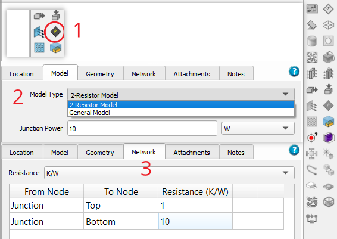
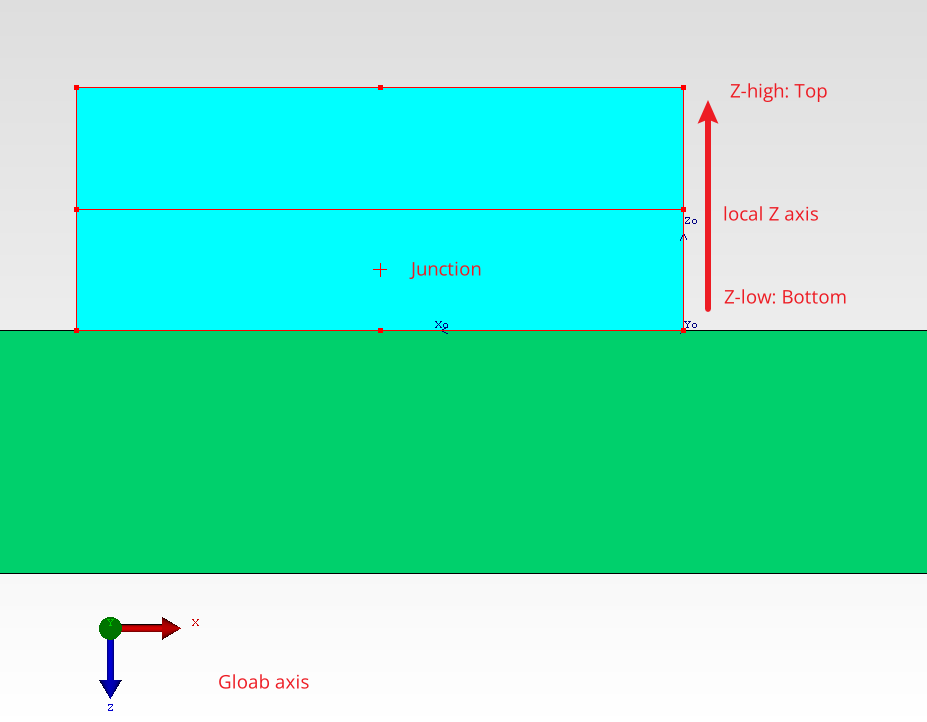

# How to build 2R resistor model in Flotherm

In this article, we will build a 2R resistor model in Flotherm.

- Click the **compact component** in the **Prject manager creater panel**. Then edit the component detial as follows:

- Model: 
    - Model type, select **2R resistor model**.
    - Junction power, set the power of this device.

- Network: set the junction to top and junction to bottom thermal resistance values.

The step above is shown in the following figure.

!!! note

    The top and bottom side define by the Z axis of this devices. The top side is the high side in Z directoin, while the bottom side is the low side in Z direction. Shows in the figure below.

