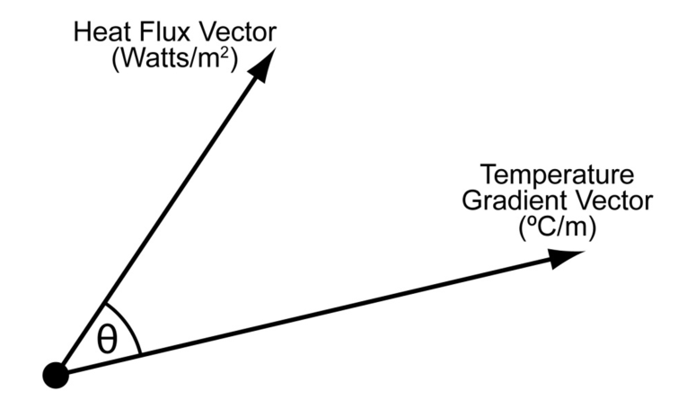

##  Flotherm 的Bn和Sn是什么意思 

$$
B_n = \left\lvert H \right\rvert \times \left\lvert T \right\rvert \times |\cos(θ)|
$$
从 $B_n$ 的定义，可以知道，它是热流矢量和温度梯度矢量的点乘有点类似，不过，它把余弦项取绝对值。
$$
B_n = \left\lvert \vec{H} \right\rvert \times \left\lvert \vec{T} \right\rvert \times |\cos(θ)|=\left\lvert \vec{H} \cdot \vec{T} \right\rvert
$$
这样就没有负值了。理论上讲应该也不会存在负值。

可以认为是热量矢量在温度梯度矢量方向上的投影，实际意义是表征这两个矢量之间的夹角。

- 两者方向一致， $B_n$ 越大
- 两者幅值越大， $B_n$ 越大

想象一下，什么情况下 $B_n$ 会比较大。首先，两者的幅值都大，其次两者方向一致：

- 温度梯度的幅值大，说明温度变化明显，也就是这个方向上热阻大。
- 热流量的幅值大，说明这个方向上要散走的热量多。
- 两者方向一致，说明这个方向是唯一相对较小的热流通路。

然后，软件对所有 $B_n$ 值做归一化，这样 $B_n$ 值较大的地方就是相对来说的散热瓶颈区域。

类似地， $S_n$ 的定义为：
$$
S_n = \left\lvert H \right\rvert \times \left\lvert T \right\rvert \times |\sin(θ)|
$$

- 两者方向不一致， $S_n$ 越大
- 两者幅值越大， $S_n$ 越大

 $S_n$ 值较大，说明热量不是从这个温度梯度方向上走的，通过查看较大 $S_n$ 值的区域可以发现哪些方向上是可以建立新的散热途径。

