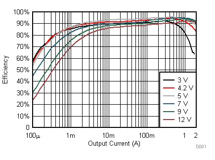

对于 DC-DC 转换器，输入电流不等于输出电流，因此我们不能使用与线性稳压器相同的公式计算它的热耗，我们可以使用数据表中的效率图进行估算。

这里以[TPS63070](https://www.ti.com/product/TPS63070) Buck-Boost DCDC 为例进行说明。在数据手册中可以找到如下图的效率曲线。它将效率绘制为输出电压和输出电流的函数。

例如图中红色曲线表示输出电压为4.2V，通过查看这条曲线可以找到在不同输出电流的情况下转换器的效率。

这个器件标称最大输出电流为3.6A，可是我们看到在输出电流>2A 时器件的效率已经开始下降，输出电压越低，下降的越多。所以在器件选择时应该留有一定的余量。

效率图将效率绘制为输出电流的函数，输出电流因输入和输出电压而异。

器件的热耗可以通过下式进行计算：

$$
P_D=P_O\times\frac{1-\eta}{\eta}
$$

其中，$P_D$为器件的热耗，$P_O$为器件的输出功率($I_{OUT)\times U_{OUT}$)

例如，输入电压为 12V，输出电压为 5V，负载电流增加到 1.0A。使用上面的 5V 效率图，效率应该在 93% 左右，因此它转化为热量的损失功率为:

$$
P_D=P_{OUT}\times \frac{1-\eta}{\eta}=(5 \times 1.0) \frac{1-93\%}{93\%}=0.376W
$$

!!! note
    在较高的温度下，DCDC的功耗通常会增加。例如，85°C 环境下的功耗可能比室温下的功耗高 10% 到 30%。
