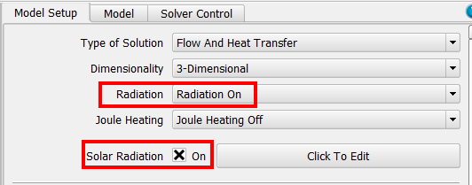
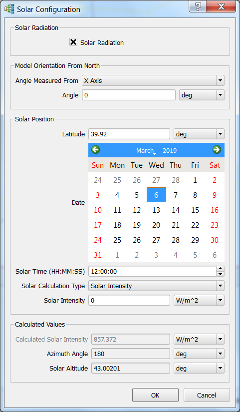

Floterhm模拟太阳辐射需要设置以下三个方面的内容：

- 模型设置中打开太阳辐射选项
- 设置太阳辐射强度和角度
- 设置表面材料属性

## 模型设置

打开Model Setup 窗口，激活Solar Radiation，如果设备对外热辐射占比较大，需同时打开辐射选项。

单击“Click To Edit”打开太阳能配置窗口。

## 太阳能配置

### 方向定义

'Model Orientation From North'用来定义“北方”在项目中的相对位置。

如下图，如果项目的重力设置为-Y方向，则X轴或Z轴将用于定义模型的北方。例如，如果North与Z轴对齐，则将'Angle Measured From' 设置为 'Z Axis'，角度设为0度。如果North不沿轴放置，请使用角度从X轴或Z轴定义此位置。

### 太阳位置定义

Flotherm使用纬度，日期和平太阳时间来定义太阳位置。如下图，北京的纬度为39.92°，日期将设定为2019年3月6日，太阳时为12:00:00。

平太阳时间可能与当地时间不同。需要将本地时间转换为平均太阳时进行准确分析。

注：不太确定Flotherm使用的是平太阳时还是真太阳时，虽然两者相差不是很大，有待验证。

这些设置用于计算方位角和太阳高度角。

 

结合Command Center可以求解在不同时间太阳辐射，例如全天的仿真情况。

### 太阳强度

用户可以自定义太阳强度，在Solar Intensity选项中输入，但是太阳的方位角和高度角还是由软件根据纬度和时间计算得到的。

另外，'Solar Calculation Type' 可以设置为cloudiness。可以认为，它将计算出的太阳强度打个折。值在0~1之间。

如下所示，计算出Cloudiness为0时，太阳能强度约为$100 W/m^2$。

 

如果Cloudiness设定为0.3，则计算出的太阳能强度降低30％，降至约$70 W/m^2$。

太阳能矢量在编辑窗口的右上角显示为黄色箭头，我们可以用来检查太阳角度设置的是否正确。

## 表面材料属性

在求解太阳辐射问题时，需要注意模型中对象的几个属性。

- 材料属性
- 表面属性
- radiation属性

确保组件具有相关的材料属性，以便它们可以传导热量。此外，应用表面属性来定义太阳能反射率和发射率。

太阳能反射率仅适用于太阳辐射打开时。这决定了太阳能负载应用于系统的程度。如果物体的太阳反射率为0.5，则仅应用该物体的50％太阳能负荷。从系统中移除反射的太阳辐射。太阳辐射就像将折叠的源SmartPart应用于模型中的零件。

设定发射率是为了定义物体的热辐射，在建模太阳辐射时应开启辐射。发射率包括表面光洁度和零件的粗糙度。该值将决定对象辐射的程度; 发射率越低，辐射传热越少。

注意：“颜色”，“光泽度”和“亮度”是仅更改模型的可视化表示的设置。

最后，需要将辐射属性应用于对象表面，以包括在热辐射计算中。
