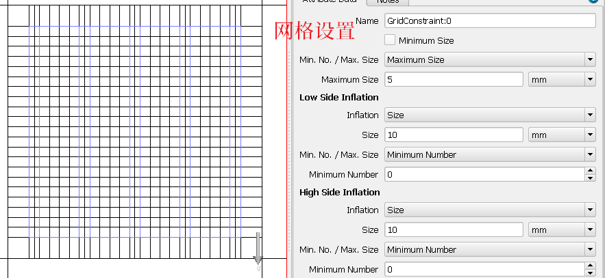
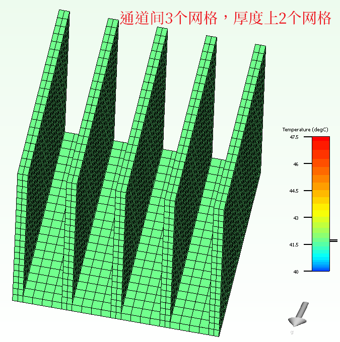

# Flotherm 模拟散热器的建议

散热器有助于将热量散布在更大的表面积上，从而可以更有效地散热

$$
Q=hA(T_s-T_{air})
$$

对这些狭窄通道内的流动空气进行建模对于捕获压力损失和热传递至关重要。当使用软件进行仿真分析时，翅片间的区域必须具有足够的网格分辨率。

FloTHERM中模拟散热器需注意以下几个方面：

1. 在FloTHERM中建模散热器最简单有效方法是使用散热器智能部件建模。

2. 打开散热器智能构建对话框时，查看散热片之间的单元格数值，默认值为3个单元格。如果需要更高的压降精度，可能需要将翅片之间网格数量增加到的5个单元。

3. 对散热器设置网格约束。

- 沿着散热片长度方向设置通胀以更好地模拟入口和出口压力损失。

- 设置网格约束以解析翅片的厚度。网格最大尺寸=翅片厚度，允许的最小尺寸 < 通道宽度/3。

- 在散热器上本地化网格。使得精细网格仅适用于散热区域，减少网格数量。

请参阅附图说明

