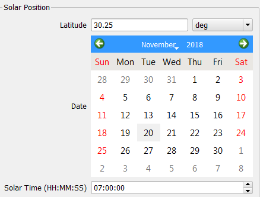
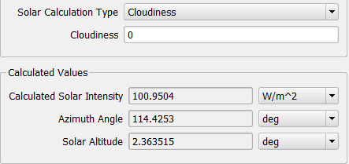
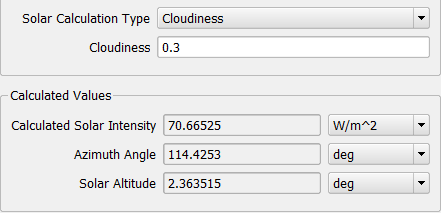
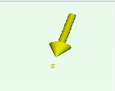

  ## Flotherm中加入热管模型后收敛困难。

  热管具有非常高的有效导热率。因此，当涉及使用温度变量收敛时，可能产生问题。

  为避免这些问题，建议用户：

  使用双精度求解器（double precision solver “求解器控制”选项卡）

  使用“共轭残差”选项（conjugate residual “求解器控制”选项卡）

  将温度的错误时间步长增加~x20（在“求解器控制”选项卡下）

  使用环境变量FLOMAXITFORTEMP

  定义新的环境变量FLOMAXITFORTEMP并将其设置为等于任何值

  ### Collapsed object辐射

  Radiation is calculated based on the temperature difference between objects.
  Therefore for the software to compute these temperature differences it must
  know the temperatures of the objects partaking in the Radiative exchange. In
  fixed temperature cuboids (collapsed or uncollapsed) the temperature of the
  object is explicitly set. Therefore these objects partake in Radiation but can
  only pass heat to other objects cooler than themselves. They cannot become
  warmer or cooler because their temperature is fixed by you. Objects set to
  have a fixed heatflow give out energy to the neighbouring grid cells but do
  not have a temperature calculated within them. Therefore there is insufficient
  data for the software to compute its radiation calculation and therefore they
  will not partake in the radiative exchange. Collapsed objects can only take
  part in the radiation calculation if they are set to be fixed temperature. If
  set to be conducting they cannot take part in the radiation calculation
  because they don't have grid-cells within them to store the temperature data.

  Note: These objects will all act as obstructions to radiation, inhibitting the
  view factor between other radiating objects.

  ### Open Domain

  运行辐射模型时，开放边界如何影响辐射传输？是否计算出交换因子？什么是辐射温度？

  - All radiating geometry inside the domain will radiate towards “infinity
  outside the domain”, the domain boundaries.

  - Therefore exchanges factor are calculated.

  - Domain boundaries are ideally “black”.

  - Radiation is always a two-way process. Hence, if the radiation temperature
  of the domain boundary is higher than the body temperatures inside there will
  be a positive net radiation heat flow into the domain and heat will be added.
  If the radiation temperature is lower than the body temperatures heat will be
  extracted from the system.

  - The temperature used to calculate the radiation of each domain boundary is
  set in the Project Manager in

  o   [Model Setup] – Default Radiant Temperature

  - Ambient Attributes may be used to overwrite the above settings with
  Radiation Temperature other than the Default Radiant Temperature. You may use
  different Ambient Attributes for different sides and hence different Radiation
  Temperatures on different sides of the domain.

  - Domain boundaries which are set to “Symmetry” are adiabatic. To prevent
  violation of the energy conservation, one side will be opened to radiation
  transfer (but only for radiation transfer!) automatically. In this case there
  will be a warning displayed in the Message Window.

  - 域内的所有辐射几何体都将向“域外无限域”（域边界）辐射。

  - 因此计算交换因子。

  - 域边界理想地是“黑色”。

  - 辐射始终是一个双向过程。因此，如果畴边界的辐射温度高于体内的体温，则将有正的净辐射热流进入区域并且将加热。如果辐射温度低于体温，则将从系统中提取热量。

  - 用于计算每个域边界辐射的温度在项目中设置[Model Setup] – Default Radiant Temperature

  - 环境属性可用于使用除默认辐射温度之外的辐射温度覆盖上述设置。您可以针对不同侧面使用不同的环境属性，从而在域的不同侧面上使用不同的辐射温度。

  - 设置为“对称”的域边界是绝热的。为了防止违反节能措施，一方将自动开放辐射传输（但仅用于辐射传输！）。在这种情况下，消息窗口中将显示警告。

  ## 求解

  Insufficient Memory < Exchange Factor Calculation performed abnormal exit >

  The total radiating faces is above the limit.

  The number of radiating faces is limitating to 120000 radiating faces by
  default. If the number of radiating surfaces exceeds this value, an exception
  is thrown and the EFG aborted.

  To increase the number of radiating faces using Environment variable, you can
  set

  System environment variable: EFGFACELIMIT 

  System environment value: Number

  When the calculation is done, the number of radiating faces can be found on
  the first line of the following file: BaseSolution\Exchange\facelist (Open
  with Wordpad)

## Flotherm中加入热管模型后收敛困难。

热管具有非常高的有效导热率。因此，当涉及使用温度变量收敛时，可能产生问题。

为避免这些问题，建议用户：

使用双精度求解器（double precision solver “求解器控制”选项卡）
使用“共轭残差”选项（conjugate residual “求解器控制”选项卡）

将温度的错误时间步长增加~x20（在“求解器控制”选项卡下）

使用环境变量FLOMAXITFORTEMP
定义新的环境变量FLOMAXITFORTEMP并将其设置为等于任何值

### Collapsed object辐射

Radiation is calculated based on the temperature difference between objects. Therefore for the software to compute these temperature differences it must know the temperatures of the objects partaking in the Radiative exchange. In fixed temperature cuboids (collapsed or uncollapsed) the temperature of the object is explicitly set. Therefore these objects partake in Radiation but can only pass heat to other objects cooler than themselves. They cannot become warmer or cooler because their temperature is fixed by you. Objects set to have a fixed heatflow give out energy to the neighbouring grid cells but do not have a temperature calculated within them. Therefore there is insufficient data for the software to compute its radiation calculation and therefore they will not partake in the radiative exchange. Collapsed objects can only take part in the radiation calculation if they are set to be fixed temperature. If set to be conducting they cannot take part in the radiation calculation because they don't have grid-cells within them to store the temperature data.

Note: These objects will all act as obstructions to radiation, inhibitting the view factor between other radiating objects.

### Open Domain

运行辐射模型时，开放边界如何影响辐射传输？是否计算出交换因子？什么是辐射温度？

- All radiating geometry inside the domain will radiate towards “infinity outside the domain”, the domain boundaries.
- Therefore exchanges factor are calculated.
- Domain boundaries are ideally “black”.
- Radiation is always a two-way process. Hence, if the radiation temperature of the domain boundary is higher than the body temperatures inside there will be a positive net radiation heat flow into the domain and heat will be added. If the radiation temperature is lower than the body temperatures heat will be extracted from the system.
- The temperature used to calculate the radiation of each domain boundary is set in the Project Manager in

o   [Model Setup] – Default Radiant Temperature

- Ambient Attributes may be used to overwrite the above settings with Radiation Temperature other than the Default Radiant Temperature. You may use different Ambient Attributes for different sides and hence different Radiation Temperatures on different sides of the domain.
- Domain boundaries which are set to “Symmetry” are adiabatic. To prevent violation of the energy conservation, one side will be opened to radiation transfer (but only for radiation transfer!) automatically. In this case there will be a warning displayed in the Message Window.

- 域内的所有辐射几何体都将向“域外无限域”（域边界）辐射。
- 因此计算交换因子。
- 域边界理想地是“黑色”。
- 辐射始终是一个双向过程。因此，如果畴边界的辐射温度高于体内的体温，则将有正的净辐射热流进入区域并且将加热。如果辐射温度低于体温，则将从系统中提取热量。
- 用于计算每个域边界辐射的温度在项目中设置[Model Setup] – Default Radiant Temperature

- 环境属性可用于使用除默认辐射温度之外的辐射温度覆盖上述设置。您可以针对不同侧面使用不同的环境属性，从而在域的不同侧面上使用不同的辐射温度。
- 设置为“对称”的域边界是绝热的。为了防止违反节能措施，一方将自动开放辐射传输（但仅用于辐射传输！）。在这种情况下，消息窗口中将显示警告。

## 求解

Insufficient Memory < Exchange Factor Calculation performed abnormal exit >
The total radiating faces is above the limit.

The number of radiating faces is limitating to 120000 radiating faces by default. If the number of radiating surfaces exceeds this value, an exception is thrown and the EFG aborted.

To increase the number of radiating faces using Environment variable, you can set

System environment variable: EFGFACELIMIT 
System environment value: Number

When the calculation is done, the number of radiating faces can be found on the first line of the following file: BaseSolution\Exchange\facelist (Open with Wordpad)

### 细节

进行更改（例如调整模型中的对象大小或移动对象）需要很长时间才能更新FloTHERM。

具有高网格单元数的较大模型可能需要几秒钟来重新计算网格。

仅当网格信息以下列任何一种形式显示时，才会重新计算网格：

 

- 当绘图板中显示网格时
- 显示“网格摘要”对话框时
- 显示“系统网格”属性表时
- 显示解除键的摘要列时

- When the grid is shown in the Drawing Board
- When the Grid Summary dialog is displayed
- When the System Grid property sheet is displayed
- When the de-keypointed summary column is displayed

 

如果您想在不重新计算网格的情况下进行多项更改，请确保上述任何显示都不是活动的。

# How to Set Solar Radiation in FloTHERM

Updated October 09, 2018

------

## SUMMARY

This KB article seeks to address questions such as: 

 How do I set solar radiation in FloTHERM?

 What angle value should be entered under 'Model Orientation From North'? 

 How do I define a solar load? 

 Do I need to provide a solar reflectivity and emissivity for my surface attributes? 

------

## DETAILS

To include solar radiation in a FloTHERM model, toggle on 'Solar Radiation' under the Model Set Up tab. It is important to turn on thermal radiation as well; otherwise, the model will appear too hot. 

Select 'Click to Edit' to open the Solar Configuration Window. 

'Model Orientation From North' is the first setting that needs to be defined. This allows the user to identify where North is in the corresponding project. 

If the gravity is set to -Y direction for the project, then the X or Z axis will be used to define the model's orientation. If North lined up with the Z axis for example, set the 'Angle Measured From' to 'Z Axis' and leave the default angle of 0 deg. If North doesn't lie along an axis, use the angle to define this location from either the X or Z axis. 

The next section of the Solar Configuration Window defines solar position using latitude, date, and solar time. For this example, the latitude will be set to 30.25 degrees for Austin, Texas. Additionally, the date will be set to November 20th, 2018 with a mean solar time (clock time) of 07:00:00. These settings are used to calculate the azimuth angle and solar altitude.

Note: The mean solar time may not be the same as local time. The user may want to find a website or program that converts local time to mean solar time for accurate analysis. 

 

Note: The solar time is a 24- hour clock, so 4PM would look like 16:00:00. Keep in mind that Command Center scenarios can be used to look at solar radiation over various times, such as throughout the day.

If solar intensity/load data is available, this can be defined using the solar intensity option for 'Solar Calculation Type.' Notice this value is applied at the calculated location (Azimuth Angle and Solar Altitude).  

As an alternative, FloTHERM can calculate a solar intensity if the 'Solar Calculation Type' is set to cloudiness. This calculated value is based on the entered latitude, date, and solar time. A 'cloudiness' of 0 is clear skies, and this value can be adjusted to capture the expected cloud coverage, up to a value of 1. Therefore, the calculated solar intensity is reduced by the defined cloudiness. 

As shown below, the calculated solar intensity with zero cloudiness is about 100W/m^2.

 

If the cloudiness is set to 0.3, the calculated solar intensity is reduced by 30%, to about 70W/m^2. 

Notice for either case, the solar vector is displayed in yellow in the upper right hand corner of the Visual Editor.

There are a couple attributes that need to be applied in the model prior to solving. 

 -material attribute

 -surface attribute

 -radiation attribute 

Make sure components have an associated material attribute so they can conduct heat. Additionally, apply a surface attribute to define a solar reflectivity and emissivity.

Solar reflectivity only applies when solar radiation is turned on. This determines how much of the solar load is being applied to the system. If an object has a solar reflectivity of 0.5 then only 50% of the solar load for that object is applied. The reflected solar radiation is removed from the system. Solar radiation is like applying a collapsed source SmartPart to parts in your model. 

Setting an emissivity comes in for regular radiation, which again, should be turned on whenever there is solar radiation being modelled. The emissivity encompasses surface finishes and roughness of a part. This value will determine how much the object will radiate; the lower the emissivity, the less radiative heat transfer. 

Note: Color, Shininess, and Brightness are settings for changing only the visual representation of the model.

Lastly, a radiation attribute needs to be applied to object surfaces as necessary to be included in the thermal radiation calculation.

# How to set thermal radiation?

Updated May 01, 2013

------

## SUMMARY

Which settings need to be activated to calculate Thermal Radiation in FloTHERM or FloVENT ?

------

## DETAILS

There are projects settings and surface settings. Here is a list of all settings needed to perform a thermal radiation calculation.

FloVENT or FloTHERM doesn’t  use a direct view factors calculation. The software uses a ray tracing method to send rays in every direction (**\*diffuse*** thermal radiation). It’s a surface to surface method with **\*no interaction of fluid*** in between.

To consider thermal radiation inside FloVENT or FloTHERM, you need to activate following settings:

1. [Model/Modeling] and activate “**Radiation On**”

2. Use 3D cuboids (non-collapsed)

   1. Or 2D cuboids if you tick on “Activate Plate Conduction”

3. Specify an emissivity for each [

   Surface

   ] attribut (high for paint surfaces. ex 0.8 to 0.9 as it depends on surface roughness. And low for non-paint polished plate).

   1. The [Surface] attribute can be attached to any [Material] attribute.

4. Specify [**Radiation**] attribute (to define the pixel size for the radiation discretization). On each pixel, FloVENT or FloTHERM will consider a uniform temperature for ray tracing method. This pixel is at least the size of the cells, but the pixel can be and will often be wider than the local cell size.

   1. “Single Radiating” : create a single pixel on the surface.
      1. Define “Single Radiating” for small parts of the models or low temperature gradient on the surface of this part.
   2. “Subdivided radiating”: create multiple pixel on the surfaces based on your criteria.
      1. Define “Subdivided radiating” for big surface or when the temperature gradients are high on the surface of this part.

# Modeling Thermal Vias in FloTHERM using FloEDA Bridge

Updated July 14, 2016

------

## SUMMARY

What is a good way to represent thermal vias in FloTHERM? How to create such a representation easily?

------

## DETAILS

Modeling each thermal via discretely leads to lot of grid hence it is recommended to model them as a lumped cuboid with orthotropic conductivity. This can be done fairly easily using FloEDA Bridge.

Thermal vias help to provide a good conductive path from the component into the PCB. In other words it increase the thermal conductivity of the PCB locally under the powered component.

If the board details are brought into FloTHERM via FloEDA.Bridge then thermal vias can be added as a daughter of a component in the tree. Below are the default values for diamter, plating thickness of an individual vis and pitch for via pattern. The use can choose to have a filling material ( like Solder within the via) or leave to None.

Once the board is transferred into FloTHERM, thermal vias come in as a lumped cuboid with an orthotropic conductivity. In this particular case kz = 7.03 W/(mK) and kx,y = 0.339 W/(mK)

Even when not modeling the board in detail users can use the above steps to estimate the orthtropic conductivity of a lumped cuboid representing the thermal via pattern.