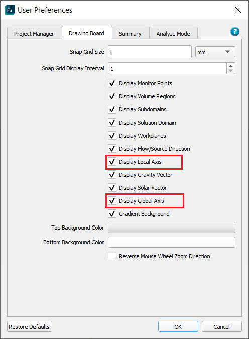
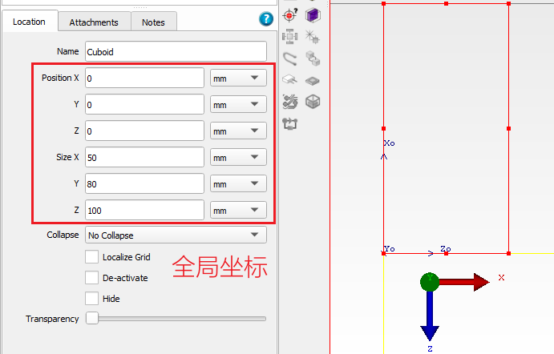
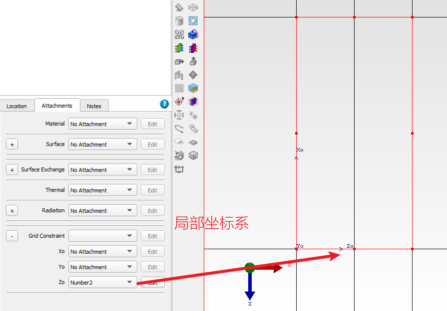
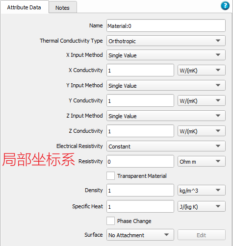
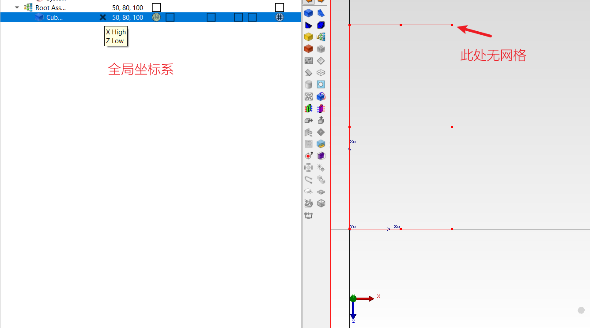

# Flotherm中的坐标

Flotherm软件中有全局坐标系，而每个器件又有自己的坐标系，经常让人摸不着头脑。这里总结下在各种情况下到底用的是什么坐标系。

## 坐标系的显示

在Edit -- User Preferences （`F11`）面板中可以设置是否显示全局坐标系和对象的局部坐标系。

## 对象Location属性面板中的坐标

对象Location属性面板中的坐标为全局坐标。如下图，Cuboid对象的局部坐标和全局坐标系不一致，但是在Position和Size中的数值是按照全局坐标系来的。

## 对象网格约束的坐标系

在对象的网格约束中，是按照对象的局部坐标系来定义的。如下图，给对象的Z0网格约束选项设置为Minimum Number为2，结果可以看到它是将局部坐标系的Z向划分成了两个网格。

## 材料属性中的坐标系

在Flotherm中可以定义材料导热率为各项异性或者双向性。如下图，将某种材料定义为各向异性，这里的X，Y，Z坐标以对象的局部坐标系为准。因此，在使用这种材料的时候要注意与对象的局部坐标系保持一致。

## 汇总信息中对象网格提示的坐标系

快捷键 `i` 可以查看对象的汇总信息，这里可以检查对象的各顶点是否有网格。如下图，提示对象的 X High和Z Low 方向上没有网格。结合下图可以看到，这里提示信息使用的是全局坐标系。

