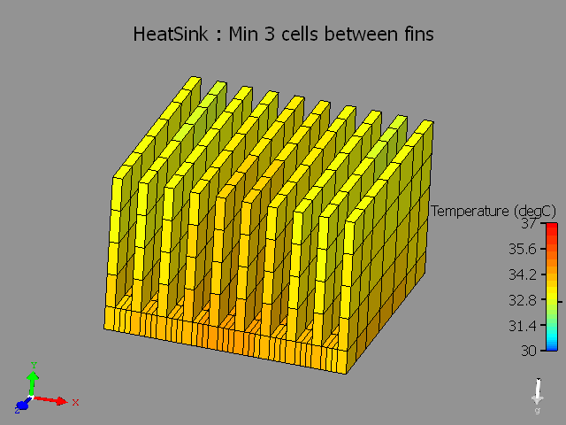
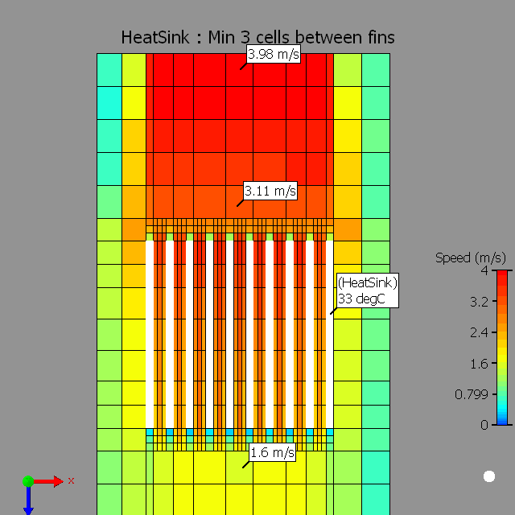

# Best practise for gridding heat sinks

## SUMMARY

- 最高效的方式是使用smart part方式建模Heat sink
- Fin间的网格数量默认是3个，为提高精度可以设置为5个
- 在翅片长度方向设置inflation，以求解入口和出口的压力损失
- 定义网格约束，Max size = fin厚度，min size allowed < 齿间距/3
- Heat Sink局部网格。

## DETAILS

Heat sink fins are not key-pointed.

The fluid flow and heat transfer in the narrow channels between the fins is not modeled accurately.

Heat sinks are extruded surfaces which help in spreading the heat over a greater surface area so that the heat can be dissipated more effectively [$Q=hA (T_s-T_{fluid})$]. Modeling the flow within these narrow channels is critical to capture the *pressure loss* and *heat transfer*. When performing analysis using CFD software such as FloTHERM, this translates to having a good mesh resolution for the regions between and around the fins.

The most efficient way of modeling a heat sink in FloTHERM is to use a heat sink smart part.

When you open the Heat sink smart construction dialog box, review the value for number of cells between fins, the default value is 3 cells. If higher accuracy of pressure drop is desired, you may want to increase this number to 5 cells between the fins.

Next step is to set grid constraints on the heat sink.

1. Along the length of Heat Sink fins set an inflation to resolve the entry and exit pressure losses.
2. Set a grid constraint to resolve the thickness of the fins. Max size = fin thickness, min size allowed < (1/3)*channel width.
3. Localize the grid on the Heat Sink. You will note that the fine grid is set only for the heat sink region along with the inflated region.

Plesae refer to Tech-Note [**MG576603**](https://supportnet.mentor.com/portal?do=reference.tutorial&id=MG576603&lang=en&prod=C127-S212-G287-P11534) : **FloTHERM - Gridding Tools and Recommendations.**

See the attached snapshots illustrating the same.

 

