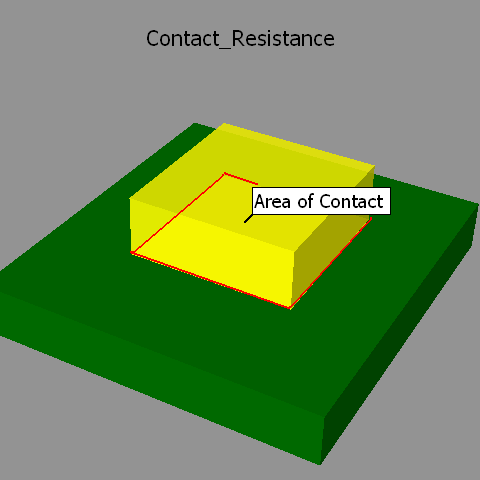
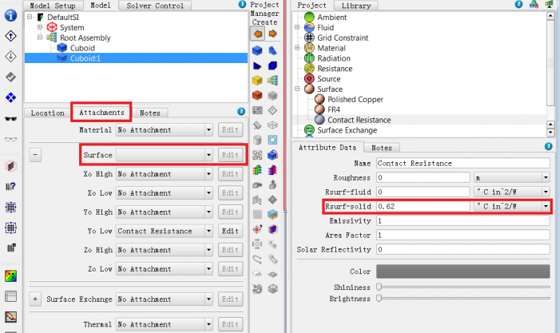

# Modeling a Thermal interface material (TIM)

## SUMMARY

两种方式：
- 两表面间创建一个collapsed cuboid，设置厚度$t$，和材料导热率$k$。Flotherm会计算法向热阻，平面方向的导热会忽略。注意：在模型树中放置的位置比两个表面对象更低，防止被与其接触的non-collapsed cuboid覆盖。
- 给其中一个对象的表面定义接触热阻， 单位为 $Km^2/W$。这种方式，模型树看起来更简单。器件和Heat sink接触时，最好定义器件表面接触热阻，它假设整个器件的表面与heat sink接触。

## DETAILS

When two solid surfaces are in contact there are small air gaps at interface due to imperfections on the surface smoothness. A thermal interface material (TIM) is placed between the two solid surfaces to fill in the air gaps and enable better heat transfer across this interface. Hence modeling the effect of TIM is critical.

In FloTHERM when modeling TIMs there are two approaches the user can take.

1. Create a collapsed cuboid of thickness 't' between the two surfaces in contact and assign a material property (conductivity $k$) to this collapsed cuboid. FloTHERM calculates the through plane resistance of this collapsed cuboid $R_{th, throughPlane} = (t/k)$, then it takes into account this $R_{th}$ for heat transfer (1D) normal to the contact surface. The in-plane conductivity (heat spreading) of the TIM cuboid is ignored.
2. Assign a surface attribute to one of the surfaces in contact and specify a value of Rsurf-solid ( SI units Km^2/W). The advantage of this approach over approach 1 is that project tree is simpler. When using this approach to model TIM between component and heat sink it is best to attach the surface property to the component surface. This is assuming the entire component surface is in contact with the heat sink.

When using option #1 above it is important to make sure that the TIM collapsed cuboid is placed lower in the hierarchy below the two objects in contact to make sure it is not overwritten by one of the non-collapsed cuboids in contact.

## MG514364

In order to do this - select one of the two objects (cuboid or smart part) Right Click>Surface =>Rsurf-solid ; you can attach this surface resistance to the appropriate surface of the object.

The advantage of this approach is that typically the TIM thickness is very very small when compared with the other objects. If TIM was to be modeled discretely as a cuboid it can lead to very thin grid cells leading to high aspect ratios. Using the Rsurf-solid approach this can be avoided.

