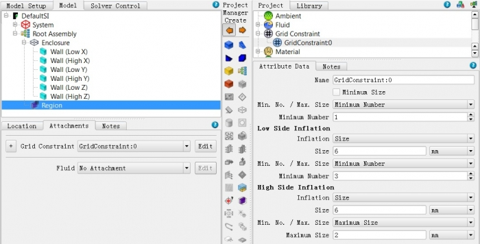
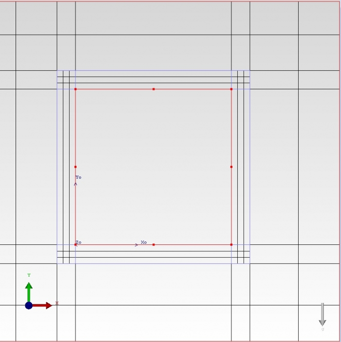

# Adding grid constraints to walls of an enclosure smart part

## SUMMARY

How to add grid constraints to resolve the heat transfer and heat spreading within the walls of a chassis modeled using enclosure smart part

Enclosure wall thickness is not resolved by the grid.

## DETAILS

When modeling enclosure walls as thick, the wall thickness is usually an order of magnitude smaller than the overall dimension of the enclosure. It is important to review the grid closely to make sure that there is at least one grid cell to resolve the wall thickness. In order to capture heat spreading effects it is recommended to have at least three cells within the wall thickness.

FloTHERM

FloVENT

When chassis walls are modeled using enclosure smart part a user can specify grid constraints to specify the Max size or Min. no. of cells in any of the specified directions for the enclosure smart part, but this applies to the overall dimensions of the enclosure and does not always ensure that the enclosure walls (when modeled thick) thickness is resolved.

If the user is modeling the enclosure walls as thick and wants to capture the heat spreading effects within the walls of the enclosure it is recommended to have at least 3 cells within the thickness of the enclosure walls. In the current version of FloTHERM there isn't an option to specify or constrain the no. of grid cells for the enclosure wall thickness.

Below are some modeling/gridding techniques to resolve enclosure walls

- Create a volume region the size of inner volume of the enclosure and specify a grid inflation same as the wall thickness 't' and min no. = 3 or Max size <= 't'/3 for both the low and high sides. Attach this grid constraint to all the three directions. After attaching this grid constraint localize the mesh on the volume region to truncate this fine mesh, right at the edge of the inflated boundary which in this case is the enclosure smart part itself.

Below is an example of setting grid constraint to have a minimum of 3 cells within the enclosure walls which have thickness 't = 6 mm'.

 

- Another option is to decompose the enclosure smart part into its individual cuboids and then attach a grid constraint to each of the six cuboids to have at least 3 or more cells to resolve the wall thickness. This modeling option however is more tedious than the former.