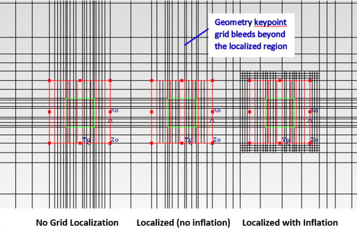
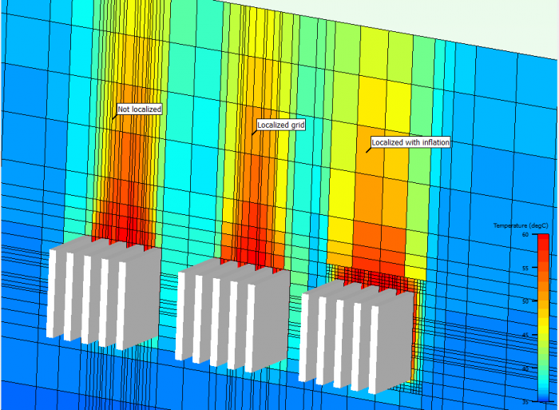

# What is the advantage of setting inflation on a localized grid?

## SUMMARY

Even after localizing the grid on an assembly, fine grid is bleeding from small objects/geometric features within the assembly.

Localizing does not seem to be taking effect.

Localizing the grid does not truncate the fine grid associated with heat sink fins and parts from detailed components.

## DETAILS

When an object/geometry touches the boundary of a localized grid, the keypoint grid associated with it bleeds beyond the localized region.

When an object/geometry touches the boundary of a localized grid, the fine grid associated with it bleeds beyond the edges of the region being localized. Setting an inflation under the grid constraints, inflates the size of this localized region (prevents the geometry from touching the localized boundary) thus preventing the fine grid from bleeding.

This can be best illustrated by Figure 1 shown below. Three identical assemblies of a detailed component with heat sinks mounted on them are placed next to each other.

- the assembly on the left is not localized
- the assembly in the center is localized, but you will notice that the keypoint grid from the heat sink fins and detailed component bleeds beyond the localized region.
- the last assembly on the right has a grid constraint with inflation set in all the three directions. The fine grid in this case truncates right at the edge of inflated grid.

​        Figure 1: Localizing with inflation prevents keypoint grid from bleeding

Sometimes setting an inflation has an added advantage of capturing physics of the problem. For example:

1. Having a fine grid at the entry & exit of heat sinks fins helps capture the pressure losses with greater accuracy (see Fig. 2 below)
2. It is strongly recommended to have grid inflation on boards and high power components to resolve the convective heat transfer close to their external surface.

 Figure 2: Grid inflation helps resolve the entry/exit losses associated with heat sinks.