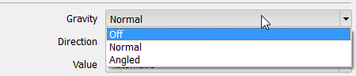
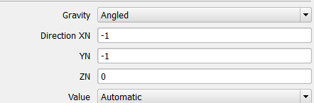
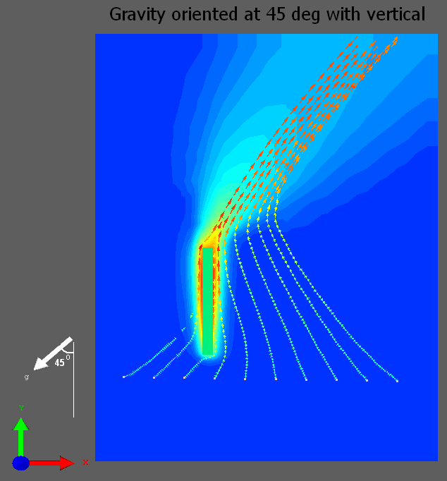

# 重力方向

## SUMMARY

Where can I edit the value for acceleration due to gravity '**g**' or turn it off if I wanted to?

I have my electronics box inclined at an angle (other than 90o) with vertical; how can I model that?

## DETAILS

It is not necessary to recreate geometry using inclined sloping blocks when performing thermal analysis on equipment inclined at an angle with gravity.

The default value of acceleration due to gravity set in the software is 9.81 m/s2 and is directed along negative Y direction. This can be reviewed under **Model Setup>Gravity** in the Project Manager. For certain applications, the user can edit this value (accelerating rocket) or turn it off completely (when in outer space).

The user can quickly change the gravity vector orientation to one of the normal directions X, Y,Z ( or -X, -Y or -Z) by selecting the appropriate option under the direction drop down.

In certain applications the electronic components or the entire chassis could be inclined at an arbitrary angle with vertical. A typical example is a telephone box placed on an inclined plank. The user can specify an angle (other than orthogonal directions) by selecting '**Angled**' and specifying the directional cosines.

Gravity vector can be resolved into its components along the orthogonal directions and can be written in vector form as.
$$
g = |g|.(g_x i +g_y j +g_z k)
$$
where $g_x$, $g_y$ & $g_z$ are normalized values of unit vector

If the gravity vector is inclined at angle of 45 deg (clockwise) with vertical the directional cosines are entered simply as below (user does not have to worry about normalizing the vector components). Gravity orientation is also available as an input variable in Command Center. The magnitude of gravity vector $|g|$ is still taken as default value of 9.81 m/s2 (unless user specified value is chosen).

Below is a simple example of an inclined heated plate modeled by rotating the gravity vector appropriately.

