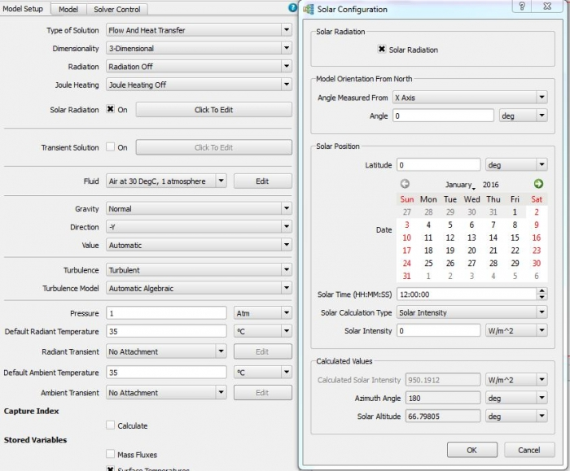

# MG558355

## SUMMARY

How to set the Latitude to get solar vector perpendicular to the roof (parallel with gravity) of the equipment?

## DETAILS

The tropic is the location on earth where the sun light can hit the equipment on its top face. Then, the solar vector is parallel to the gravity vector.

InFloTHERM under Model Setup  tab select Solar Radiation and click to Edit:

- Set the "Model Orientation From North" with default value as the sun is on top of equipment and the model orientation is not important. 
- The "Angle measured From" should be different from the gravity direction.
- "Latitude" 23.5 deg
- Day: 21 June
- Solar Time: 12 h
- Specify the "Solar Intensity" to fit with user data.