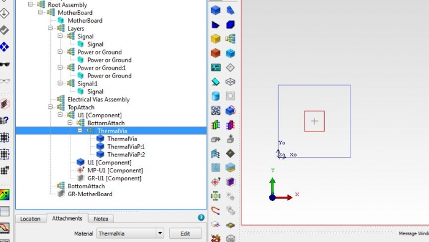

# Modeling Thermal Vias in FloTHERM using FloEDA Bridge

## SUMMARY

What is a good way to represent thermal vias in FloTHERM? How to create such a representation easily?

------

## DETAILS

Modeling each thermal via discretely leads to lot of grid hence it is recommended to model them as a lumped cuboid with orthotropic conductivity. This can be done fairly easily using FloEDA Bridge.

Thermal vias help to provide a good conductive path from the component into the PCB. In other words it increase the thermal conductivity of the PCB locally under the powered component.

If the board details are brought into FloTHERM via FloEDA.Bridge then thermal vias can be added as a daughter of a component in the tree. Below are the default values for diamter, plating thickness of an individual vis and pitch for via pattern. The use can choose to have a filling material ( like Solder within the via) or leave to None.

Once the board is transferred into FloTHERM, thermal vias come in as a lumped cuboid with an orthotropic conductivity. In this particular case kz = 7.03 W/(mK) and kx,y = 0.339 W/(mK)

Even when not modeling the board in detail users can use the above steps to estimate the orthtropic conductivity of a lumped cuboid representing the thermal via pattern.