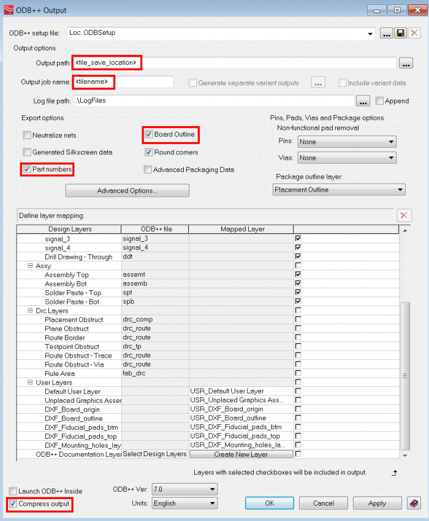
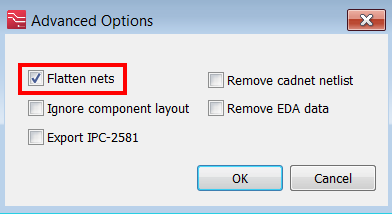

# Exporting ODB++ files from Mentor Graphics Xpedition

## SUMMARY

What options need to be selected in ODB++ Output window in Xpedition in order to create an ODB++ file for use in FloEDA Bridge (both in FloTHERM and FloTHERM XT)?

## DETAILS

Select Output/ODB++ from top menu bar in Xpedition. In the ODB++ Output window.

1. Make sure Board Outline is selected.

2. Make sure Part numbers are selected.

3. Fab layers are the most important item. Make sure all Fab layers are selected. It is not necessary to include User Layers and/or Solder Paste Layers. Output Version can be either 7.0 or 8.0. Units can also be either Metric or English.

4. It is recommended to select Compress output option as well.

 

5. Under Advanced Options, make sure Flatten nets is selected

 