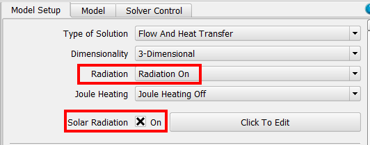
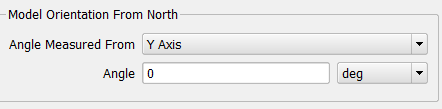
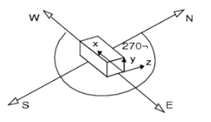
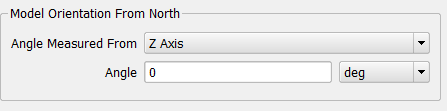
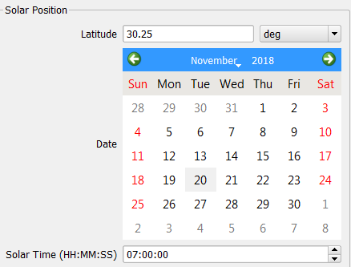
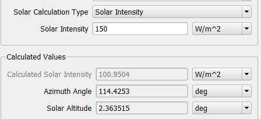
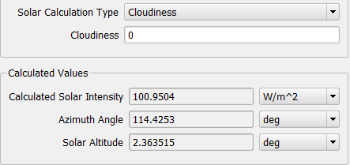
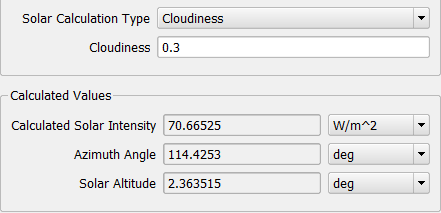
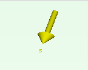
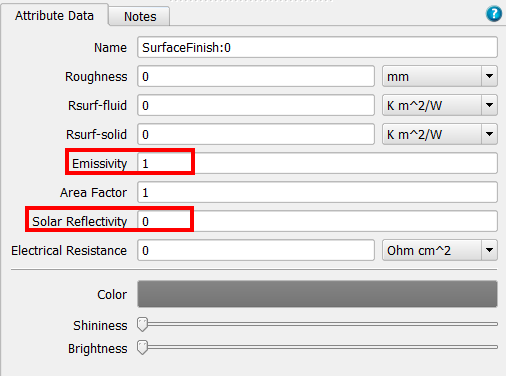

# How to Set Solar Radiation in FloTHERM

  SUMMARY

This KB article seeks to address questions such as: 

 How do I set solar radiation in FloTHERM?

 What angle value should be entered under 'Model Orientation From North'? 

 How do I define a solar load? 

 Do I need to provide a solar reflectivity and emissivity for my surface attributes? 

------

## DETAILS

To include solar radiation in a FloTHERM model, toggle on 'Solar Radiation' under the Model Set Up tab. It is important to turn on thermal radiation as well; otherwise, the model will appear too hot. 

Select 'Click to Edit' to open the Solar Configuration Window. 

'Model Orientation From North' is the first setting that needs to be defined. This allows the user to identify where North is in the corresponding project. 

If the gravity is set to -Y direction for the project, then the X or Z axis will be used to define the model's orientation. If North lined up with the Z axis for example, set the 'Angle Measured From' to 'Z Axis' and leave the default angle of 0 deg. If North doesn't lie along an axis, use the angle to define this location from either the X or Z axis. 

The next section of the Solar Configuration Window defines solar position using latitude, date, and solar time. For this example, the latitude will be set to 30.25 degrees for Austin, Texas. Additionally, the date will be set to November 20th, 2018 with a mean solar time (clock time) of 07:00:00. These settings are used to calculate the azimuth angle and solar altitude.

Note: The mean solar time may not be the same as local time. The user may want to find a website or program that converts local time to mean solar time for accurate analysis. 

 

Note: The solar time is a 24- hour clock, so 4PM would look like 16:00:00. Keep in mind that Command Center scenarios can be used to look at solar radiation over various times, such as throughout the day.

If solar intensity/load data is available, this can be defined using the solar intensity option for 'Solar Calculation Type.' Notice this value is applied at the calculated location (Azimuth Angle and Solar Altitude).  

As an alternative, FloTHERM can calculate a solar intensity if the 'Solar Calculation Type' is set to cloudiness. This calculated value is based on the entered latitude, date, and solar time. A 'cloudiness' of 0 is clear skies, and this value can be adjusted to capture the expected cloud coverage, up to a value of 1. Therefore, the calculated solar intensity is reduced by the defined cloudiness. 

As shown below, the calculated solar intensity with zero cloudiness is about 100W/m^2.

 

If the cloudiness is set to 0.3, the calculated solar intensity is reduced by 30%, to about 70W/m^2. 

Notice for either case, the solar vector is displayed in yellow in the upper right hand corner of the Visual Editor.

There are a couple attributes that need to be applied in the model prior to solving. 

 -material attribute

 -surface attribute

 -radiation attribute 

Make sure components have an associated material attribute so they can conduct heat. Additionally, apply a surface attribute to define a solar reflectivity and emissivity.

Solar reflectivity only applies when solar radiation is turned on. This determines how much of the solar load is being applied to the system. If an object has a solar reflectivity of 0.5 then only 50% of the solar load for that object is applied. The reflected solar radiation is removed from the system. Solar radiation is like applying a collapsed source SmartPart to parts in your model. 

Setting an emissivity comes in for regular radiation, which again, should be turned on whenever there is solar radiation being modelled. The emissivity encompasses surface finishes and roughness of a part. This value will determine how much the object will radiate; the lower the emissivity, the less radiative heat transfer. 

Note: Color, Shininess, and Brightness are settings for changing only the visual representation of the model.

Lastly, a radiation attribute needs to be applied to object surfaces as necessary to be included in the thermal radiation calculation.