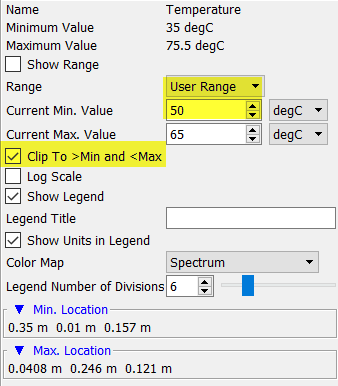
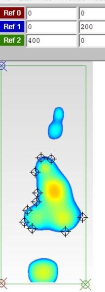

# Providing thermal keepout areas on PCB to the Electrical Engineers

## SUMMARY

- 创建PCB温度平面分布图
- 从图片提取坐标
- 将区域添加到IDF文件中作为Keepout区域

## DETAILS

You can obtain this information by following the steps/ workflow below: 

- Create a plane plot of temperature in the first layer of the board.

- Set the minimum temperature in the legend to be the desired temperature.  The maximum temperature doesn’t matter much.

- Use the clip below and above option.

  

- Ensure the board outline is visible (top the board) and save an image.

Now you’ll need a utility that can pull coordinates out of an image. You could use ‘Data Thief III’ (<https://datathief.org/>) or other tools like such for this purpose. In this tool:

- Define three reference points (origin, two corners of the (bounding box) of the board by selecting points on the image and entering the physical coordinates based on board dimensions.

- Add points to surround the temperatures zones of interest with whatever resolution you want.

- Export a text file containing the coordinates of the zones.  See attached for the example below.

  

Then you have the polyline description of the keepouts than can be added to an IDF file.