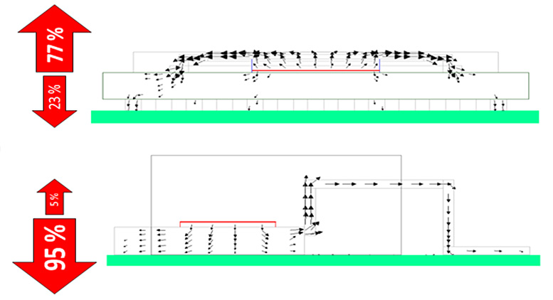
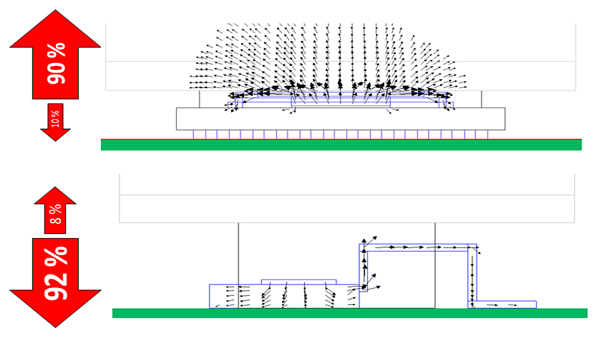
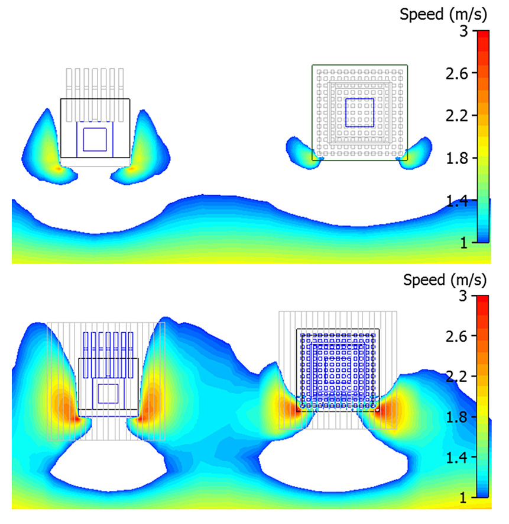

# 如何有效地分析结果

## 通过Heat flow path 图

Heat flow path 图可以帮助揭示热量主要是通过哪里流走的。

如上图BAG封装有77%的热量通过顶部流走，TO263封装95%的热量是通过底部导走的。

下图可以看到两种封装的顶部加上散热器后的效果。

### 速度图

下图显示了，有散热器和没有散热器两种情况下，PCB上方平面的速度图。揭示散热器可以增加PCB表面风的流速，从PCB可以带走更多的热量。

