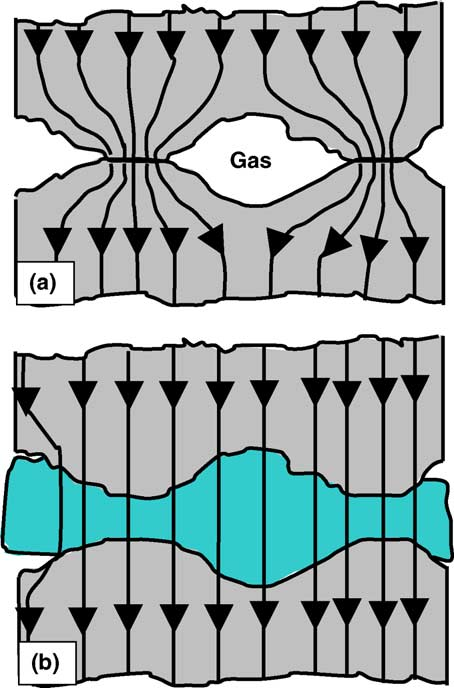

## 什么是接触热阻？

当两个不同温度的材料接触时，两个材料的表面似乎完全直接接触在一起，但当我们放大接触部分的界面时，会发现许多材料在微米或纳米尺度具有明显的凹凸不平，两个界面事实上并不是完全接触的，如图 (a)。

所以，表面粗糙度在接触的材料之间引入了空隙，通常其中会充满空气。气体的热导率，通常远低于常见固体材料的热导率。因此，在没有接触到的区域中热流率较小，导致界面上的热阻增加。

Grujicic 等人[^1]研究了下面参数对界面接触热阻的影响：

- 接触压力
- 微硬度
- 表面粗糙度
- 表面粗糙度坡度

如果增加气隙处的结构应力，将减小气隙的尺寸和宽度，从而影响到热阻率。多数情况下，在气隙中还存在表面对表面的辐射，只是在很多应用中由于材料间的温差足够小。

另外，上海依阳实业有限公司测试、研究了两块接触材料的热导率随真空度的提高而下降的现象[^2]。

所以，为了减小界面热阻带来的影响，通常人们会在接触界面处填充比较柔软的导热材料，称为界面材料（TIM），如图 (b)。根据应用场景的不同，有各种性能的TIM材料以满足不同的需求。以前，TIM材料只有国外厂家能提供，现在他们的市场份额被越来越多的国内公司所替代。这个小小的界面层培养了不少上市公司，养活了多少老板和员工。

## Foltherm中模拟TIM层或界面热阻的方法

在对界面热阻或TIM层建模时的FloTHERM中，用户可以采用多种方法。

- 在接触的两个表面之间创建一个长方体(Cuboid). 定义3个方向的尺寸, 并指定合适的材料属性。这种方式的缺点是，通常由于TIM层很薄，这样会导致TIM长方体垂直方向的网格必须比较细，才能模拟导热过程。
- 在接触的两个表面之间创建厚度为 $t$ 的折叠长方体(collapsed cuboid)，并为此折叠长方体定义合适的导热率 $k$ 。FloTHERM计算该折叠长方体的垂直方向热阻。
   $$
      R_{\mathrm{throughPlane}} = t / k
   $$
   只考虑垂直方于接触表面的热传递，而忽略TIM层水平方向上热传递。所以这种方式不太适合于比较厚的TIM层，或各向异性的TIM材料，如石墨烯垫片。
   另外需注意，在结构树中要将模拟TIM层的折叠长方体放到两个对象的后面，以保证它不会被这两个对象覆盖。
- 通过指定一个接触面的表面属性来定义接触热阻。在材料的表面属性中有一项Rsurf-solid可以定义表面热阻, 单位为(Km ^ 2 / W)。

[^1]: The effect of thermal contact resistance on heat management in the electronic packaging.
[^2]: 采用瞬态平面热源法测量NIST标准参考材料SRM 1453热导率随真空度的变化