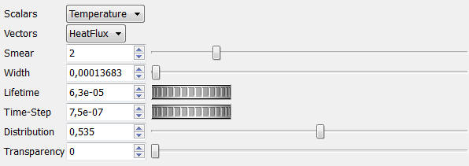
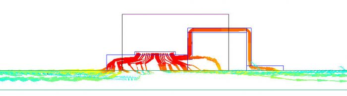

# 01 固体内部热流图

要仅显示实心部件中的热通量，请按以下步骤处理：

1. 在“Model Setup”选项卡中的“Stored Variables”下勾选“Heat Fluxes”。
2. 在Visual Editor窗口中，设置粒子属性，如下所示：

- 定义足够短的“Lifetime”，仅在实体内显示HeatFlux。请注意，热通量在固体中比在流体中更快地传播。因此，保持短寿命仅允许在固体中显示热通量路径。

- 当热量通量快速扩散时，定义一个简短的“Lifetime”以将热通量显示为箭头。如果时间步长太高，那么你会看到像丝带这样的粒子

安装在PCB上的TO示例：
[组件板载文件](assets/to_mounted_on_board.pack)。

在此包文件中，查看粒子设置：

 固态热通量的显示如下所示：
