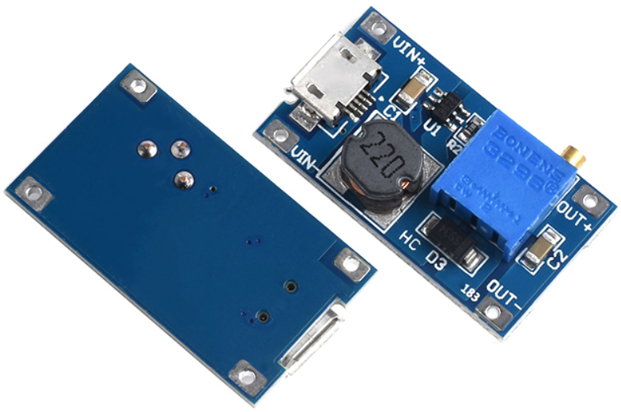

# MK2101

MK2101 is an adjustable 2A DCDC boost converter, the output power can be easily changed.

## Features

- Input voltage: 2~24V
- Output voltage: 5~28V
- Output current: <2A
- Size: 30mmX17mmX1.4mm

## Download

- MK2101 Schematic