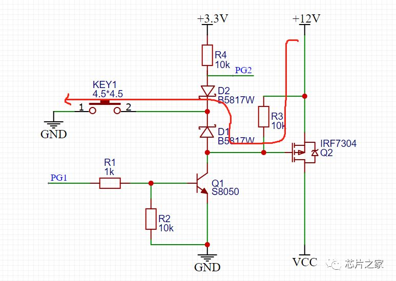
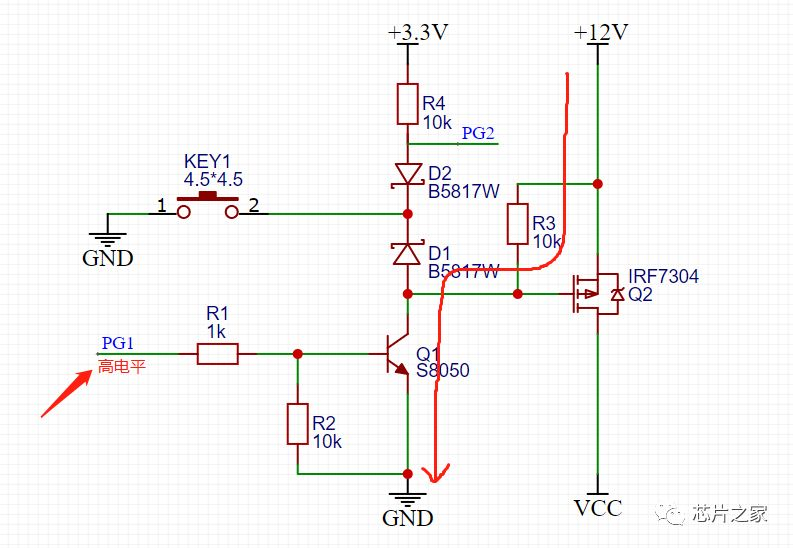
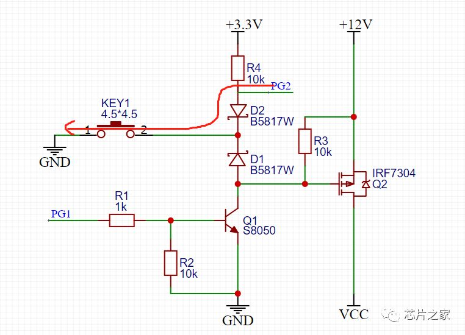
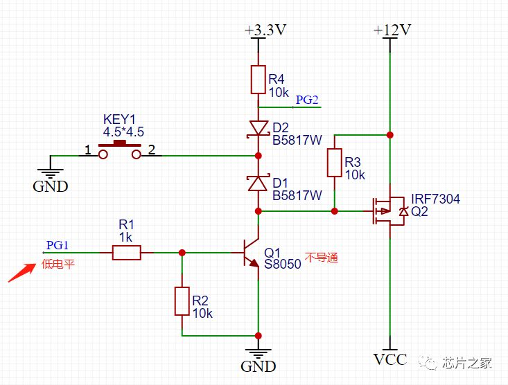

# 一键开关机电路

按键电路在我们的电路设计中非常常见，其中有一种比较特殊，就是一键开关机电路，顾名思义，就是只用一个按键实现开机关机以及其他功能，其实大家都接触过，我们手机中的开机键就是一个很好的例子，一键开关机有纯硬件机制，也有软件配合机制。

原理其实很简单，就是通过控制PMOS Q2的通断来实现的，当按键KEY1按下的时候，PMOS Q2导通，之后控制Q1导通，就可以实现PMOS一直导通，实现开机，开机之后，可以检测PG2的电平来判断按键的短按，双击，长按等操作。

## 开机过程

按键没按下之前，PMOS GS两端电压一样，不导通，当按键按下之后，看上图红色回路，G极通过二极管D1接地，PMOS导通，12V电压通过PMOS到VCC，给后级供电，这时候有老铁就要问了，难道我要一直按着嘛，按键松开的话MOS不就关断了？

别急，重点来了，大家有没有注意到一个细节，我们长按手机的时候，什么时候会松开按键，当屏幕点亮的时候才会松开吧，其实从按下到屏幕点亮，系统已经运行起来一部分了，系统刚运行起来的时候，会立刻将PG1拉高，三极管Q1导通。

此时，如上图所示，MOS管的G极被拉低，即使松开按键了，PMOS依然导通，由此实现长按开机功能。

那么又有老铁问了，系统开机后，我还想用这个按键实现一些别的功能，比如短按，双击什么的，该怎么办？

## 按键过程

好说，这里肯定帮老铁们考虑好了，看上图红色部分，按键按下之后，PG2通过D2到地，松开之后，被上拉到高电平，由此就可以检测KEY1按键的短按，长按，双击等功能。

## 关机过程

这里的关机其实是“软关机”，当检测到到KEY1长按时，系统先进行必要的关机处理，之后将PG1拉低，Q1关断，松开按键后，实现关机。

声明：本文经作者授权，转载自“芯片之家”公众号。转载仅为学习参考，不代表本号认同其观点，本号亦不对其内容、文字、图片承担任何侵权责任。如有版权问题，请联系删除！
